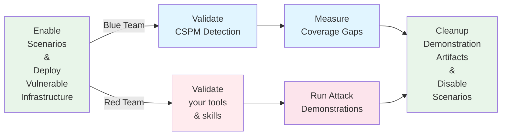

<div align="center">

# Pathfinding Labs


**A modular platform for deploying intentionally vulnerable AWS configurations**


[Quick Start](#quick-start) • [Scenarios](#available-scenarios---single-account) • [Documentation](#architecture) • [Contributing](#contributing)

</div>

---

Pathfinding Labs helps security teams validate their Cloud Security Posture Management (CSPM) tools by deploying intentionally vulnerable cloud resources to sandbox environments.


### How Pathfinding Labs Works



##  Who Is This For?

<table>
<tr>
<td width="50%" valign="top">

### 🛡️ **Blue Teamers**
- ✅ **Validate CSPM Detection**: Does your security tooling detect all vulnerable configurations?
- ✅ **Train Your Team**: Provide hands-on experience with real attack scenarios
- ✅ **Measure Coverage**: Identify gaps in your security monitoring

</td>
<td width="50%" valign="top">

### ⚔️ **Red Teamers**
- ✅ **Practice IAM Exploitation**: Sharpen your privilege escalation skills
- ✅ **Test Your Tooling**: Does your toolset find all the paths?
- ✅ **Build Attack Chains**: Learn complex multi-hop and cross-account techniques
- ✅ **Demonstrate Risk**: Show stakeholders real-world attack scenarios

</td>
</tr>
</table>

## What types of paths are supported?


<table>
<tr>
<td align="center" colspan="4">

**💀 Privilege Escalation Scenarios**

Each privilege escalation scenario comes in two forms. 
A scenario that leads **to admin**, and a scenario that leads **to a specific target bucket**. 
The bucket scenarios exist to show you that you don't always need adminisraive permissions to access the mos sensitive data)
</td>
</tr>
<tr>
<td align="center" width="25%">

**🎯 Self-Escalation**

Principal modifies itself<br/>

To Admin | To Bucket

</td>
<td align="center" width="25%">

**⚡ One-Hop**

Single principal traversal

To Admin | To Bucket

</td>
<td align="center" width="25%">

**🔗 Multi-Hop**

Multiple principal traversals

To Admin | To Bucket

</td>
<td align="center" width="25%">

**🌐 Cross-Account**

Spans multiple accounts

To Admin | To Bucket

</td>
</tr>
<tr>
<td align="center" colspan="4">

**💀 CSPM: Misconfig Scenarios** — Single-condition security misconfigurations
</td>
<tr>
<td align="center" colspan="4">

**💀 CSPM: Toxic Combination Scenarios** — Multiple compounding misconfigurations

</td>
</tr>
</table>


## Quick Start

### Prerequisites
- One or more AWS accounts (playground/sandbox accounts recommended)
- AWS CLI configured with appropriate profiles
- Terraform 1.0+

### Setup in 5 Steps

```bash
# 1. Clone the repository
git clone https://github.com/DataDog/pathfinding-labs.git
cd pathfinding-labs

# 2. Copy and configure your settings
cp terraform.tfvars.example terraform.tfvars
# Edit terraform.tfvars with your account IDs and AWS profiles

# 3. Enable specific scenarios (edit terraform.tfvars)
enable_single_account_privesc_one_hop_to_admin_iam_002_iam_createaccesskey = true

# 4. Deploy
terraform init
terraform apply

# 5. Run demo scripts (credentials are automatically read from terraform outputs)
cd modules/scenarios/single-account/privesc-one-hop/to-admin/iam-002-iam-createaccesskey
./demo_attack.sh
```

---

# Available Scenarios

## Single Account

All scenarios below deploy to a single AWS account (prod) and can be used with just one playground account.

### Privilege Escalation to Admin

Traditional IAM privilege escalation scenarios or chains of traditional scenarios. Grouped according to how many hops between principals are involved. 

#### Self-Escalation to Admin (8 scenarios)

In these scenarios, an IAM principal has the permission to update their own permissions! Some tools consider these permissions equivalent to that of an administrator, some use the term "effective administrator", and some treat these the same as the one-hop scenarios below.

| Scenario | Description |
|----------|-------------|
| [`iam-001-iam-createpolicyversion`](modules/scenarios/single-account/privesc-self-escalation/to-admin/iam-001-iam-createpolicyversion/README.md) | Role creates new policy versions with elevated permissions |
| [`iam-005-iam-putrolepolicy`](modules/scenarios/single-account/privesc-self-escalation/to-admin/iam-005-iam-putrolepolicy/README.md) | Role modifies its own inline policy to grant admin access |
| [`iam-007-iam-putuserpolicy`](modules/scenarios/single-account/privesc-self-escalation/to-admin/iam-007-iam-putuserpolicy/README.md) | User adds inline admin policy to themselves |
| [`iam-008-iam-attachuserpolicy`](modules/scenarios/single-account/privesc-self-escalation/to-admin/iam-008-iam-attachuserpolicy/README.md) | User attaches managed admin policies to themselves |
| [`iam-009-iam-attachrolepolicy`](modules/scenarios/single-account/privesc-self-escalation/to-admin/iam-009-iam-attachrolepolicy/README.md) | Role attaches managed admin policies to itself |
| [`iam-010-iam-attachgrouppolicy`](modules/scenarios/single-account/privesc-self-escalation/to-admin/iam-010-iam-attachgrouppolicy/README.md) | User attaches admin policies to their group |
| [`iam-011-iam-putgrouppolicy`](modules/scenarios/single-account/privesc-self-escalation/to-admin/iam-011-iam-putgrouppolicy/README.md) | User modifies group inline policy to grant admin access |
| [`iam-013-iam-addusertogroup`](modules/scenarios/single-account/privesc-self-escalation/to-admin/iam-013-iam-addusertogroup/README.md) | User adds themselves to an admin group |

#### One-Hop to Admin (59 scenarios)

In these scenarios, one principal has enough permissions to gain access to another principal, and that principal has administrative access.

| Scenario | Description |
|----------|-------------|
| [`apprunner-001-iam-passrole+apprunner-createservice`](modules/scenarios/single-account/privesc-one-hop/to-admin/apprunner-001-iam-passrole+apprunner-createservice/README.md) | User creates AppRunner service with admin role |
| [`apprunner-002-apprunner-updateservice`](modules/scenarios/single-account/privesc-one-hop/to-admin/apprunner-002-apprunner-updateservice/README.md) | User updates AppRunner service configuration to use privileged role |
| [`bedrock-001-iam-passrole+bedrockagentcore-codeinterpreter`](modules/scenarios/single-account/privesc-one-hop/to-admin/bedrock-001-iam-passrole+bedrockagentcore-codeinterpreter/README.md) | User creates Bedrock code interpreter with admin role |
| [`bedrock-002-bedrockagentcore-startsession+invoke`](modules/scenarios/single-account/privesc-one-hop/to-admin/bedrock-002-bedrockagentcore-startsession+invoke/README.md) | User starts Bedrock code interpreter session and invokes with admin role |
| [`cloudformation-001-iam-passrole-cloudformation`](modules/scenarios/single-account/privesc-one-hop/to-admin/cloudformation-001-iam-passrole-cloudformation/README.md) | User passes admin role to CloudFormation to create escalated resources |
| [`cloudformation-002-cloudformation-updatestack`](modules/scenarios/single-account/privesc-one-hop/to-admin/cloudformation-002-cloudformation-updatestack/README.md) | User modifies existing CloudFormation stack to create admin role using stack's elevated service role |
| [`cloudformation-003-iam-passrole+cloudformation-createstackset+cloudformation-createstackinstances`](modules/scenarios/single-account/privesc-one-hop/to-admin/cloudformation-003-iam-passrole+cloudformation-createstackset+cloudformation-createstackinstances/README.md) | User passes admin role to CloudFormation StackSet execution role to create escalated resources |
| [`cloudformation-004-iam-passrole+cloudformation-updatestackset`](modules/scenarios/single-account/privesc-one-hop/to-admin/cloudformation-004-iam-passrole+cloudformation-updatestackset/README.md) | User with iam:PassRole + cloudformation:UpdateStackSet modifies existing StackSet to create admin role |
| [`cloudformation-005-cloudformation-createchangeset+executechangeset`](modules/scenarios/single-account/privesc-one-hop/to-admin/cloudformation-005-cloudformation-createchangeset+executechangeset/README.md) | User creates and executes CloudFormation change set to create admin role |
| [`codebuild-001-iam-passrole+codebuild-createproject+codebuild-startbuild`](modules/scenarios/single-account/privesc-one-hop/to-admin/codebuild-001-iam-passrole+codebuild-createproject+codebuild-startbuild/README.md) | User creates CodeBuild project with admin role and starts build |
| [`codebuild-002-codebuild-startbuild`](modules/scenarios/single-account/privesc-one-hop/to-admin/codebuild-002-codebuild-startbuild/README.md) | User starts existing CodeBuild project with admin role |
| [`codebuild-003-codebuild-startbuildbatch`](modules/scenarios/single-account/privesc-one-hop/to-admin/codebuild-003-codebuild-startbuildbatch/README.md) | User starts CodeBuild batch build with admin role |
| [`codebuild-004-iam-passrole+codebuild-createproject+codebuild-startbuildbatch`](modules/scenarios/single-account/privesc-one-hop/to-admin/codebuild-004-iam-passrole+codebuild-createproject+codebuild-startbuildbatch/README.md) | User creates CodeBuild project with admin role and starts batch build |
| [`ec2-001-iam-passrole+ec2-runinstances`](modules/scenarios/single-account/privesc-one-hop/to-admin/ec2-001-iam-passrole+ec2-runinstances/README.md) | User passes admin role to EC2 instance for credential extraction |
| [`ec2-002-ec2-modifyinstanceattribute+stopinstances+startinstances`](modules/scenarios/single-account/privesc-one-hop/to-admin/ec2-002-ec2-modifyinstanceattribute+stopinstances+startinstances/README.md) | User modifies EC2 instance role by stopping and starting instance |
| [`ec2-003-ec2-instance-connect-sendsshpublickey`](modules/scenarios/single-account/privesc-one-hop/to-admin/ec2-003-ec2-instance-connect-sendsshpublickey/README.md) | User sends SSH public key to EC2 instance with admin role |
| [`ec2-004-iam-passrole+ec2-requestspotinstances`](modules/scenarios/single-account/privesc-one-hop/to-admin/ec2-004-iam-passrole+ec2-requestspotinstances/README.md) | User requests spot instances with admin role |
| [`ec2-005-ec2-createlaunchtemplateversion+ec2-modifylaunchtemplate`](modules/scenarios/single-account/privesc-one-hop/to-admin/ec2-005-ec2-createlaunchtemplateversion+ec2-modifylaunchtemplate/README.md) | User modifies existing launch template to use admin role |
| [`ecs-001-iam-passrole+ecs-createcluster+ecs-registertaskdefinition+ecs-createservice`](modules/scenarios/single-account/privesc-one-hop/to-admin/ecs-001-iam-passrole+ecs-createcluster+ecs-registertaskdefinition+ecs-createservice/README.md) | User creates ECS cluster, registers task definition with admin role, and creates service |
| [`ecs-002-iam-passrole+ecs-createcluster+ecs-registertaskdefinition+ecs-runtask`](modules/scenarios/single-account/privesc-one-hop/to-admin/ecs-002-iam-passrole+ecs-createcluster+ecs-registertaskdefinition+ecs-runtask/README.md) | User creates ECS cluster, registers task definition with admin role, and runs task |
| [`ecs-003-iam-passrole+ecs-registertaskdefinition+ecs-createservice`](modules/scenarios/single-account/privesc-one-hop/to-admin/ecs-003-iam-passrole+ecs-registertaskdefinition+ecs-createservice/README.md) | User registers task definition with admin role and creates service |
| [`ecs-004-iam-passrole+ecs-registertaskdefinition+ecs-runtask`](modules/scenarios/single-account/privesc-one-hop/to-admin/ecs-004-iam-passrole+ecs-registertaskdefinition+ecs-runtask/README.md) | User registers task definition with admin role and runs task |
| [`ecs-005-iam-passrole+ecs-registertaskdefinition+ecs-starttask`](modules/scenarios/single-account/privesc-one-hop/to-admin/ecs-005-iam-passrole+ecs-registertaskdefinition+ecs-starttask/README.md) | User registers ECS task definition with admin role and starts task |
| [`ecs-006-ecs-executecommand`](modules/scenarios/single-account/privesc-one-hop/to-admin/ecs-006-ecs-executecommand/README.md) | User shells into running ECS task with admin role to extract credentials |
| [`ecs-007-iam-passrole+ecs-starttask+ecs-registercontainerinstance`](modules/scenarios/single-account/privesc-one-hop/to-admin/ecs-007-iam-passrole+ecs-starttask+ecs-registercontainerinstance/README.md) | User with iam:PassRole, ecs:StartTask, and ecs:RegisterContainerInstance can override existing task definition commands to escalate to admin |
| [`ecs-008-iam-passrole+ecs-runtask`](modules/scenarios/single-account/privesc-one-hop/to-admin/ecs-008-iam-passrole+ecs-runtask/README.md) | User with iam:PassRole and ecs:RunTask can override existing task definition commands to escalate to admin via Fargate |
| [`glue-001-iam-passrole+glue-createdevendpoint`](modules/scenarios/single-account/privesc-one-hop/to-admin/glue-001-iam-passrole+glue-createdevendpoint/README.md) | User creates Glue dev endpoint with admin role |
| [`glue-002-glue-updatedevendpoint`](modules/scenarios/single-account/privesc-one-hop/to-admin/glue-002-glue-updatedevendpoint/README.md) | User updates existing Glue dev endpoint with admin role |
| [`glue-003-iam-passrole+glue-createjob+glue-startjobrun`](modules/scenarios/single-account/privesc-one-hop/to-admin/glue-003-iam-passrole+glue-createjob+glue-startjobrun/README.md) | User creates Glue job with admin role and starts job run |
| [`glue-004-iam-passrole+glue-createjob+glue-createtrigger`](modules/scenarios/single-account/privesc-one-hop/to-admin/glue-004-iam-passrole+glue-createjob+glue-createtrigger/README.md) | User creates Glue job with admin role and trigger to execute it |
| [`glue-005-iam-passrole+glue-updatejob+glue-startjobrun`](modules/scenarios/single-account/privesc-one-hop/to-admin/glue-005-iam-passrole+glue-updatejob+glue-startjobrun/README.md) | User updates Glue job with admin role and starts job run |
| [`glue-006-iam-passrole+glue-updatejob+glue-createtrigger`](modules/scenarios/single-account/privesc-one-hop/to-admin/glue-006-iam-passrole+glue-updatejob+glue-createtrigger/README.md) | User updates Glue job with admin role and creates trigger |
| [`iam-002-iam-createaccesskey`](modules/scenarios/single-account/privesc-one-hop/to-admin/iam-002-iam-createaccesskey/README.md) | User creates access keys for an admin user |
| [`iam-003-iam-deleteaccesskey+createaccesskey`](modules/scenarios/single-account/privesc-one-hop/to-admin/iam-003-iam-deleteaccesskey+createaccesskey/README.md) | User deletes and recreates access keys for admin user |
| [`iam-004-iam-createloginprofile`](modules/scenarios/single-account/privesc-one-hop/to-admin/iam-004-iam-createloginprofile/README.md) | User creates console password for an admin user |
| [`iam-006-iam-updateloginprofile`](modules/scenarios/single-account/privesc-one-hop/to-admin/iam-006-iam-updateloginprofile/README.md) | User resets console password for an admin user |
| [`iam-012-iam-updateassumerolepolicy`](modules/scenarios/single-account/privesc-one-hop/to-admin/iam-012-iam-updateassumerolepolicy/README.md) | User modifies trust policy of admin role to grant access |
| [`iam-014-iam-attachrolepolicy+sts-assumerole`](modules/scenarios/single-account/privesc-one-hop/to-admin/iam-014-iam-attachrolepolicy+sts-assumerole/README.md) | User attaches admin policy to assumable role then assumes it |
| [`iam-015-iam-attachuserpolicy+iam-createaccesskey`](modules/scenarios/single-account/privesc-one-hop/to-admin/iam-015-iam-attachuserpolicy+iam-createaccesskey/README.md) | User attaches AWS-managed AdministratorAccess to target user and creates access keys |
| [`iam-016-iam-createpolicyversion+sts-assumerole`](modules/scenarios/single-account/privesc-one-hop/to-admin/iam-016-iam-createpolicyversion+sts-assumerole/README.md) | User creates new policy version with admin permissions then assumes role |
| [`iam-017-iam-putrolepolicy+sts-assumerole`](modules/scenarios/single-account/privesc-one-hop/to-admin/iam-017-iam-putrolepolicy+sts-assumerole/README.md) | User adds inline admin policy to assumable role then assumes it |
| [`iam-018-iam-putuserpolicy+iam-createaccesskey`](modules/scenarios/single-account/privesc-one-hop/to-admin/iam-018-iam-putuserpolicy+iam-createaccesskey/README.md) | User adds admin inline policy to target user and creates access keys |
| [`iam-019-iam-attachrolepolicy+iam-updateassumerolepolicy`](modules/scenarios/single-account/privesc-one-hop/to-admin/iam-019-iam-attachrolepolicy+iam-updateassumerolepolicy/README.md) | User attaches admin policy to role and modifies trust policy to assume it |
| [`iam-020-iam-createpolicyversion+iam-updateassumerolepolicy`](modules/scenarios/single-account/privesc-one-hop/to-admin/iam-020-iam-createpolicyversion+iam-updateassumerolepolicy/README.md) | User creates new policy version with admin permissions and updates trust policy |
| [`iam-021-iam-putrolepolicy+iam-updateassumerolepolicy`](modules/scenarios/single-account/privesc-one-hop/to-admin/iam-021-iam-putrolepolicy+iam-updateassumerolepolicy/README.md) | User adds inline admin policy to role and updates trust policy to allow assumption |
| [`lambda-001-iam-passrole+lambda-createfunction+lambda-invokefunction`](modules/scenarios/single-account/privesc-one-hop/to-admin/lambda-001-iam-passrole+lambda-createfunction+lambda-invokefunction/README.md) | User creates Lambda with admin role and invokes to extract credentials |
| [`lambda-002-iam-passrole+lambda-createfunction+createeventsourcemapping-dynamodb`](modules/scenarios/single-account/privesc-one-hop/to-admin/lambda-002-iam-passrole+lambda-createfunction+createeventsourcemapping-dynamodb/README.md) | User creates Lambda with admin role triggered by DynamoDB events |
| [`lambda-003-lambda-updatefunctioncode`](modules/scenarios/single-account/privesc-one-hop/to-admin/lambda-003-lambda-updatefunctioncode/README.md) | User modifies existing Lambda function code to execute under privileged role |
| [`lambda-004-lambda-updatefunctioncode+lambda-invokefunction`](modules/scenarios/single-account/privesc-one-hop/to-admin/lambda-004-lambda-updatefunctioncode+lambda-invokefunction/README.md) | User modifies Lambda code and invokes to extract credentials |
| [`lambda-005-lambda-updatefunctioncode+lambda-addpermission`](modules/scenarios/single-account/privesc-one-hop/to-admin/lambda-005-lambda-updatefunctioncode+lambda-addpermission/README.md) | User modifies Lambda code and adds permission for invocation |
| [`lambda-006-iam-passrole+lambda-createfunction+lambda-addpermission`](modules/scenarios/single-account/privesc-one-hop/to-admin/lambda-006-iam-passrole+lambda-createfunction+lambda-addpermission/README.md) | User creates Lambda with admin role and adds permission for public invocation |
| [`sagemaker-001-iam-passrole+sagemaker-createnotebookinstance`](modules/scenarios/single-account/privesc-one-hop/to-admin/sagemaker-001-iam-passrole+sagemaker-createnotebookinstance/README.md) | User creates SageMaker notebook with admin role and accesses Jupyter terminal |
| [`sagemaker-002-iam-passrole+sagemaker-createtrainingjob`](modules/scenarios/single-account/privesc-one-hop/to-admin/sagemaker-002-iam-passrole+sagemaker-createtrainingjob/README.md) | User creates SageMaker training job with admin role and malicious script |
| [`sagemaker-003-iam-passrole+sagemaker-createprocessingjob`](modules/scenarios/single-account/privesc-one-hop/to-admin/sagemaker-003-iam-passrole+sagemaker-createprocessingjob/README.md) | User creates SageMaker processing job with admin role |
| [`sagemaker-004-sagemaker-createpresignednotebookinstanceurl`](modules/scenarios/single-account/privesc-one-hop/to-admin/sagemaker-004-sagemaker-createpresignednotebookinstanceurl/README.md) | User generates presigned URL to access existing SageMaker notebook with admin role |
| [`sagemaker-005-sagemaker-updatenotebook-lifecycle-config`](modules/scenarios/single-account/privesc-one-hop/to-admin/sagemaker-005-sagemaker-updatenotebook-lifecycle-config/README.md) | User injects malicious lifecycle config into existing SageMaker notebook |
| [`ssm-001-ssm-startsession`](modules/scenarios/single-account/privesc-one-hop/to-admin/ssm-001-ssm-startsession/README.md) | User starts SSM session on EC2 instance with admin role |
| [`ssm-002-ssm-sendcommand`](modules/scenarios/single-account/privesc-one-hop/to-admin/ssm-002-ssm-sendcommand/README.md) | User executes commands on EC2 instances with admin roles to extract credentials |
| [`sts-001-sts-assumerole`](modules/scenarios/single-account/privesc-one-hop/to-admin/sts-001-sts-assumerole/README.md) | Role directly assumes another role with admin permissions |

#### Multi-Hop to Admin (1 scenario)

While everything above is consider an "atomic" privilege escalation path, these scenarios demonstrate what is commonly observed in AWS environments - multi-step paths that lead to administrative access.

| Scenario | Hops | Description |
|----------|------|-------------|
| [`multiple-paths-combined`](modules/scenarios/single-account/privesc-multi-hop/to-admin/multiple-paths-combined/README.md) | 2-3 | Combines EC2, Lambda, and CloudFormation paths to admin |

---

### Lateral movement to an target S3 Bucket

The attacker uses the same privesc mechanisms as above, but the attacker never gets full admin permissions - they only get to the destination bucket. 


#### Self-Escalation to Bucket (2 scenarios)

| Scenario | Description |
|----------|-------------|
| [`iam-005-iam-putrolepolicy`](modules/scenarios/single-account/privesc-self-escalation/to-bucket/iam-005-iam-putrolepolicy/README.md) | Role modifies its own inline policy to grant S3 bucket access |
| [`iam-009-iam-attachrolepolicy`](modules/scenarios/single-account/privesc-self-escalation/to-bucket/iam-009-iam-attachrolepolicy/README.md) | Role attaches S3 access policies to itself |


#### One-Hop to Bucket (11 scenarios)

| Scenario | Description |
|----------|-------------|
| [`ec2-003-ec2-instance-connect-sendsshpublickey`](modules/scenarios/single-account/privesc-one-hop/to-bucket/ec2-003-ec2-instance-connect-sendsshpublickey/README.md) | User sends SSH public key to EC2 instance with bucket access role |
| [`glue-001-iam-passrole+glue-createdevendpoint`](modules/scenarios/single-account/privesc-one-hop/to-bucket/glue-001-iam-passrole+glue-createdevendpoint/README.md) | User creates Glue dev endpoint with bucket access role |
| [`glue-002-glue-updatedevendpoint`](modules/scenarios/single-account/privesc-one-hop/to-bucket/glue-002-glue-updatedevendpoint/README.md) | User updates existing Glue dev endpoint with bucket access role |
| [`iam-002-iam-createaccesskey`](modules/scenarios/single-account/privesc-one-hop/to-bucket/iam-002-iam-createaccesskey/README.md) | User creates keys for user with bucket access |
| [`iam-003-iam-deleteaccesskey+createaccesskey`](modules/scenarios/single-account/privesc-one-hop/to-bucket/iam-003-iam-deleteaccesskey+createaccesskey/README.md) | User deletes and recreates access keys for user with bucket access |
| [`iam-004-iam-createloginprofile`](modules/scenarios/single-account/privesc-one-hop/to-bucket/iam-004-iam-createloginprofile/README.md) | User creates console password for user with bucket access |
| [`iam-006-iam-updateloginprofile`](modules/scenarios/single-account/privesc-one-hop/to-bucket/iam-006-iam-updateloginprofile/README.md) | User resets console password for user with bucket access |
| [`iam-012-iam-updateassumerolepolicy`](modules/scenarios/single-account/privesc-one-hop/to-bucket/iam-012-iam-updateassumerolepolicy/README.md) | User modifies trust policies to assume bucket-access roles |
| [`ssm-001-ssm-startsession`](modules/scenarios/single-account/privesc-one-hop/to-bucket/ssm-001-ssm-startsession/README.md) | User starts SSM session on EC2 instance with bucket access role |
| [`ssm-002-ssm-sendcommand`](modules/scenarios/single-account/privesc-one-hop/to-bucket/ssm-002-ssm-sendcommand/README.md) | User executes commands on EC2 instances with bucket access roles |
| [`sts-001-sts-assumerole`](modules/scenarios/single-account/privesc-one-hop/to-bucket/sts-001-sts-assumerole/README.md) | Role directly assumes another role with bucket permissions |

#### Multi-Hop to Bucket (1 scenario)

| Scenario | Hops | Description |
|----------|------|-------------|
| [`role-chain-to-s3`](modules/scenarios/single-account/privesc-multi-hop/to-bucket/role-chain-to-s3/README.md) | 3 | Three-hop role assumption chain ending at S3 bucket |


---

### CSPM: Misconfig (1 scenario)

Single-condition security misconfigurations that CSPM tools should detect.

| Scenario | Risk Level | Description |
|----------|------------|-------------|
| [`cspm-ec2-001-instance-with-privileged-role`](modules/scenarios/single-account/cspm-misconfig/cspm-ec2-001-instance-with-privileged-role/README.md) | 🟠 High | EC2 instance with overly permissive administrative role |

---

### CSPM: Toxic Combinations (1 scenario)

Multiple compounding misconfigurations that together create critical security risks.

| Scenario | Risk Level | Description |
|----------|------------|-------------|
| [`public-lambda-with-admin`](modules/scenarios/single-account/cspm-toxic-combo/public-lambda-with-admin/README.md) | 🔴 Critical | Publicly accessible Lambda function with administrative role |

---

### Tool Testing Scenarios

Edge cases and scenarios designed to test detection engine capabilities.

#### Tool Testing (5 scenarios)

| Scenario | Focus | Description |
|----------|-------|-------------|
| [`exclusive-resource-policy`](modules/scenarios/tool-testing/exclusive-resource-policy/README.md) | Policy parsing | Tests detection of exclusive resource policy configurations |
| [`resource-policy-bypass`](modules/scenarios/tool-testing/resource-policy-bypass/README.md) | Edge case detection | Tests detection of resource policies that bypass IAM restrictions |
| [`test-effective-permissions-evaluation`](modules/scenarios/tool-testing/test-effective-permissions-evaluation/README.md) | Permissions evaluation | Comprehensive scenario with 25+ principals testing admin access patterns, denies, boundaries, and edge cases |
| [`test-reverse-blast-radius-direct-and-indirect-through-admin`](modules/scenarios/tool-testing/test-reverse-blast-radius-direct-and-indirect-through-admin/README.md) | Reverse blast radius | Tests detection of direct S3 access and indirect access via admin role |
| [`test-reverse-blast-radius-direct-and-indirect-to-bucket`](modules/scenarios/tool-testing/test-reverse-blast-radius-direct-and-indirect-to-bucket/README.md) | Reverse blast radius | Tests detection of direct and indirect S3 bucket access paths |

---

### CTF Scenarios

Capture-the-flag challenges that blend real-world attack techniques with a hidden flag. No demo script is provided -- the exploit is the challenge.

#### CTF (2 scenarios)

| Scenario | Difficulty | Description |
|----------|------------|-------------|
| [`ai-chatbot-to-admin`](modules/scenarios/ctf/ai-chatbot-to-admin/README.md) | Beginner | Prompt injection against an LLM chatbot with an unrestricted shell execution tool leaks Lambda execution role credentials (AdministratorAccess) |
| [`ai-chatbot-lambda-pivot`](modules/scenarios/ctf/ai-chatbot-lambda-pivot/README.md) | Intermediate | Prompt injection leaks limited Lambda credentials; update the function code to pivot to full admin access |

---

### Cross-Account Scenarios

Privilege escalation paths that span multiple AWS accounts. These scenarios require at least two AWS accounts (dev/ops and prod).

#### Cross-Account Dev-to-Prod (5 scenarios)

| Scenario | Hops | Description |
|----------|------|-------------|
| [`lambda-invoke-update`](modules/scenarios/cross-account/dev-to-prod/multi-hop/lambda-invoke-update/README.md) | 2 | Lambda function code update to extract prod credentials |
| [`multi-hop-both-sides`](modules/scenarios/cross-account/dev-to-prod/multi-hop/multi-hop-both-sides/README.md) | 3 | Privilege escalation in both accounts before crossing |
| [`passrole-lambda-admin`](modules/scenarios/cross-account/dev-to-prod/multi-hop/passrole-lambda-admin/README.md) | 2 | PassRole privilege escalation via Lambda across accounts |
| [`root-trust-role-assumption`](modules/scenarios/cross-account/dev-to-prod/one-hop/root-trust-role-assumption/README.md) | 1 | Cross-account role assumption exploiting :root trust (any dev principal can assume) |
| [`simple-role-assumption`](modules/scenarios/cross-account/dev-to-prod/one-hop/simple-role-assumption/README.md) | 1 | Direct cross-account role assumption from dev to prod |

#### Cross-Account Ops-to-Prod (1 scenario)

| Scenario | Hops | Description |
|----------|------|-------------|
| [`simple-role-assumption`](modules/scenarios/cross-account/ops-to-prod/one-hop/simple-role-assumption/README.md) | 1 | Direct cross-account role assumption from ops to prod |

---


## How It Works

**Modular Architecture**: Each attack scenario is a self-contained, independently deployable module that can be enabled or disabled via boolean flags.

```
┌─────────────────────────────────────────────────────────┐
│  1. Select Scenarios      (terraform.tfvars)            │
│     enable_scenario_x = true                            │
├─────────────────────────────────────────────────────────┤
│  2. Deploy                (terraform apply)             │
│     Creates vulnerable resources in your AWS account    │
├─────────────────────────────────────────────────────────┤
│  3. Test                  (demo_attack.sh)              │
│     Exploit OR detect with your CSPM                    │
├─────────────────────────────────────────────────────────┤
│  4. Clean Up              (terraform apply)             │
│     enable_scenario_x = false                           │
└─────────────────────────────────────────────────────────┘
```

### Terraform Outputs

All scenarios provide **grouped outputs** that bundle all credentials and resource information into a single JSON object:

```bash
# Example: Get all outputs for a scenario
terraform output -json | jq '.single_account_privesc_one_hop_to_admin_iam_002_iam_createaccesskey'

# Demo scripts automatically parse these outputs
# No need to manually configure AWS profiles or copy credentials!
```

---

## Scenario Taxonomy

Pathfinding Labs organizes attack scenarios into five main categories:

### **Self-Escalation**
Principal directly modifies itself to gain elevated privileges without traversing to another principal. This is the most direct form of privilege escalation where an entity grants itself additional permissions.

**Examples:**
- `Role → iam:PutRolePolicy (on self) → Admin`
- `User → iam:PutUserPolicy (on self) → Admin`
- `User → iam:AddUserToGroup → AdminGroup → Admin`
- `Role → iam:AttachRolePolicy (on self) → S3 Bucket Access`

### **One-Hop Privilege Escalation**
Single principal traversal scenarios where one principal gains access to another principal's privileges. These are single-account scenarios within the prod environment.

**Examples:**
- `Role → iam:CreateAccessKey → AdminUser → Admin`
- `Role → iam:PassRole + lambda:CreateFunction → AdminRole → Admin`
- `Role → lambda:UpdateFunctionCode → Lambda with Admin Role → Admin`
- `Role → ssm:SendCommand → EC2 with Admin Role → Admin`

### **Multi-Hop Privilege Escalation**
Multiple privilege escalation steps chaining through multiple principals. These are single-account scenarios within the prod environment.

**Examples:**
- `User → sts:AssumeRole → RoleA → iam:CreateAccessKey → UserB → AssumeRole → AdminRole`
- `RoleA → iam:PutRolePolicy → RoleB → AssumeRole → RoleC → Sensitive Bucket`

### **CSPM: Misconfig**
Single-condition security misconfigurations that CSPM tools should detect. These are single-account scenarios within the prod environment.

**Examples:**
- `EC2 Instance with Admin Role` - Overly permissive instance profile
- `S3 Bucket (public)` - Publicly accessible storage
- `Security Group (0.0.0.0/0)` - Unrestricted network access

### **CSPM: Toxic Combinations**
Multiple compounding misconfigurations that together create critical security risks. These are single-account scenarios within the prod environment.

**Examples:**
- `Lambda Function (publicly accessible) + Admin Role`
- `EC2 Instance (publicly accessible) + Critical CVE + Admin Role`
- `S3 Bucket (public) + Sensitive Data + No Encryption`

### **Cross-Account Privilege Escalation**
Privilege escalation paths that span multiple AWS accounts (dev, ops, prod). These scenarios demonstrate how compromise in one account can lead to access in another.

**Examples:**
- `Dev:User → AssumeRole → Prod:Role → Admin`
- `Dev:Role → Lambda:InvokeFunction → Prod:Lambda → Extract Credentials → Prod:Admin`
- `Ops:User → AssumeRole → Prod:Role → S3:SensitiveBucket`

### **Tool Testing**
Edge cases and scenarios designed to test detection engine capabilities. These scenarios aren't distinct escalation types, but rather configurations that challenge CSPM and security tool detection accuracy.

**Focus Areas:**
- Resource policies that bypass IAM restrictions
- Complex policy condition evaluation
- False positive scenarios
- Policy parsing edge cases

**Examples:**
- `Resource policy granting exclusive bucket access, bypassing IAM policies`
- `Complex condition keys that tools may misinterpret`
- `Legitimate configurations that appear vulnerable`

--- 

## Configuration

### Enabling Scenarios

Edit your `terraform.tfvars` file:

```hcl
# Account Configuration
prod_account_id        = "111111111111"
dev_account_id         = "222222222222"
operations_account_id  = "333333333333"

prod_account_aws_profile       = "my-prod-profile"
dev_account_aws_profile        = "my-dev-profile"
operations_account_aws_profile = "my-ops-profile"

# Enable specific scenarios
enable_single_account_privesc_self_escalation_to_admin_iam_005_iam_putrolepolicy = true
enable_single_account_privesc_one_hop_to_admin_iam_002_iam_createaccesskey = true
enable_single_account_cspm_toxic_combo_public_lambda_with_admin = true

# Keep everything else disabled
enable_single_account_privesc_multi_hop_to_bucket_role_chain_to_s3 = false
# ... etc
```

### Single Account Mode

**You only need ONE AWS account to use most of Pathfinding Labs!**

All single-account scenarios deploy to the `prod` account. The `dev` and `ops` accounts are only required for cross-account scenarios.

```hcl
# Minimal configuration (single account)
prod_account_id          = "111111111111"
prod_account_aws_profile = "my-playground-account"

# These are optional and only needed for cross-account scenarios
# dev_account_id         = ""
# operations_account_id  = ""
```

---

## Running Attack Demonstrations

Each scenario includes a demonstration script that shows how to exploit the vulnerability:

```bash
# Navigate to a specific scenario
cd modules/scenarios/single-account/privesc-one-hop/to-admin/iam-002-iam-createaccesskey

# Run the demonstration
./demo_attack.sh

# Clean up attack artifacts (keeps infrastructure)
./cleanup_attack.sh
```

The demo scripts provide:
- ✅ Step-by-step exploitation walkthrough
- ✅ AWS CLI commands with explanations
- ✅ Real-time verification of privilege escalation
- ✅ Color-coded output for clarity
- ✅ **Automatic credential retrieval** - No AWS profile configuration needed!

**How it works:** Demo scripts automatically read credentials from Terraform's grouped outputs, so you can run them immediately after `terraform apply` without any additional setup.

**Optional:** If you want to configure AWS CLI profiles for manual testing, you can run `./create_pathfinding_profiles.sh` to create profiles for the pathfinding starting users.

---

## Security Practices

### Pathfinding Starting Users

Each environment has a dedicated starting user with **minimal permissions**:

- **`pl-pathfinding-starting-user-prod`** - Production starting point
- **`pl-pathfinding-starting-user-dev`** - Development starting point  
- **`pl-pathfinding-starting-user-operations`** - Operations starting point

**Permissions:**
```json
{
  "Version": "2012-10-17",
  "Statement": [
    {
      "Effect": "Allow",
      "Action": [
        "sts:GetCallerIdentity",
        "iam:GetUser"
      ],
      "Resource": "*"
    }
  ]
}
```

### Cleanup Users

Each environment includes an admin cleanup user for easy teardown:
- **`pl-admin-user-for-cleanup-scripts`**

---

## Resource Naming Convention

All resources follow a consistent naming pattern:

```
pl-{resource-description}-{context}

Examples:
- pl-pathfinding-starting-user-prod
- pl-cak-admin (CreateAccessKey Admin)
- pl-prod-one-hop-putrolepolicy-role
```

Globally unique resources (S3 buckets) include a random suffix:
```
pl-{resource}-{account-id}-{random-6-char}

Example:
- pl-sensitive-data-954976316246-a3f9x2
```

---

## Architecture

### Directory Structure

```
pathfinding-labs/
├── modules/
│   ├── environments/          # Base infrastructure (always deployed)
│   │   ├── prod/             # Production environment base resources
│   │   ├── dev/              # Development environment base resources
│   │   └── operations/       # Operations environment base resources
│   │
│   └── scenarios/            # Attack scenarios (opt-in via flags)
│       ├── single-account/
│       │   ├── privesc-self-escalation/
│       │   │   ├── to-admin/    # Principal modifies itself to gain admin
│       │   │   └── to-bucket/   # Principal modifies itself for S3 access
│       │   ├── privesc-one-hop/
│       │   │   ├── to-admin/    # Single principal traversal to admin
│       │   │   └── to-bucket/   # Single principal traversal to S3 access
│       │   ├── privesc-multi-hop/
│       │   │   ├── to-admin/    # Multiple principal traversals to admin
│       │   │   └── to-bucket/   # Multiple principal traversals to S3 access
│       │   ├── cspm-misconfig/  # Single-condition security misconfigurations
│       │   └── cspm-toxic-combo/ # Multiple compounding misconfigurations
│       ├── tool-testing/         # Edge cases for testing detection engines
│       └── cross-account/
│           ├── dev-to-prod/     # Dev → Prod attack paths
│           │   ├── one-hop/     # Single-hop cross-account escalation
│           │   └── multi-hop/   # Multi-hop cross-account escalation
│           └── ops-to-prod/     # Ops → Prod attack paths
│               └── one-hop/     # Single-hop cross-account escalation
│
├── main.tf                   # Root module with conditional instantiation
├── variables.tf              # Boolean flags for each scenario
├── outputs.tf                # Credential outputs for testing
└── terraform.tfvars          # Your configuration (gitignored)
```

### Module Structure

Each scenario follows a standard structure:

```
scenario-name/
├── main.tf              # Terraform resources
├── variables.tf         # Input variables
├── outputs.tf           # Output values
├── README.md            # Documentation with mermaid diagrams
├── demo_attack.sh       # Exploitation demonstration
└── cleanup_attack.sh    # Artifact cleanup script
```

---

## 🎯 Use Cases

### 1. CSPM Validation
```bash
# Deploy a known vulnerability
enable_single_account_cspm_toxic_combo_public_lambda_with_admin = true
terraform apply

# Check if your CSPM detects it
# Expected alerts:
# - Lambda function publicly accessible
# - Lambda function has administrative permissions
# - Critical risk: Toxic combination detected
```

### 2. Red Team Training
```bash
# Deploy privilege escalation paths
enable_single_account_privesc_self_escalation_to_admin_iam_005_iam_putrolepolicy = true
terraform apply

# Practice exploitation
cd modules/scenarios/single-account/privesc-self-escalation/to-admin/iam-005-iam-putrolepolicy
./demo_attack.sh

# Learn the technique, modify the script, try variations
```

### 3. Security Tool Testing
```bash
# Deploy multiple scenarios
enable_single_account_privesc_self_escalation_to_admin_iam_005_iam_putrolepolicy = true
enable_single_account_privesc_one_hop_to_admin_iam_002_iam_createaccesskey = true
enable_single_account_privesc_multi_hop_to_admin_multiple_paths_combined = true
terraform apply

# Test if your tooling finds all paths
# Compare results across different security tools
```

### 4. Incident Response Practice
```bash
# Create a realistic compromise scenario
enable_cross_account_dev_to_prod_multi_hop_lambda_invoke_update = true
terraform apply

# Practice detection, investigation, and response
# Use CloudTrail, GuardDuty, and other AWS security services
```

---

## CSPM Detection Examples

Each scenario documents what a properly configured CSPM should detect:

### Example: iam-createaccesskey Scenario

**Expected CSPM Alerts:**
- ⚠️ IAM role can create access keys for privileged users
- ⚠️ Privilege escalation path detected
- ⚠️ Role has permissions on admin user
- ⚠️ Potential for credential theft

**MITRE ATT&CK Mapping:**
- **Tactic**: Privilege Escalation, Persistence
- **Technique**: T1098.001 - Account Manipulation: Additional Cloud Credentials

---

## Contributing

We welcome contributions! To add a new scenario:

1. **Create the scenario directory** following the standard structure
2. **Implement resources** with proper provider configuration
3. **Write documentation** including mermaid diagrams and CSPM detection notes
4. **Create demo scripts** showing the exploitation technique
5. **Add to main.tf** with conditional instantiation
6. **Add boolean variable** to variables.tf
7. **Update terraform.tfvars.example**
8. **Test thoroughly** in an isolated AWS account
9. **Submit a pull request** with clear description

See our [Contributing Guide](CONTRIBUTING.md) for detailed instructions.

---

## Important Warnings

### **ONLY USE IN PLAYGROUND/SANDBOX ACCOUNTS**

- ❌ **NEVER** deploy to production AWS accounts
- ❌ **NEVER** deploy to accounts with real customer data
- ❌ **NEVER** deploy to accounts with production workloads
- ✅ **ALWAYS** use isolated playground/sandbox accounts
- ✅ **ALWAYS** tear down resources when finished
- ✅ **ALWAYS** monitor costs and set billing alarms

### Security Best Practices

1. **Use SCPs** to prevent accidental production deployment
2. **Set up billing alerts** to catch unexpected charges
3. **Use separate AWS Organizations** for testing
4. **Review each scenario** before enabling
5. **Document your testing** for compliance and audit purposes

---

## Current Status

- ✅ **95 scenarios** available
  - 8 Self-Escalation to Admin
  - 2 Self-Escalation to Bucket
  - 59 One-Hop to Admin
  - 11 One-Hop to Bucket
  - 1 Multi-Hop to Admin
  - 1 Multi-Hop to Bucket
  - 1 CSPM: Misconfig
  - 1 CSPM: Toxic Combo
  - 5 Tool Testing
  - 6 Cross-Account (5 dev-to-prod, 1 ops-to-prod)
- ✅ **Single-account support** (works with just one AWS account)
- ✅ **Multi-account support** (optional cross-account scenarios)
- ✅ **Modular architecture** (enable/disable any scenario)
- ✅ **Demo scripts** for all scenarios
- ✅ **CSPM detection guidance** included

---

## Roadmap

- [ ] Web interface for scenario management
- [ ] Go CLI for easier configuration
- [ ] More toxic combination scenarios
- [ ] GCP and Azure support
- [ ] Integration with popular CSPM tools
- [ ] Automated testing framework
- [ ] Video walkthroughs for each scenario

---

## Additional Resources

- [IAM Vulnerable Project](https://github.com/bishopfox/iam-vulnerable) - Inspiration for single-account paths
- [MITRE ATT&CK Cloud Matrix](https://attack.mitre.org/matrices/enterprise/cloud/)

---

## License

[Add your license here]

---

## Acknowledgments

Built with inspiration from:
- [IAM Vulnerable](https://github.com/bishopfox/iam-vulnerable) by Bishop Fox
- [Stratus Red Team](https://github.com/DataDog/stratus-red-team) by Datadog
- AWS Security community
