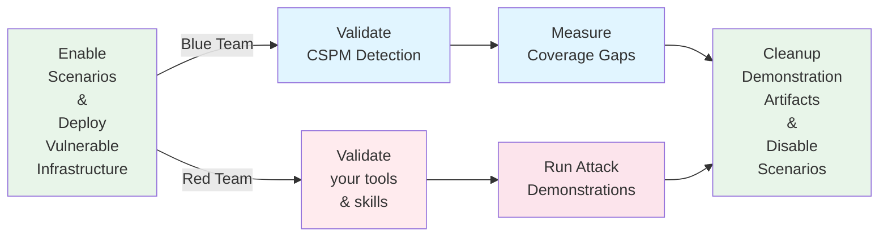

<div align="center">

# Pathfinding Labs


**A modular platform for deploying intentionally vulnerable AWS configurations**


[Quick Start](#quick-start) • [Scenarios](https://pathfinding.cloud/labs) • [How It Works](#how-it-works) • [Security](#what-gets-deployed) • [Contributing](#contributing)

</div>

---

Pathfinding Labs helps security teams validate their Cloud Security Posture Management (CSPM) tools by deploying intentionally vulnerable cloud resources to sandbox environments.

> **Full scenario catalog, individual lab docs, and guided installation:** [pathfinding.cloud/labs](https://pathfinding.cloud/labs)
> This README is a quick-start guide and command reference for users working directly from the repository.

### How Pathfinding Labs Works



##  Who Is This For?

<table>
<tr>
<td width="50%" valign="top">

### 🛡️ **Blue Teamers**
- ✅ **Validate CSPM Detection**: Does your security tooling detect all vulnerable configurations?
- ✅ **Train Your Team**: Provide hands-on experience with real attack scenarios
- ✅ **Measure Coverage**: Identify gaps in your security monitoring

</td>
<td width="50%" valign="top">

### ⚔️ **Red Teamers**
- ✅ **Practice IAM Exploitation**: Sharpen your privilege escalation skills
- ✅ **Test Your Tooling**: Does your toolset find all the paths?
- ✅ **Build Attack Chains**: Learn complex multi-hop and cross-account techniques
- ✅ **Demonstrate Risk**: Show stakeholders real-world attack scenarios

</td>
</tr>
</table>

## What types of scenarios are supported?


<table>
<tr>
<td align="center" colspan="4">

**💀 Privilege Escalation Scenarios**

Each privilege escalation scenario comes in two forms.
A scenario that leads **to admin**, and a scenario that leads **to a specific target bucket**.
The bucket scenarios exist to show you that you don't always need administrative permissions to access the most sensitive data.
</td>
</tr>
<tr>
<td align="center" width="25%">

**🎯 Self-Escalation**

Principal modifies itself<br/>

To Admin | To Bucket

</td>
<td align="center" width="25%">

**⚡ One-Hop**

Single principal traversal

To Admin | To Bucket

</td>
<td align="center" width="25%">

**🔗 Multi-Hop**

Multiple principal traversals

To Admin | To Bucket

</td>
<td align="center" width="25%">

**🌐 Cross-Account**

Spans multiple accounts

To Admin | To Bucket

</td>
</tr>
<tr>
<td align="center" colspan="4">

**🔍 CSPM: Misconfig Scenarios** — Single-condition security misconfigurations
</td>
</tr>
<tr>
<td align="center" colspan="4">

**☠️ CSPM: Toxic Combination Scenarios** — Multiple compounding misconfigurations that together create critical risk
</td>
</tr>
<tr>
<td align="center" colspan="4">

**🧪 Tool Testing Scenarios** — Edge cases designed to stress-test detection engine accuracy (false positives, policy parsing, complex conditions)
</td>
</tr>
<tr>
<td align="center" colspan="4">

**🎮 CTF Scenarios** — Capture-the-flag challenges blending real attack techniques with a hidden flag; no demo script provided — the exploit is the challenge
</td>
</tr>
<tr>
<td align="center" colspan="4">

**🎬 Attack Simulation Scenarios** — Recreations of documented real-world cloud breaches, sourced from public incident reports
</td>
</tr>
</table>


## Quick Start

### Prerequisites
- One or more AWS accounts (playground/sandbox accounts recommended)
- AWS CLI configured with appropriate profiles

### Install plabs

```bash
# Option A: Homebrew (recommended)
brew install pathfinding-labs/tap/plabs

# Option B: Build from source
git clone https://github.com/DataDog/pathfinding-labs.git
cd pathfinding-labs
go build -o plabs ./cmd/plabs
cp plabs /usr/local/bin/
chmod +x /usr/local/bin/plabs
```

### Interactive Setup (recommended)

```bash
# 1. Initialize: downloads terraform, clones repo, runs AWS profile setup wizard
plabs init

# 2. Open the TUI dashboard
plabs

# 3. In the TUI: use ↑↓ to browse scenarios, space to toggle, a to deploy
```

<!-- SCREENSHOT: plabs TUI dashboard — three-pane layout: environment/account status (left), scrollable+filterable scenario list with enabled indicators (center), scenario detail with attack path and credentials (right) -->
> _[Screenshot: plabs TUI dashboard — replace this line with the image]_

### Non-Interactive Setup

```bash
# 1. Configure your AWS profile
plabs config set prod-profile my-playground-account
plabs config set prod-region us-east-1

# 2. Enable scenarios
plabs enable iam-002-iam-createaccesskey

# 3. Deploy
plabs apply -y

# 4. Run a demo
plabs demo iam-002-iam-createaccesskey
```

---

# Available Scenarios

The full catalog of labs — with descriptions, attack maps, difficulty levels, and filtering by category — is at **[pathfinding.cloud/labs](https://pathfinding.cloud/labs)**.

---

## How It Works

**Modular Architecture**: Each attack scenario is a self-contained, independently deployable module that can be enabled or disabled via `plabs`.

```
┌─────────────────────────────────────────────────────────┐
│  1. Select Scenarios      (plabs TUI or plabs enable)   │
│     space to toggle in TUI, or: plabs enable <id>       │
├─────────────────────────────────────────────────────────┤
│  2. Deploy                (plabs apply)                 │
│     Creates vulnerable resources in your AWS account    │
├─────────────────────────────────────────────────────────┤
│  3. Test                  (plabs demo <id>)             │
│     Exploit OR detect with your CSPM                    │
├─────────────────────────────────────────────────────────┤
│  4. Clean Up              (plabs disable <id> &&        │
│                            plabs apply)                 │
└─────────────────────────────────────────────────────────┘
```

### Scenario Outputs

All scenarios expose credentials and resource information via grouped outputs:

```bash
# View credentials and outputs for a scenario
plabs credentials iam-002-iam-createaccesskey
plabs output iam-002-iam-createaccesskey

# Demo scripts automatically read these outputs
# No need to manually configure AWS profiles or copy credentials
```

---

## Configuration

All configuration is managed through `plabs`. There is no need to edit Terraform files directly.

### Configuring AWS Profiles

**Interactive** — run the setup wizard:

```bash
plabs init
```

**Non-interactive** — set values directly:

```bash
plabs config set prod-profile   my-prod-profile
plabs config set prod-region    us-east-1
```

| Key | Required | Description |
|-----|----------|-------------|
| `prod-profile` | Yes | AWS CLI profile for the prod account |
| `prod-region` | Yes | AWS region for the prod account |
| `dev-profile` | No | Dev account profile (cross-account scenarios only) |
| `dev-region` | No | Dev account region |
| `ops-profile` | No | Ops account profile (cross-account scenarios only) |
| `ops-region` | No | Ops account region |

**You only need ONE AWS account to use most of Pathfinding Labs.** All single-account scenarios deploy to `prod`. Dev and ops are only required for cross-account scenarios.

### Enabling and Disabling Scenarios

**Interactive (TUI):**

```bash
plabs       # open the dashboard
# ↑↓ to navigate, space to toggle, a to deploy
```

**CLI:**

```bash
# Enable by scenario ID
plabs enable iam-002-iam-createaccesskey

# Enable multiple at once
plabs enable iam-002-iam-createaccesskey lambda-001-iam-passrole

# Disable
plabs disable iam-002-iam-createaccesskey
```

### Deploying

```bash
plabs apply        # shows plan, prompts for confirmation
plabs apply -y     # skip confirmation
plabs plan         # preview changes without deploying
```

### Dev Mode

By default, `plabs` uses the repository it cloned into `~/.plabs/pathfinding-labs/`. If you are contributing and want to test local Terraform changes, enable dev mode from inside the repo:

```bash
# Run from inside your cloned pathfinding-labs directory
plabs config set dev-mode true
# plabs now uses local modules instead of ~/.plabs/pathfinding-labs/

plabs config set dev-mode false  # revert to the managed copy
```

---

## Running Attack Demonstrations

Each scenario includes a demonstration script that shows how to exploit the vulnerability.

**Using plabs (recommended):**

```bash
plabs demo    iam-002-iam-createaccesskey
plabs cleanup iam-002-iam-createaccesskey
```

**Directly from the scenario directory:**

```bash
cd modules/scenarios/single-account/privesc-one-hop/to-admin/iam-002-iam-createaccesskey
./demo_attack.sh
./cleanup_attack.sh
```

The demo scripts provide:
- ✅ Step-by-step exploitation walkthrough
- ✅ AWS CLI commands with explanations
- ✅ Real-time verification of privilege escalation
- ✅ Color-coded output for clarity
- ✅ **Automatic credential retrieval** — no manual AWS profile setup needed

<!-- SCREENSHOT: demo_attack.sh output — color-coded terminal output showing step-by-step exploitation walkthrough with AWS CLI commands and verification steps -->
> _[Screenshot: demo_attack.sh output — replace this line with the image]_

---

## What Gets Deployed

Understanding exactly what Pathfinding Labs creates in your account helps you assess the risk and plan your testing environment appropriately.

### IAM Resources

Every scenario creates IAM principals (users, roles) and policies with deliberate misconfigurations. **No existing resources in your account are modified.** All created resources use the `pl-` prefix so they are easy to identify and audit.

### Starting Users

Each configured environment gets one dedicated starting user with **minimal permissions** — this is the simulated attacker's initial foothold:

| User | Environment |
|------|-------------|
| `pl-pathfinding-starting-user-prod` | Production |
| `pl-pathfinding-starting-user-dev` | Development |
| `pl-pathfinding-starting-user-operations` | Operations |

Starting users are granted only two permissions:

```json
{
  "Version": "2012-10-17",
  "Statement": [
    {
      "Effect": "Allow",
      "Action": [
        "sts:GetCallerIdentity",
        "iam:GetUser"
      ],
      "Resource": "*"
    }
  ]
}
```

### Cleanup Admin User

Each environment also includes one admin-level user used exclusively by cleanup scripts to revert demo artifacts:

- **`pl-admin-user-for-cleanup-scripts`**

This user has broad permissions. It exists so cleanup scripts can undo changes made during attack demonstrations (e.g., deleting access keys that were created, reverting modified policies). **This is another reason to keep your lab environment isolated from production.**

### Network Exposure by Scenario Type

Not all scenarios expose resources to the internet:

| Category | Network Exposure |
|----------|-----------------|
| Privilege escalation (all hops) | None — IAM-only, no network resources |
| CSPM Misconfig / Toxic Combo | Some scenarios intentionally create public S3 buckets, Lambda function URLs, or open security groups |
| CTF | May include internet-facing endpoints as part of the challenge |
| Attack Simulation | May include internet-accessible resources mirroring the original breach |

Each scenario's README documents what it creates and any public-facing resources.

### Cost Guidance

Most scenarios are IAM-only and incur no AWS charges. Scenarios that deploy compute or storage resources (EC2, Lambda, ECS, S3 with data) incur small charges while deployed. Recommended: set a billing alert at $10–20/month as a safety net.

Tear down scenarios when not actively testing:

```bash
plabs disable <id> && plabs apply   # disable a specific scenario
plabs destroy                        # destroy all deployed resources
```

### Containment

All resources are created only in the accounts and regions you configure via `plabs config`. Teardown is complete — `plabs destroy` removes everything Pathfinding Labs created.

---

## Resource Naming Convention

All resources follow a consistent naming pattern:

```
pl-{resource-description}-{context}

Examples:
- pl-pathfinding-starting-user-prod
- pl-cak-admin (CreateAccessKey Admin)
- pl-prod-one-hop-putrolepolicy-role
```

Globally unique resources (S3 buckets) include a random suffix:
```
pl-{resource}-{account-id}-{random-6-char}

Example:
- pl-sensitive-data-954976316246-a3f9x2
```

---


## Scenario Taxonomy

Pathfinding Labs organizes scenarios into eight categories:

### **Self-Escalation**
Principal directly modifies itself to gain elevated privileges without traversing to another principal. This is the most direct form of privilege escalation where an entity grants itself additional permissions.

**Examples:**
- `Role → iam:PutRolePolicy (on self) → Admin`
- `User → iam:PutUserPolicy (on self) → Admin`
- `User → iam:AddUserToGroup → AdminGroup → Admin`
- `Role → iam:AttachRolePolicy (on self) → S3 Bucket Access`

### **One-Hop Privilege Escalation**
Single principal traversal scenarios where one principal gains access to another principal's privileges. These are single-account scenarios within the prod environment.

**Examples:**
- `Role → iam:CreateAccessKey → AdminUser → Admin`
- `Role → iam:PassRole + lambda:CreateFunction → AdminRole → Admin`
- `Role → lambda:UpdateFunctionCode → Lambda with Admin Role → Admin`
- `Role → ssm:SendCommand → EC2 with Admin Role → Admin`

### **Multi-Hop Privilege Escalation**
Multiple privilege escalation steps chaining through multiple principals. These are single-account scenarios within the prod environment.

**Examples:**
- `User → sts:AssumeRole → RoleA → iam:CreateAccessKey → UserB → AssumeRole → AdminRole`
- `RoleA → iam:PutRolePolicy → RoleB → AssumeRole → RoleC → Sensitive Bucket`

### **CSPM: Misconfig**
Single-condition security misconfigurations that CSPM tools should detect. These are single-account scenarios within the prod environment.

**Examples:**
- `EC2 Instance with Admin Role` - Overly permissive instance profile
- `S3 Bucket (public)` - Publicly accessible storage
- `Security Group (0.0.0.0/0)` - Unrestricted network access

### **CSPM: Toxic Combinations**
Multiple compounding misconfigurations that together create critical security risks. These are single-account scenarios within the prod environment.

**Examples:**
- `Lambda Function (publicly accessible) + Admin Role`
- `EC2 Instance (publicly accessible) + Critical CVE + Admin Role`
- `S3 Bucket (public) + Sensitive Data + No Encryption`

### **Cross-Account Privilege Escalation**
Privilege escalation paths that span multiple AWS accounts (dev, ops, prod). These scenarios demonstrate how compromise in one account can lead to access in another.

**Examples:**
- `Dev:User → AssumeRole → Prod:Role → Admin`
- `Dev:Role → Lambda:InvokeFunction → Prod:Lambda → Extract Credentials → Prod:Admin`
- `Ops:User → AssumeRole → Prod:Role → S3:SensitiveBucket`

### **Tool Testing**
Edge cases and scenarios designed to test detection engine capabilities. These scenarios aren't distinct escalation types, but rather configurations that challenge CSPM and security tool detection accuracy.

**Focus Areas:**
- Resource policies that bypass IAM restrictions
- Complex policy condition evaluation
- False positive scenarios
- Policy parsing edge cases

**Examples:**
- `Resource policy granting exclusive bucket access, bypassing IAM policies`
- `Complex condition keys that tools may misinterpret`
- `Legitimate configurations that appear vulnerable`

### **CTF**
Capture-the-flag challenges that blend real-world AWS attack techniques with a hidden flag. No demo script is provided — finding and exploiting the path is the challenge. Suitable for individual practice or team competitions.

**Examples:**
- Prompt injection against an LLM chatbot leaks Lambda execution role credentials
- Limited credentials require chaining multiple techniques to reach full admin access

### **Attack Simulation**
Recreations of documented real-world cloud breaches, sourced from public incident reports and blog posts. Demo scripts mirror the original attack as closely as possible — including failed recon attempts and enumeration steps — rather than taking the most direct path. The attack map records only the successful path.

**Examples:**
- Recreation of the Sysdig TRT breach: credentials in a private S3 RAG bucket → Lambda code injection → admin in under 8 minutes

--- 


## Architecture

### Directory Structure

```
pathfinding-labs/
├── modules/
│   ├── environments/          # Base infrastructure (always deployed)
│   │   ├── prod/             # Production environment base resources
│   │   ├── dev/              # Development environment base resources
│   │   └── operations/       # Operations environment base resources
│   │
│   └── scenarios/            # Attack scenarios (opt-in via flags)
│       ├── single-account/
│       │   ├── privesc-self-escalation/
│       │   │   ├── to-admin/    # Principal modifies itself to gain admin
│       │   │   └── to-bucket/   # Principal modifies itself for S3 access
│       │   ├── privesc-one-hop/
│       │   │   ├── to-admin/    # Single principal traversal to admin
│       │   │   └── to-bucket/   # Single principal traversal to S3 access
│       │   ├── privesc-multi-hop/
│       │   │   ├── to-admin/    # Multiple principal traversals to admin
│       │   │   └── to-bucket/   # Multiple principal traversals to S3 access
│       │   ├── cspm-misconfig/  # Single-condition security misconfigurations
│       │   └── cspm-toxic-combo/ # Multiple compounding misconfigurations
│       ├── tool-testing/         # Edge cases for testing detection engines
│       ├── ctf/                  # Capture-the-flag challenges (no demo scripts)
│       ├── attack-simulation/    # Recreations of real-world cloud breaches
│       └── cross-account/
│           ├── dev-to-prod/     # Dev → Prod attack paths
│           │   ├── one-hop/     # Single-hop cross-account escalation
│           │   └── multi-hop/   # Multi-hop cross-account escalation
│           └── ops-to-prod/     # Ops → Prod attack paths
│               └── one-hop/     # Single-hop cross-account escalation
│
├── main.tf                   # Root module with conditional instantiation
├── variables.tf              # Boolean flags for each scenario
├── outputs.tf                # Credential outputs for testing
└── terraform.tfvars          # Your configuration (gitignored)
```

### Module Structure

Each scenario follows a standard structure:

```
scenario-name/
├── main.tf              # Terraform resources
├── variables.tf         # Input variables
├── outputs.tf           # Output values
├── README.md            # Documentation with mermaid diagrams
├── demo_attack.sh       # Exploitation demonstration
└── cleanup_attack.sh    # Artifact cleanup script
```

---

## Use Cases

### 1. CSPM Validation
```bash
# Deploy a known vulnerability
plabs enable public-lambda-with-admin
plabs apply -y

# Check if your CSPM detects it
# Expected alerts:
# - Lambda function publicly accessible
# - Lambda function has administrative permissions
# - Critical risk: Toxic combination detected
```

### 2. Red Team Training
```bash
# Deploy a privilege escalation path
plabs enable iam-005-iam-putrolepolicy
plabs apply -y

# Practice exploitation
plabs demo iam-005-iam-putrolepolicy
```

### 3. Security Tool Testing
```bash
# Deploy multiple scenarios at once
plabs enable iam-005-iam-putrolepolicy iam-002-iam-createaccesskey multiple-paths-combined
plabs apply -y

# Test if your tooling finds all paths
# Compare results across different security tools
```

### 4. Incident Response Practice
```bash
# Create a realistic compromise scenario
plabs enable lambda-invoke-update
plabs apply -y

# Practice detection, investigation, and response
# Use CloudTrail, GuardDuty, and other AWS security services
```

### 5. CTF Challenges
```bash
# Deploy a CTF scenario — no demo script, the exploit is the challenge
plabs enable ai-chatbot-to-admin
plabs apply -y

# Browse to pathfinding.cloud/labs for hints and difficulty ratings
```

### 6. Attack Simulation / Breach Recreations
```bash
# Recreate a documented real-world breach
plabs enable sysdig-8-minutes-to-admin
plabs apply -y

# Run the simulation — includes failed recon steps mirroring the original attack
plabs demo sysdig-8-minutes-to-admin
```

---

## CSPM Detection Examples

Each scenario documents what a properly configured CSPM should detect:

### Example: iam-createaccesskey Scenario

**Expected CSPM Alerts:**
- ⚠️ IAM role can create access keys for privileged users
- ⚠️ Privilege escalation path detected
- ⚠️ Role has permissions on admin user
- ⚠️ Potential for credential theft

**MITRE ATT&CK Mapping:**
- **Tactic**: Privilege Escalation, Persistence
- **Technique**: T1098.001 - Account Manipulation: Additional Cloud Credentials

---

## Contributing

We welcome contributions! To add a new scenario:

1. **Create the scenario directory** following the standard structure
2. **Implement resources** with proper provider configuration
3. **Write documentation** including mermaid diagrams and CSPM detection notes
4. **Create demo scripts** showing the exploitation technique
5. **Add to main.tf** with conditional instantiation
6. **Add boolean variable** to variables.tf
7. **Update terraform.tfvars.example**
8. **Test thoroughly** in an isolated AWS account — enable dev mode (`plabs config set dev-mode true`) to use your local copy, then `plabs enable <id> && plabs apply`
9. **Submit a pull request** with clear description

See our [Contributing Guide](CONTRIBUTING.md) for detailed instructions.

---

## Important Warnings

### **ONLY USE IN PLAYGROUND/SANDBOX ACCOUNTS**

- ❌ **NEVER** deploy to production AWS accounts
- ❌ **NEVER** deploy to accounts with real customer data
- ❌ **NEVER** deploy to accounts with production workloads
- ✅ **ALWAYS** use isolated playground/sandbox accounts
- ✅ **ALWAYS** tear down resources when finished
- ✅ **ALWAYS** monitor costs and set billing alarms

### Security Best Practices

1. **Use SCPs** to prevent accidental production deployment
2. **Set up billing alerts** to catch unexpected charges
3. **Use separate AWS Organizations** for testing
4. **Review each scenario** before enabling
5. **Document your testing** for compliance and audit purposes

---

## Additional Resources

- [IAM Vulnerable Project](https://github.com/bishopfox/iam-vulnerable) - Inspiration for single-account paths
- [MITRE ATT&CK Cloud Matrix](https://attack.mitre.org/matrices/enterprise/cloud/)

---

## License

This project is licensed under the [Apache License 2.0](LICENSE).

---

## Acknowledgments

Built with inspiration from:
- [IAM Vulnerable](https://github.com/bishopfox/iam-vulnerable) by Bishop Fox
- [Stratus Red Team](https://github.com/DataDog/stratus-red-team) by Datadog
