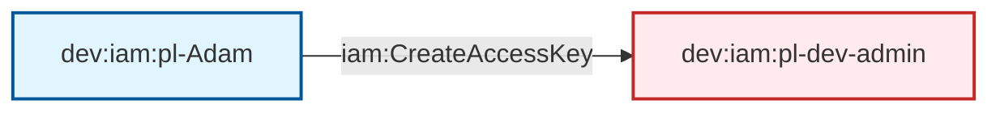

# Dev User Has CreateAccessKey to Admin

This module demonstrates a privilege escalation attack where a user with `iam:CreateAccessKey` permission on an admin user can escalate privileges by creating access keys for that admin user.

## Attack Path Overview

The attack path shows how a regular user (Adam) with limited permissions can escalate to admin privileges by leveraging the `iam:CreateAccessKey` permission on an admin user.

## Access Path Diagram



## Attack Steps

1. **Initial State**: Adam user has `iam:CreateAccessKey` permission specifically on the `pl-dev-admin` user
2. **Access Key Creation**: Adam creates an access key for the `pl-dev-admin` user
3. **Privilege Escalation**: Adam uses the newly created access key to assume admin privileges
4. **Admin Access**: With the admin access key, Adam can now perform any administrative actions

## Resources Created

### Dev Environment (`dev.tf`)
- **Adam User** (`pl-Adam`): Regular user with limited permissions
- **Adam Policy**: Policy that grants `iam:CreateAccessKey` permission specifically on `pl-dev-admin` user

## Prerequisites

- AWS CLI configured with appropriate credentials
- The `pl-dev-admin` user must exist (created by the dev environment module)
- Adam user must have the `iam:CreateAccessKey` permission on the admin user

## Usage

### Deploy the Module

```bash
# From the project root
terraform init
terraform plan
terraform apply
```

### Run the Attack Demo

```bash
# Navigate to the module directory
cd modules/paths/dev__user_has_createAccessKey_to_admin

# Make the demo script executable
chmod +x demo_attack.sh

# Run the attack demo
./demo_attack.sh
```

### Cleanup After Demo

```bash
# Make the cleanup script executable
chmod +x cleanup_attack.sh

# Run the cleanup script
./cleanup_attack.sh
```

## Demo Script Details

The `demo_attack.sh` script demonstrates the complete attack flow:

1. **Verification**: Checks current identity and permissions
2. **Access Key Creation**: Creates an access key for the admin user
3. **Privilege Escalation**: Uses the new access key to assume admin identity
4. **Permission Testing**: Verifies admin access by testing various permissions
5. **Cleanup**: Removes the created access key

## Security Implications

This attack demonstrates a critical privilege escalation vulnerability:

- **Low Privilege User**: Adam starts with minimal permissions
- **Targeted Permission**: Only has `iam:CreateAccessKey` on a specific admin user
- **High Impact**: Can escalate to full admin privileges
- **Stealthy**: Creates access keys that may not be immediately noticed

## Mitigation Strategies

1. **Principle of Least Privilege**: Avoid granting `iam:CreateAccessKey` permissions unless absolutely necessary
2. **Access Key Monitoring**: Monitor and alert on access key creation activities
3. **Regular Audits**: Regularly audit IAM permissions and access keys
4. **MFA Requirements**: Require MFA for sensitive operations
5. **Access Key Rotation**: Implement regular access key rotation policies

## Testing

This module is included in the automated test suite. To run tests:

```bash
# From the project root
cd tests
./run_all_tests.sh
```

The test will verify that:
- The attack can be successfully executed
- Admin privileges are properly escalated
- The cleanup process works correctly

## Outputs

- `adam_user_name`: The name of the Adam user
- `adam_user_arn`: The ARN of the Adam user  
- `adam_policy_name`: The name of the policy attached to Adam user

## Variables

- `dev_account_id`: The AWS account ID for the dev environment
- `prod_account_id`: The AWS account ID for the prod environment
- `operations_account_id`: The AWS account ID for the operations environment
- `resource_suffix`: Random suffix for globally namespaced resources
