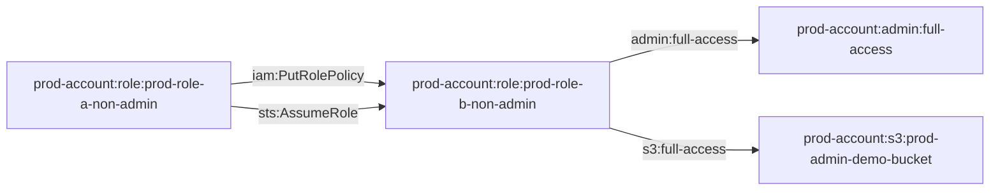

# prod_role_has_putrolepolicy_on_non_admin_role

A privilege escalation scenario where a non-admin role can modify another non-admin role's policies to gain administrative access.

## Overview

This module demonstrates a dangerous privilege escalation attack where RoleA (a non-admin role) has `iam:PutRolePolicy` permission on RoleB (also a non-admin role). RoleA must first add an admin policy to RoleB, then assume RoleB to gain full administrative access.

## Access Path Diagram



## Access Path Details

### 1. RoleA → RoleB (Policy Modification)
- **Permission**: `iam:PutRolePolicy`
- **Scope**: Limited to RoleB only (cannot modify its own policies)
- **Implementation**: `aws_iam_policy.prod_role_a_policy`
- **Purpose**: Add admin policy to RoleB during attack

### 2. RoleA → RoleB (Role Assumption)
- **Permission**: `sts:AssumeRole`
- **Trust Policy**: RoleB trusts RoleA to assume it
- **Implementation**: `aws_iam_role.prod_role_b` trust policy

### 3. RoleB → Full Admin Access (After Policy Modification)
- **Permissions**: `*` (all actions on all resources) - added by RoleA during attack
- **Implementation**: Admin policy added by RoleA using PutRolePolicy

### 4. RoleB → S3 Bucket Access
- **Permissions**: Full S3 access to demonstrate admin capabilities
- **Implementation**: Admin policy grants access to demo bucket

## Attack Scenario

1. **Initial State**: 
   - RoleA has limited permissions but can modify RoleB's policies
   - RoleB has no policies and is non-admin
2. **Exploitation**: RoleA uses `iam:PutRolePolicy` to add admin permissions to RoleB
3. **Privilege Escalation**: RoleA assumes RoleB (which now has admin permissions)
4. **Demonstration**: Access sensitive resources (S3 bucket) to prove admin access

## Resources Created

- **RoleA**: `prod-role-a-non-admin` - Non-admin role with PutRolePolicy permission on RoleB
- **RoleB**: `prod-role-b-non-admin` - Non-admin role that trusts RoleA (starts with no policies)
- **S3 Bucket**: `prod-admin-demo-bucket-{account-id}` - Demo bucket to demonstrate admin access
- **Flag File**: `admin-flag.txt` - Contains proof of successful privilege escalation

## Security Implications

This attack demonstrates a critical privilege escalation vulnerability:
- **Limited Scope**: RoleA can only modify RoleB's policies, not its own
- **Trust Relationship**: RoleB trusts RoleA, enabling the attack
- **Policy Injection**: RoleA injects admin policy into RoleB during attack
- **Admin Access**: Results in full administrative privileges
- **Real-world Impact**: Common misconfiguration in AWS environments

## Usage

This module creates a realistic privilege escalation scenario for security research and testing. It demonstrates how seemingly limited permissions can lead to full administrative access through policy manipulation and role assumption.

## Requirements

- AWS provider configured for prod account
- Production account ID

## Demo Script

A bash script is included to demonstrate the PutRolePolicy privilege escalation attack:

### Prerequisites
- AWS CLI installed and configured
- AWS profile `pl-prod.AWSAdministratorAccess` configured
- Terraform module deployed

### Running the Demo
```bash
cd modules/prod_role_has_putrolepolicy_on_non_admin_role
./demo_attack.sh
```

### What the Demo Does
1. **Step 1**: Assumes RoleA (non-admin role) using the configured AWS profile
2. **Step 2**: Uses RoleA to add admin policy to RoleB using iam:PutRolePolicy
3. **Step 3**: Assumes RoleB (now with admin permissions)
4. **Step 4**: Demonstrates admin access by listing S3 buckets
5. **Step 5**: Accesses admin demo bucket and downloads flag file
6. **Step 6**: Shows additional admin capabilities

The script demonstrates how an attacker with limited iam:PutRolePolicy permissions can gain full administrative access by modifying trusted roles.

## Cleanup Script

A cleanup script is included to revert the permanent changes made by the attack:

### Running the Cleanup
```bash
cd modules/prod_role_has_putrolepolicy_on_non_admin_role
./clean_up_attack.sh
```

### What the Cleanup Does
1. **Step 1**: Assumes RoleA to clean up RoleB's policies
2. **Step 2**: Removes the malicious admin policy from RoleB
3. **Step 3**: Verifies RoleB no longer has admin policies
4. **Step 4**: Confirms RoleB cannot perform admin actions
5. **Step 5**: Final verification of cleanup

The cleanup script ensures that RoleB returns to its original non-admin state and the attack can no longer be performed.
