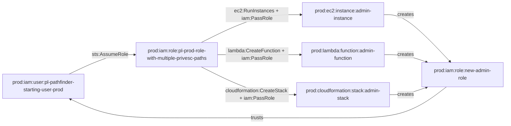

# Prod Role with Multiple Privilege Escalation Paths Module

This module creates a role with multiple privilege escalation paths and three separate service-trusting admin roles for EC2, Lambda, and CloudFormation.

## Access Path

The attack paths are:
1. `pl-pathfinder_starting_user_prod` assumes `pl-prod-role-with-multiple-privesc-paths`
2. The role can then use multiple methods to escalate privileges:
   - **EC2 Path**: Create EC2 instance with admin role → EC2 creates new admin role
   - **Lambda Path**: Create Lambda function with admin role → Lambda creates new admin role  
   - **CloudFormation Path**: Create CloudFormation stack with admin role → Stack creates new admin role

## Architecture

## Resources Created

### Privilege Escalation Role
- **Role**: `pl-prod-role-with-multiple-privesc-paths`
  - Trusts: `pl-pathfinder-starting-user-prod` user
  - Permissions: `iam:PassRole`, `lambda:CreateFunction`, `cloudformation:CreateStack`, `ec2:RunInstances`, `iam:CreateLoginProfile`

### Service Admin Roles
- **EC2 Role**: `pl-prod-ec2-admin-role`
  - Trusts: `ec2.amazonaws.com` service
  - Permissions: AdministratorAccess

- **Lambda Role**: `pl-prod-lambda-admin-role`
  - Trusts: `lambda.amazonaws.com` service
  - Permissions: AdministratorAccess

- **CloudFormation Role**: `pl-prod-cloudformation-admin-role`
  - Trusts: `cloudformation.amazonaws.com` service
  - Permissions: AdministratorAccess

## Usage

This module demonstrates multiple privilege escalation techniques where a role can:
1. Create EC2 instances with admin privileges
2. Create Lambda functions with admin privileges
3. Create CloudFormation stacks with admin privileges

Each service can then create new admin roles that trust the pathfinder starting user, proving the escalation worked.

## Demo Scripts

### demo_attack.sh
A comprehensive demo script that shows all three attack paths:
1. Assumes the privilege escalation role
2. Creates EC2 instance with admin role and payload
3. Creates Lambda function with admin role and payload
4. Creates CloudFormation stack with admin role and payload
5. Verifies that new admin roles were created
6. Cleans up all created resources

### cleanup_attack.sh
A cleanup script that removes all changes made by the demo:
1. Terminates EC2 instances
2. Deletes Lambda functions
3. Deletes CloudFormation stacks
4. Removes any admin roles created by the payloads
5. Verifies complete cleanup

## Security Implications

This pattern is dangerous because:
- It provides multiple attack vectors for privilege escalation
- Service-trusting roles with admin access are extremely powerful
- The attack can be automated and scaled
- It demonstrates real-world attack patterns used by adversaries
- Each service provides a different persistence mechanism
