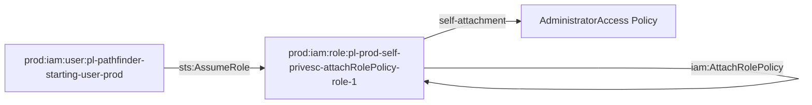

# Prod Self Privilege Escalation via AttachRolePolicy Module

This module creates a role that can escalate its own privileges by attaching managed policies to itself using `iam:AttachRolePolicy`.

## Access Path

The attack path is:
1. `pl-pathfinder_starting_user_basic` assumes `pl-prod-self-privesc-attachRolePolicy-role-1`
2. The role can then use `iam:AttachRolePolicy` to attach managed policies to itself
3. The role can attach the AdministratorAccess policy to gain full admin privileges

## Architecture

## Resources Created

- **Role**: `pl-prod-self-privesc-attachRolePolicy-role-1`
  - Trusts: `pl-pathfinder-starting-user-prod` user
  - Permissions: `iam:AttachRolePolicy` on itself only

- **Policy**: `pl-prod-self-privesc-attachRolePolicy-policy`
  - Allows: `iam:AttachRolePolicy` on the role itself
  - Resource: The role's own ARN (not wildcard)

## Usage

This module demonstrates a self-privilege escalation attack where a role can attach managed policies to itself. This is particularly dangerous because:

1. The role starts with minimal permissions
2. It can attach any managed policy to itself
3. It can attach the AdministratorAccess policy for full privileges
4. The attack is self-contained and doesn't require external resources

## Demo Scripts

### demo_attack.sh
A demo script that shows how to:
1. Assume the role using the pathfinder starting user credentials
2. Use `aws iam attach-role-policy` to attach the AdministratorAccess policy
3. Verify the escalation worked
4. Clean up the attached policy

### cleanup_attack.sh
A cleanup script that removes any changes made by the demo script:
1. Assumes the role using the pathfinder starting user credentials
2. Detaches the AdministratorAccess policy created during the demo
3. Checks for and optionally detaches other dangerous policies
4. Verifies the role is back to its original state

## Security Implications

This pattern is dangerous because:
- It allows privilege escalation without external dependencies
- The role can attach any managed policy to itself
- It can gain administrator access through policy attachment
- It's difficult to detect as it appears as normal policy management
- It bypasses typical privilege escalation detection mechanisms

## Difference from PutRolePolicy Module

This module uses `iam:AttachRolePolicy` (managed policies) instead of `iam:PutRolePolicy` (inline policies):
- **AttachRolePolicy**: Attaches existing managed policies to the role
- **PutRolePolicy**: Creates inline policies directly on the role
