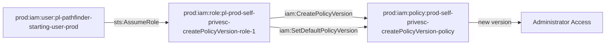

# Prod Self Privilege Escalation via CreatePolicyVersion Module

This module creates a role that can escalate its own privileges by creating new versions of policies attached to itself using `iam:CreatePolicyVersion` and `iam:SetDefaultPolicyVersion`.

## Access Path

The attack path is:
1. `pl-pathfinder_starting_user_basic` assumes `pl-prod-self-privesc-createPolicyVersion-role-1`
2. The role can then use `iam:CreatePolicyVersion` to create a new version of its own policy with elevated permissions
3. The role uses `iam:SetDefaultPolicyVersion` to make the new version active
4. The role now has the elevated permissions defined in the new policy version

## Architecture

## Resources Created

- **Role**: `pl-prod-self-privesc-createPolicyVersion-role-1`
  - Trusts: `pl-pathfinder-starting-user-prod` user
  - Permissions: `iam:CreatePolicyVersion` and `iam:SetDefaultPolicyVersion` on its own policy

- **Policy**: `pl-prod-self-privesc-createPolicyVersion-policy`
  - Allows: `iam:CreatePolicyVersion` and `iam:SetDefaultPolicyVersion` on the policy itself
  - Resource: The policy's own ARN (not wildcard)

## Usage

This module demonstrates a self-privilege escalation attack where a role can modify its own permissions by creating new policy versions. This is particularly dangerous because:

1. The role starts with minimal permissions
2. It can create new versions of its own policy with any permissions
3. It can set the new version as the default to activate the permissions
4. The attack is self-contained and doesn't require external resources

## Demo Scripts

### demo_attack.sh
A demo script that shows how to:
1. Assume the role using the pathfinder starting user credentials
2. Use `aws iam create-policy-version` to create a new policy version with admin permissions
3. Use `aws iam set-default-policy-version` to activate the new version
4. Verify the escalation worked
5. Clean up by reverting to the original policy version

### cleanup_attack.sh
A cleanup script that removes any changes made by the demo script:
1. Assumes the role using the pathfinder starting user credentials
2. Reverts to the original policy version created by Terraform
3. Deletes any additional policy versions created during the demo
4. Verifies the role is back to its original state

## Security Implications

This pattern is dangerous because:
- It allows privilege escalation without external dependencies
- The role can modify its own permissions through policy versioning
- It can gain administrator access through policy modification
- It's difficult to detect as it appears as normal policy management
- It bypasses typical privilege escalation detection mechanisms
- Policy versioning is often overlooked in security monitoring

## Difference from Other Self-Privilege Escalation Modules

This module uses `iam:CreatePolicyVersion` instead of other methods:
- **PutRolePolicy**: Creates inline policies directly on the role
- **AttachRolePolicy**: Attaches existing managed policies to the role
- **CreatePolicyVersion**: Modifies existing managed policies by creating new versions

## Policy Versioning Attack

The attack works by:
1. Creating a new version of the existing policy with elevated permissions
2. Setting the new version as the default (active) version
3. The role immediately gains the new permissions
4. The attack can be hidden by reverting to the original version after use
