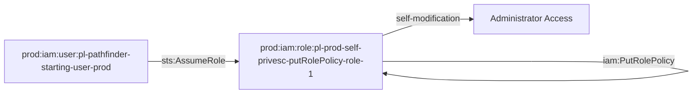

# Prod Self Privilege Escalation via PutRolePolicy Module

This module creates a role that can escalate its own privileges by modifying its own role policy using `iam:PutRolePolicy`.

## Access Path

The attack path is:
1. `pl-pathfinder_starting_user_basic` assumes `pl-prod-self-privesc-putRolePolicy-role-1`
2. The role can then use `iam:PutRolePolicy` to modify its own role policy
3. The role can grant itself administrator access or other elevated permissions

## Architecture

## Resources Created

- **Role**: `pl-prod-self-privesc-putRolePolicy-role-1`
  - Trusts: `pl-pathfinder-starting-user-prod` user
  - Permissions: `iam:PutRolePolicy` on itself only

- **Policy**: `pl-prod-self-privesc-putRolePolicy-policy`
  - Allows: `iam:PutRolePolicy` on the role itself
  - Resource: The role's own ARN (not wildcard)

## Usage

This module demonstrates a self-privilege escalation attack where a role can modify its own permissions. This is particularly dangerous because:

1. The role starts with minimal permissions
2. It can grant itself additional permissions
3. It can eventually grant itself administrator access
4. The attack is self-contained and doesn't require external resources

## Demo Scripts

### demo_attack.sh
A demo script that shows how to:
1. Assume the role using the pathfinder starting user credentials
2. Use `aws iam put-role-policy` to modify the role's policy
3. Grant the role administrator access
4. Verify the escalation worked

### cleanup_attack.sh
A cleanup script that removes any changes made by the demo script:
1. Assumes the role using the pathfinder starting user credentials
2. Removes the self-admin-policy created during the demo
3. Checks for and optionally removes other dangerous policies
4. Verifies the role is back to its original state

## Security Implications

This pattern is dangerous because:
- It allows privilege escalation without external dependencies
- The role can grant itself any permissions
- It's difficult to detect as it appears as normal role policy management
- It bypasses typical privilege escalation detection mechanisms
