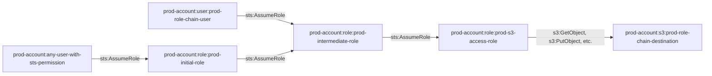

# prod_simple_explicit_role_assumption_chain

A 3-hop role assumption chain in the production environment with an S3 bucket destination.

## Overview

This module demonstrates a simple 3-hop role assumption chain where each role can assume the next role in the chain, ultimately granting access to an S3 bucket. The chain also includes an IAM user that can directly assume the intermediate role.

## Access Path Diagram



## Access Path Details

### Chain 1: Prod Account (any user with sts:AssumeRole permission) → Initial Role → Intermediate Role → S3 Access Role → S3 Bucket
1. **Prod Account → Initial Role**
   - Permission: `sts:AssumeRole`
   - Trust Policy: Allows any user in prod account with sts:AssumeRole permission to assume initial role
   - Implementation: `aws_iam_role.prod_initial_role` (name: `pl-prod-initial-role`)

2. **Initial Role → Intermediate Role**
   - Permission: `sts:AssumeRole`
   - Trust Policy: Allows initial role to assume intermediate role
   - Implementation: `aws_iam_role_policy.prod_initial_policy` (commented out)

3. **Intermediate Role → S3 Access Role**
   - Permission: `sts:AssumeRole`
   - Trust Policy: Allows intermediate role to assume S3 access role
   - Implementation: `aws_iam_role_policy.prod_intermediate_policy` (name: `pl-prod-intermediate-policy`)

4. **S3 Access Role → S3 Bucket**
   - Permissions: `s3:GetObject`, `s3:PutObject`, `s3:DeleteObject`, `s3:ListBucket`, etc.
   - Implementation: `aws_iam_policy.prod_s3_access_policy` (name: `pl-prod-s3-access-policy`)

### Chain 2: IAM User → Intermediate Role → S3 Access Role → S3 Bucket
1. **IAM User → Intermediate Role**
   - Permission: `sts:AssumeRole`
   - Trust Policy: Allows IAM user to assume intermediate role
   - Implementation: `aws_iam_user_policy.prod_chain_user_policy` (commented out)

2. **Intermediate Role → S3 Access Role** (same as above)
3. **S3 Access Role → S3 Bucket** (same as above)

## Resources Created

- **S3 Bucket**: `pl-prod-role-chain-destination-{account-id}` - The destination bucket with full read/write access
- **Role 1**: `pl-prod-initial-role` - Can be assumed by any user in prod account with sts:AssumeRole permission
- **Role 2**: `pl-prod-intermediate-role` - Can be assumed by initial role and IAM user
- **Role 3**: `pl-prod-s3-access-role` - Has full S3 access to the destination bucket
- **IAM User**: `pl-prod-role-chain-user` - Can directly assume the intermediate role

## Usage

This module creates a complete 3-hop role assumption chain that can be used for testing cross-account access patterns and privilege escalation scenarios.

## Requirements

- AWS provider configured for prod account
- Production account ID
- Operations account ID

## Demo Script

A bash script is included to demonstrate the 3-hop role assumption chain attack:

### Prerequisites
- AWS CLI installed and configured
- AWS profile `pl-prod.AWSAdministratorAccess` configured
- Terraform module deployed

### Running the Demo
```bash
cd modules/prod_simple_explicit_role_assumption_chain
./demo_attack.sh
```

### What the Demo Does
1. **Step 1**: Assumes the initial role using the configured AWS profile
2. **Step 2**: Uses the initial role's credentials to assume the intermediate role
3. **Step 3**: Uses the intermediate role's credentials to assume the S3 access role
4. **Step 4**: Lists S3 buckets to find the target bucket
5. **Step 5**: Lists the contents of the S3 bucket using the final role's permissions

The script demonstrates how an attacker can traverse the entire role chain to gain access to sensitive S3 data, starting from a user with minimal permissions in the prod account.
