# Multi-Hop Cross-Account Privilege Escalation (Both Sides)

This module demonstrates a complex multi-hop privilege escalation attack that spans both dev and prod accounts, using login profile manipulation to escalate privileges across account boundaries.

## Attack Path Overview

The attack path shows how a dev user can escalate to admin privileges across both dev and prod accounts through a series of role assumptions and login profile manipulations.

## Access Path Diagram

```mermaid
graph LR
    %% Nodes
    Pathfinder[dev:user:pl-pathfinder-starting-user-dev]
    Helpdesk[dev:role:pl-helpdesk]
    Josh[dev:user:pl-Josh]
    TrustsDev[prod:role:pl-trustsdev]
    Jeremy[prod:user:pl-Jeremy]
    
    %% Edges
    Pathfinder -->|sts:AssumeRole| Helpdesk
    Helpdesk -->|iam:CreateLoginProfile| Josh
    Josh -->|sts:AssumeRole| TrustsDev
    TrustsDev -->|iam:UpdateLoginProfile| Jeremy
    
    %% Styling
    classDef userNode fill:#e1f5fe,stroke:#01579b,stroke-width:2px
    classDef roleNode fill:#fff3e0,stroke:#f57c00,stroke-width:2px
    classDef adminNode fill:#ffebee,stroke:#c62828,stroke-width:2px
    
    class Pathfinder userNode
    class Helpdesk roleNode
    class Josh adminNode
    class TrustsDev roleNode
    class Jeremy adminNode
```



## Attack Steps

1. **Initial State**: Dev user `pl-pathfinder-starting-user-dev` has `sts:AssumeRole` permission on `pl-helpdesk` role
2. **First Hop**: Dev user assumes the `pl-helpdesk` role in dev account
3. **Login Profile Creation**: Helpdesk role creates a login profile for `pl-Josh` user (admin in dev)
4. **Second Hop**: Josh user (now with login profile) assumes the `pl-trustsdev` role in prod account
5. **Login Profile Update**: Trustsdev role updates the login profile for `pl-Jeremy` user (admin in prod)
6. **Admin Access**: Jeremy now has admin access in prod account

## Resources Created

### Dev Environment (`dev.tf`)
- **Josh User** (`pl-Josh`): Admin user in dev environment
- **Josh Admin Policy**: Full admin policy attached to Josh user
- **Helpdesk Role** (`pl-helpdesk`): Role that trusts pathfinder starting user
- **Helpdesk Policy**: Policy with `iam:CreateLoginProfile` and related permissions

### Prod Environment (`prod.tf`)
- **Jeremy User** (`pl-Jeremy`): Admin user in prod environment with initial login profile
- **Jeremy Admin Policy**: Full admin policy attached to Jeremy user
- **Trustsdev Role** (`pl-trustsdev`): Role that trusts Josh user from dev account
- **Trustsdev Policy**: Policy with `iam:UpdateLoginProfile` and related permissions

## Prerequisites

- AWS CLI configured with appropriate credentials
- The pathfinder starting user must have permission to assume the helpdesk role
- The helpdesk role must have `iam:CreateLoginProfile` permission
- Josh user must have permission to assume the trustsdev role
- The trustsdev role must have `iam:UpdateLoginProfile` permission
- Jeremy user must exist with an initial login profile

## Usage

### Deploy the Module

```bash
# From the project root
terraform init
terraform plan
terraform apply
```

### Run the Attack Demo

```bash
# Navigate to the module directory
cd modules/paths/x-account-from-dev-to-prod-multi-hop-privesc-both-sides

# Make the demo script executable
chmod +x demo_attack.sh

# Run the attack demo
./demo_attack.sh
```

### Cleanup After Demo

```bash
# Make the cleanup script executable
chmod +x cleanup_attack.sh

# Run the cleanup script
./cleanup_attack.sh
```

## Demo Script Details

The `demo_attack.sh` script demonstrates the complete attack flow:

1. **Verification**: Checks current identity and permissions
2. **First Role Assumption**: Assumes the helpdesk role in dev
3. **Login Profile Creation**: Creates login profile for Josh user
4. **Second Role Assumption**: Josh assumes trustsdev role in prod
5. **Login Profile Update**: Updates Jeremy's login profile in prod
6. **Admin Verification**: Confirms admin access in both accounts
7. **Cleanup**: Resets login profiles to original state

## Security Implications

This attack demonstrates a critical multi-hop privilege escalation vulnerability:

- **Cross-Account Access**: Dev user can access prod resources
- **Login Profile Manipulation**: Login profiles can be used to escalate privileges
- **Multi-Hop Escalation**: Complex attack chain across multiple accounts
- **High Impact**: Full admin access in both dev and prod accounts

## Mitigation Strategies

1. **Principle of Least Privilege**: Avoid granting `iam:CreateLoginProfile` and `iam:UpdateLoginProfile` permissions unless absolutely necessary
2. **Cross-Account Restrictions**: Limit cross-account role assumptions to specific use cases
3. **Login Profile Monitoring**: Monitor and alert on login profile creation and updates
4. **Role Trust Policies**: Use more restrictive trust policies for cross-account roles
5. **Regular Audits**: Regularly audit cross-account permissions and login profile usage
6. **Multi-Factor Authentication**: Require MFA for sensitive operations
7. **Account Isolation**: Implement stronger boundaries between dev and prod accounts

## Testing

This module is included in the automated test suite. To run tests:

```bash
# From the project root
cd tests
./run_all_tests.sh
```

The test will verify that:
- The multi-hop role assumption works
- Login profile creation and updates work correctly
- Admin access is confirmed in both accounts
- The cleanup process works correctly

## Outputs

- `josh_user_name`: The name of the Josh user in dev
- `josh_user_arn`: The ARN of the Josh user in dev
- `helpdesk_role_name`: The name of the helpdesk role in dev
- `helpdesk_role_arn`: The ARN of the helpdesk role in dev
- `jeremy_user_name`: The name of the Jeremy user in prod
- `jeremy_user_arn`: The ARN of the Jeremy user in prod
- `trustsdev_role_name`: The name of the trustsdev role in prod
- `trustsdev_role_arn`: The ARN of the trustsdev role in prod

## Variables

- `dev_account_id`: The AWS account ID for the dev environment
- `prod_account_id`: The AWS account ID for the prod environment
- `operations_account_id`: The AWS account ID for the operations environment
- `resource_suffix`: Random suffix for globally namespaced resources
