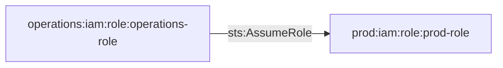

# Cross-Account from Operations to Prod Simple Role Assumption

This module demonstrates cross-account role trust relationships between operations and production accounts, allowing simple role assumption from operations to prod.

## Access Path Diagram

## Access Path Details

### 1. Operations Role → Prod Role
- **Permission**: `sts:AssumeRole`
- **Trust Policy**: Allows operations role to assume prod role
- **Implementation**: Cross-account role trust relationship

## Usage

This module establishes trust relationships between operations and production accounts, allowing operations teams to assume roles in the production environment for maintenance and monitoring purposes.

## Requirements

- AWS provider configured for both operations and prod accounts
- Account IDs for operations and prod environments
