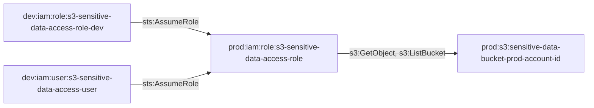

# Cross-Account from Dev to Prod Role Assumption

This module demonstrates cross-account role assumption from dev to prod environments, enabling dev resources to assume roles in the production account.

## Access Path Diagram

## Access Path Details

### 1. Dev Role → Prod Role
- **Permission**: `sts:AssumeRole`
- **Trust Policy**: Allows dev role to assume prod role
- **Implementation**: Cross-account role trust relationship

### 2. Dev User → Prod Role
- **Permission**: `sts:AssumeRole`
- **Trust Policy**: Allows dev user to assume prod role
- **Implementation**: User policy with assume role permissions

### 3. Prod Role → S3 Bucket
- **Permissions**: `s3:GetObject`, `s3:ListBucket`
- **Implementation**: Role policy with S3 access permissions

## Usage

This module creates the necessary IAM roles, users, and policies to enable cross-account access from dev to prod environments. The module handles both role-based and user-based access patterns for S3 resources.

## Requirements

- AWS provider configured for both dev and prod accounts
- Account IDs for dev and prod environments
