# Cross-Account Lambda Function Code Update Attack

* **Category:** Privilege Escalation
* **Sub-Category:** privilege-chaining
* **Path Type:** cross-account
* **Target:** to-admin
* **Environments:** dev, prod
* **Technique:** Cross-account Lambda function code injection to extract admin credentials

This module demonstrates a cross-account privilege escalation attack where a dev role can update and invoke a prod Lambda function to extract credentials from the Lambda execution role.

## Attack Path Overview

The attack path shows how a dev role with Lambda invoke and update permissions can modify a prod Lambda function to extract credentials and gain administrative access to the prod account.

## Access Path Diagram

```mermaid
graph LR
    %% Nodes
    DevUser[dev:iam:pl-pathfinding-starting-user-dev]
    DevRole[dev:iam:pl-dev-lambda-invoke-role]
    ProdLambda[prod:lambda:pl-prod-hello-world]
    LambdaRole[prod:iam:pl-prod-lambda-execution-role]
    AdminAccess[prod:admin:full-access]
    
    %% Edges
    DevUser -->|sts:AssumeRole| DevRole
    DevRole -->|lambda:UpdateFunctionCode| ProdLambda
    DevRole -->|lambda:InvokeFunction| ProdLambda
    ProdLambda -->|uses| LambdaRole
    LambdaRole -->|admin:full-access| AdminAccess
    
    %% Styling
    classDef userNode fill:#e1f5fe,stroke:#01579b,stroke-width:2px
    classDef roleNode fill:#fff3e0,stroke:#f57c00,stroke-width:2px
    classDef lambdaNode fill:#f3e5f5,stroke:#7b1fa2,stroke-width:2px
    classDef adminNode fill:#ffebee,stroke:#c62828,stroke-width:2px
    
    class DevUser userNode
    class DevRole roleNode
    class ProdLambda lambdaNode
    class LambdaRole adminNode
    class AdminAccess adminNode
```



## Attack Steps

1. **Initial State**: Dev user `pl-pathfinding-starting-user-dev` can assume the `pl-dev-lambda-invoke-role`
2. **Role Assumption**: Dev user assumes the dev Lambda invoke role
3. **Function Update**: The dev role uses `lambda:UpdateFunctionCode` to replace the prod Lambda function with malicious code
4. **Function Invocation**: The dev role uses `lambda:InvokeFunction` to execute the malicious code
5. **Credential Extraction**: The malicious Lambda function extracts credentials from the Lambda execution role
6. **Admin Access**: The extracted credentials provide full administrative access to the prod account

## Resources Created

### Dev Environment (`dev.tf`)
- **Lambda Invoke Role** (`pl-dev-lambda-invoke-role`): Role that trusts the dev starting user
- **Lambda Invoke Policy**: Policy with `lambda:InvokeFunction` and `lambda:UpdateFunctionCode` permissions on prod Lambda functions

### Prod Environment (`prod.tf`)
- **Lambda Execution Role** (`pl-prod-lambda-execution-role`): Role with AdministratorAccess policy
- **Hello World Lambda Function**: Simple Python function that can be replaced with malicious code
- **Lambda Resource Policies**: Policies that allow the entire dev account to invoke and update the function

## Prerequisites

- AWS CLI configured with appropriate credentials
- The dev starting user must have permission to assume the dev Lambda invoke role
- The dev role must have `lambda:InvokeFunction` and `lambda:UpdateFunctionCode` permissions
- The prod Lambda function must have resource policies allowing dev account access

## Usage

### Deploy the Module

```bash
# From the project root
terraform init
terraform plan
terraform apply
```

### Run the Attack Demo

```bash
# Navigate to the module directory
cd modules/paths/x-account-from-dev-to-prod-invoke-and-update-on-prod-lambda

# Make the demo script executable
chmod +x demo_attack.sh

# Run the attack demo
./demo_attack.sh
```

### Cleanup After Demo

```bash
# Make the cleanup script executable
chmod +x cleanup_attack.sh

# Run the cleanup script
./cleanup_attack.sh
```

## Demo Script Details

The `demo_attack.sh` script demonstrates the complete attack flow:

1. **Role Assumption**: Assumes the dev Lambda invoke role
2. **Function Discovery**: Finds the prod Lambda function
3. **Malicious Code Creation**: Creates malicious Python code for credential extraction
4. **Function Update**: Updates the prod Lambda function with malicious code
5. **Function Invocation**: Invokes the malicious function to extract credentials
6. **Credential Display**: Shows the extracted credentials and their potential impact

## Security Implications

This attack demonstrates a critical cross-account privilege escalation vulnerability:

- **Cross-Account Access**: Dev role can modify and execute prod Lambda functions
- **Code Injection**: Ability to inject malicious code into prod Lambda functions
- **Credential Extraction**: Lambda execution roles often have high privileges
- **High Impact**: Full administrative access through credential extraction
- **Stealthy**: Appears as normal Lambda function operations

## Mitigation Strategies

1. **Principle of Least Privilege**: Avoid granting `lambda:UpdateFunctionCode` permissions unless absolutely necessary
2. **Cross-Account Restrictions**: Limit cross-account Lambda permissions to specific use cases
3. **Resource Policy Auditing**: Regularly audit Lambda resource policies
4. **Code Review**: Implement code review processes for Lambda function updates
5. **Monitoring**: Monitor and alert on Lambda function code changes
6. **Execution Role Restrictions**: Limit Lambda execution role permissions
7. **Network Isolation**: Use VPC endpoints and network restrictions for Lambda functions

## Testing

This module is included in the automated test suite. To run tests:

```bash
# From the project root
cd tests
./run_all_tests.sh
```

The test will verify that:
- The cross-account role assumption works
- The dev role can update the prod Lambda function
- The malicious code can be injected and executed
- Credentials can be extracted from the Lambda execution role
- The cleanup process works correctly

## Outputs

- `dev_lambda_invoke_role_name`: The name of the dev Lambda invoke role
- `dev_lambda_invoke_role_arn`: The ARN of the dev Lambda invoke role
- `prod_lambda_function_name`: The name of the prod Lambda function
- `prod_lambda_function_arn`: The ARN of the prod Lambda function
- `prod_lambda_execution_role_name`: The name of the prod Lambda execution role
- `prod_lambda_execution_role_arn`: The ARN of the prod Lambda execution role

## Variables

- `dev_account_id`: The AWS account ID for the dev environment
- `prod_account_id`: The AWS account ID for the prod environment
- `operations_account_id`: The AWS account ID for the operations environment
- `resource_suffix`: Random suffix for globally namespaced resources

## Technical Details

### Malicious Code Example

The malicious Lambda function code extracts credentials:

```python
import boto3
import json

def lambda_handler(event, context):
    # Get the Lambda execution role credentials
    session = boto3.Session()
    credentials = session.get_credentials()
    
    # Extract credential information
    cred_data = {
        'access_key_id': credentials.access_key,
        'secret_access_key': credentials.secret_key,
        'session_token': credentials.token,
        'region': session.region_name,
        'function_name': context.function_name,
        'function_arn': context.invoked_function_arn,
        'account_id': context.invoked_function_arn.split(':')[4]
    }
    
    return {
        'statusCode': 200,
        'body': json.dumps({
            'message': 'Credentials extracted successfully',
            'credentials': cred_data
        })
    }
```

### Resource Policy Example

The Lambda resource policy allows dev account access:

```json
{
  "Version": "2012-10-17",
  "Statement": [
    {
      "Sid": "AllowDevAccount",
      "Effect": "Allow",
      "Principal": {
        "AWS": "arn:aws:iam::DEV_ACCOUNT:root"
      },
      "Action": [
        "lambda:InvokeFunction",
        "lambda:UpdateFunctionCode"
      ],
      "Resource": "arn:aws:lambda:*:PROD_ACCOUNT:function:pl-prod-hello-world-*"
    }
  ]
}
```

This demonstrates how overly permissive Lambda resource policies can lead to critical security vulnerabilities through code injection and credential extraction.
