# Cross-Account PassRole to Lambda Admin

* **Category:** Privilege Escalation
* **Sub-Category:** privilege-chaining
* **Path Type:** cross-account
* **Target:** to-admin
* **Environments:** dev, prod
* **Technique:** Multi-hop cross-account privilege escalation using PassRole to create Lambda with admin role

This module demonstrates a multi-hop cross-account privilege escalation attack where a dev user can escalate to admin privileges through a chain of role assumptions, ultimately using `iam:PassRole` permission to create Lambda functions with admin roles.

## Attack Path Overview

The attack path shows how a dev user can escalate to admin privileges through multi-hop role assumption and PassRole permission abuse:
1. `pl-pathfinding-starting-user-dev` (user) → `pl-lambda-prod-updater` (dev role)
2. `pl-lambda-prod-updater` (dev role) → `pl-lambda-updater` (prod role)  
3. `pl-lambda-updater` (prod role) → `pl-Lambda-admin` (via PassRole to Lambda service)

## Access Path Diagram

```mermaid
graph LR
    %% Nodes
    StartingUser[dev:iam:pl-pathfinding-starting-user-dev]
    DevRole[dev:iam:pl-lambda-prod-updater]
    ProdRole[prod:iam:pl-lambda-updater]
    LambdaAdmin[prod:iam:pl-Lambda-admin]
    LambdaFunction[prod:lambda:function:admin-function]
    
    %% Edges
    StartingUser -->|sts:AssumeRole| DevRole
    DevRole -->|sts:AssumeRole| ProdRole
    ProdRole -->|iam:PassRole| LambdaAdmin
    ProdRole -->|lambda:CreateFunction| LambdaFunction
    LambdaFunction -->|uses| LambdaAdmin
    
    %% Styling
    classDef userNode fill:#e1f5fe,stroke:#01579b,stroke-width:2px
    classDef roleNode fill:#fff3e0,stroke:#f57c00,stroke-width:2px
    classDef adminNode fill:#ffebee,stroke:#c62828,stroke-width:2px
    classDef serviceNode fill:#f3e5f5,stroke:#7b1fa2,stroke-width:2px
    
    class StartingUser userNode
    class DevRole,ProdRole roleNode
    class LambdaAdmin adminNode
    class LambdaFunction serviceNode
```



## Attack Steps

1. **Initial State**: Dev user `pl-pathfinding-starting-user-dev` has `sts:AssumeRole` permission on dev role `pl-lambda-prod-updater`
2. **First Role Assumption**: Dev user assumes the dev role `pl-lambda-prod-updater`
3. **Cross-Account Assumption**: Dev role assumes the prod role `pl-lambda-updater` 
4. **PassRole Abuse**: The prod role has `iam:PassRole` permission and can pass admin roles to services
5. **Lambda Creation**: Create a Lambda function using the `pl-Lambda-admin` role (which has full admin permissions)
6. **Admin Access**: The Lambda function executes with full admin privileges

## Resources Created

### Dev Environment (`dev.tf`)
- **Lambda Prod Updater Role** (`pl-lambda-prod-updater`): Role that can be assumed by `pl-pathfinding-starting-user-dev` and has permission to assume prod role
- **Role Policy**: Policy that grants `sts:AssumeRole` permission specifically on the prod lambda-updater role

### Prod Environment (`prod.tf`)
- **Lambda Updater Role** (`pl-lambda-updater`): Role that trusts the dev lambda-prod-updater role and has PassRole permission
- **Lambda Updater Policy**: Policy with Lambda permissions and `iam:PassRole`
- **Lambda Admin Role** (`pl-Lambda-admin`): Admin role that can be passed to Lambda service
- **Lambda Admin Policy**: Full admin policy attached to the Lambda admin role

## Prerequisites

- AWS CLI configured with appropriate credentials
- The dev user `pl-pathfinding-starting-user-dev` must have permission to assume the dev role `pl-lambda-prod-updater`
- The dev role must have permission to assume the prod role `pl-lambda-updater`
- The prod role must have `iam:PassRole` permission
- The Lambda admin role must exist and be assumable by Lambda service

## Usage

### Deploy the Module

```bash
# From the project root
terraform init
terraform plan
terraform apply
```

### Run the Attack Demo

```bash
# Navigate to the module directory
cd modules/paths/x-account-from-dev-to-prod-role-assumption-passrole-to-lambda-admin

# Make the demo script executable
chmod +x demo_attack.sh

# Run the attack demo
./demo_attack.sh
```

### Cleanup After Demo

```bash
# Make the cleanup script executable
chmod +x cleanup_attack.sh

# Run the cleanup script
./cleanup_attack.sh
```

## Demo Script Details

The `demo_attack.sh` script demonstrates the complete attack flow:

1. **Verification**: Checks current identity and permissions
2. **First Role Assumption**: Assumes the dev lambda-prod-updater role
3. **Cross-Account Role Assumption**: Assumes the prod lambda-updater role
4. **PassRole Abuse**: Creates a Lambda function using the admin role
5. **Admin Verification**: Invokes the Lambda function to confirm admin access
6. **Cleanup**: Removes the created Lambda function

## Security Implications

This attack demonstrates a critical multi-hop cross-account privilege escalation vulnerability:

- **Multi-Hop Privilege Escalation**: Chain of role assumptions from user to dev role to prod role
- **Cross-Account Access**: Dev roles can access prod resources through trust relationships
- **PassRole Abuse**: `iam:PassRole` permission allows escalating to admin roles
- **Service Trust**: Lambda service can assume admin roles
- **High Impact**: Full admin access through Lambda function execution

## Mitigation Strategies

1. **Principle of Least Privilege**: Avoid granting `iam:PassRole` permissions unless absolutely necessary
2. **Cross-Account Restrictions**: Limit cross-account role assumptions to specific use cases
3. **Multi-Hop Prevention**: Avoid creating long chains of role assumptions; use direct access where possible
4. **Role Trust Policies**: Use more restrictive trust policies for service roles
5. **PassRole Monitoring**: Monitor and alert on PassRole usage
6. **Regular Audits**: Regularly audit cross-account permissions and PassRole usage
7. **Service Role Restrictions**: Limit which roles can be passed to which services

## Testing

This module is included in the automated test suite. To run tests:

```bash
# From the project root
cd tests
./run_all_tests.sh
```

The test will verify that:
- The dev role assumption works
- The cross-account role assumption works
- PassRole permission allows creating Lambda with admin role
- The Lambda function executes with admin privileges
- The cleanup process works correctly

## Outputs

- `lambda_prod_updater_role_name`: The name of the lambda prod updater role in dev
- `lambda_prod_updater_role_arn`: The ARN of the lambda prod updater role
- `lambda_updater_role_name`: The name of the lambda updater role in prod
- `lambda_updater_role_arn`: The ARN of the lambda updater role in prod
- `lambda_admin_role_name`: The name of the lambda admin role in prod
- `lambda_admin_role_arn`: The ARN of the lambda admin role in prod

## Variables

- `dev_account_id`: The AWS account ID for the dev environment
- `prod_account_id`: The AWS account ID for the prod environment
- `operations_account_id`: The AWS account ID for the operations environment
- `resource_suffix`: Random suffix for globally namespaced resources
