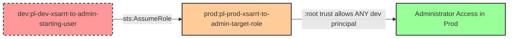

# Cross-Account Privilege Escalation: Dev to Prod Root Trust Role Assumption

* **Category:** Privilege Escalation
* **Sub-Category:** principal-access
* **Path Type:** cross-account
* **Target:** to-admin
* **Environments:** dev, prod
* **Cost Estimate:** $0/mo
* **Technique:** Cross-account role assumption exploiting overly permissive :root trust policy
* **Terraform Variable:** `enable_cross_account_dev_to_prod_one_hop_root_trust_role_assumption`
* **Schema Version:** 1.0.0
* **Attack Path:** dev:starting_user → (AssumeRole) → prod:target_role (trusts :root) → admin access in prod
* **Attack Principals:** `arn:aws:iam::{dev_account_id}:user/pl-dev-xsarrt-to-admin-starting-user`; `arn:aws:iam::{prod_account_id}:role/pl-prod-xsarrt-to-admin-target-role`
* **Required Permissions:** `sts:AssumeRole` on `arn:aws:iam::{prod_account_id}:role/pl-prod-xsarrt-to-admin-target-role`
* **Helpful Permissions:** `sts:GetCallerIdentity` (Verify current identity before and after role assumption); `iam:ListRoles` (Discover assumable roles in the target account)
* **MITRE Tactics:** TA0004 - Privilege Escalation, TA0008 - Lateral Movement
* **MITRE Techniques:** T1078.004 - Valid Accounts: Cloud Accounts

## Attack Overview

This scenario demonstrates a critical cross-account privilege escalation vulnerability where a production administrative role trusts the entire dev account via the `:root` principal, rather than trusting specific users or roles. This represents one of the most dangerous misconfigurations in multi-account AWS environments.

The attack exploits an overly permissive trust policy in the prod account that trusts `arn:aws:iam::{DEV_ACCOUNT}:root` instead of specific principal ARNs. When a trust policy uses the `:root` principal, it means **ANY** principal in that account can assume the role, as long as they have `sts:AssumeRole` permission. This is far more dangerous than trusting specific users or roles.

In this scenario, a user in the dev account with `sts:AssumeRole` permission can assume the production admin role and gain full administrative access. If ANY principal in the dev account is compromised, the attacker can immediately escalate to production admin privileges. This violates the fundamental security principle that production accounts should have stricter access controls than development accounts.

### MITRE ATT&CK Mapping

- **Tactic**: TA0004 - Privilege Escalation, TA0008 - Lateral Movement
- **Technique**: T1078.004 - Valid Accounts: Cloud Accounts
- **Description**: Adversary uses valid credentials to assume cross-account roles, exploiting overly permissive :root trust policies to escalate from a lower-privileged dev account to gain administrative access in a production account

### Principals in the attack path

- `arn:aws:iam::{DEV_ACCOUNT}:user/pl-dev-xsarrt-to-admin-starting-user` (Dev account starting user with AssumeRole permission)
- `arn:aws:iam::{PROD_ACCOUNT}:role/pl-prod-xsarrt-to-admin-target-role` (Prod account admin role with :root trust policy)

### Attack Path Diagram



### Attack Steps

1. **Initial Access**: Start as `pl-dev-xsarrt-to-admin-starting-user` in the dev account (credentials provided via Terraform outputs)
2. **Cross-Account Role Assumption**: Use `sts:AssumeRole` to assume `pl-prod-xsarrt-to-admin-target-role` in the prod account
3. **Exploitation of :root Trust**: The role's trust policy trusts `arn:aws:iam::{DEV_ACCOUNT}:root`, allowing ANY dev principal with AssumeRole permission to assume it
4. **Verification**: Verify administrative access in the prod account by listing IAM users or performing other admin-only operations

### Scenario specific resources created

| ARN | Purpose |
| -- | -- |
| `arn:aws:iam::{DEV_ACCOUNT}:user/pl-dev-xsarrt-to-admin-starting-user` | Dev account starting user with cross-account AssumeRole permission |
| `arn:aws:iam::{PROD_ACCOUNT}:role/pl-prod-xsarrt-to-admin-target-role` | Prod account admin role with DANGEROUS :root trust policy |

### Why :root Trust is Dangerous

The key vulnerability is the trust policy format:

**VULNERABLE (This Scenario):**
```json
{
  "Version": "2012-10-17",
  "Statement": [
    {
      "Effect": "Allow",
      "Principal": {
        "AWS": "arn:aws:iam::{DEV_ACCOUNT}:root"
      },
      "Action": "sts:AssumeRole"
    }
  ]
}
```

This trusts **ALL** principals in the dev account. Any user, role, or service in dev with `sts:AssumeRole` permission can assume this role.

**SAFER (Explicit Principal Trust):**
```json
{
  "Version": "2012-10-17",
  "Statement": [
    {
      "Effect": "Allow",
      "Principal": {
        "AWS": "arn:aws:iam::{DEV_ACCOUNT}:user/specific-approved-user"
      },
      "Action": "sts:AssumeRole"
    }
  ]
}
```

This trusts only the specific user. Even if other dev principals are compromised, they cannot assume the role.

**Impact Comparison:**
- **:root trust**: Compromise of ANY dev principal = production admin access
- **Explicit trust**: Compromise requires access to the SPECIFIC trusted principal
- **:root trust**: Blast radius includes entire dev account (hundreds of potential principals)
- **Explicit trust**: Blast radius limited to single trusted principal

## Attack Lab

### Prerequisites

1. Install the `plabs` CLI:
   ```bash
   brew install pathfinding-labs/tap/plabs
   ```
2. Configure your AWS profiles in `~/.plabs/plabs.yaml` (or run `plabs init` if you haven't already)

### Deploy with plabs non-interactive

```bash
plabs enable enable_cross_account_dev_to_prod_one_hop_root_trust_role_assumption
plabs apply
```

### Deploy with plabs tui

1. Launch the TUI: `plabs`
2. Navigate to this scenario in the scenarios list
3. Press `space` to enable it
4. Press `d` to deploy

### Executing the automated demo_attack script

The script will:
1. Display a step-by-step walkthrough with color-coded output
2. Show the commands being executed and their results
3. Demonstrate how the :root trust allows the assumption
4. Verify successful cross-account privilege escalation to admin
5. Output standardized test results for automation

#### Resources created by attack script

- No persistent resources are created; `sts:AssumeRole` sessions are temporary and expire automatically

#### With plabs non-interactive

```bash
plabs demo --list
plabs demo root-trust-role-assumption
```

#### With plabs tui

1. Launch the TUI: `plabs`
2. Navigate to this scenario in the scenarios list
3. Press `r` to run the demo script

### Cleanup

#### With plabs non-interactive

```bash
plabs cleanup --list
plabs cleanup root-trust-role-assumption
```

#### With plabs tui

1. Launch the TUI: `plabs`
2. Navigate to this scenario in the scenarios list
3. Press `c` to run the cleanup script

### Teardown with plabs non-interactive

```bash
plabs disable enable_cross_account_dev_to_prod_one_hop_root_trust_role_assumption
plabs apply
```

### Teardown with plabs tui

1. Launch the TUI: `plabs`
2. Navigate to this scenario in the scenarios list
3. Press `space` to disable it
4. Press `D` to destroy

## Detecting Misconfiguration (CSPM)

### What CSPM tools should detect

A properly configured Cloud Security Posture Management (CSPM) tool should detect:

- **:root Trust Policies**: ANY role that trusts another account's :root principal (CRITICAL SEVERITY)
- **Cross-Account Trust Violations**: Prod roles that trust principals from lower-trust environments (dev, test, sandbox)
- **Overly Permissive Trust Policies**: Trust policies using :root instead of explicit principal ARNs
- **Direct Admin Access from Non-Prod**: Cross-account paths that grant administrative access from non-production accounts
- **Missing MFA Requirements**: Trust policies for administrative roles that don't require MFA
- **Lack of External ID**: Cross-account trusts without external ID requirements (where applicable)
- **Privilege Escalation Paths**: Automated detection of dev → prod admin paths in IAM Access Analyzer
- **Trust Policy Comparison**: Flag :root trusts as significantly higher risk than explicit principal trusts

**Key Detection Indicators:**

1. **Trust Policy Pattern**: `"Principal": {"AWS": "arn:aws:iam::*:root"}`
2. **Cross-Account Boundary**: Dev account ID ≠ Prod account ID
3. **Permission Level**: Role has administrative or sensitive permissions
4. **Missing Conditions**: No MFA, external ID, or IP restrictions

### Prevention recommendations

- **NEVER Use :root in Trust Policies**: Always specify explicit principal ARNs (users or roles) in trust policies, never use :root
- **Principle of Explicit Trust**: Trust specific principals by full ARN, not entire accounts
  ```json
  {
    "Principal": {
      "AWS": "arn:aws:iam::{DEV_ACCOUNT}:role/specific-approved-role"
    }
  }
  ```
- **Audit All :root Trusts**: Use AWS Config or custom scripts to identify and remediate ALL trust policies containing :root principals
- **Use Service Control Policies (SCPs)**: Implement SCPs at the AWS Organizations level to restrict cross-account AssumeRole operations:
  ```json
  {
    "Version": "2012-10-17",
    "Statement": [
      {
        "Effect": "Deny",
        "Action": "sts:AssumeRole",
        "Resource": "arn:aws:iam::{PROD_ACCOUNT}:role/admin-*",
        "Condition": {
          "StringNotEquals": {
            "aws:PrincipalAccount": "{PROD_ACCOUNT}"
          }
        }
      }
    ]
  }
  ```
- **Require MFA for Cross-Account Admin Access**: Add MFA conditions to trust policies for administrative roles:
  ```json
  {
    "Condition": {
      "Bool": {
        "aws:MultiFactorAuthPresent": "true"
      }
    }
  }
  ```
- **Use External IDs**: For service-to-service cross-account access, require external IDs to prevent confused deputy attacks
- **Implement Separate AWS Organizations**: Keep production and non-production accounts in separate AWS Organizations with no trust relationships
- **Role Chaining Instead of Direct Trust**: Require multi-hop role assumption with approval workflows for prod access from dev accounts
- **Use IAM Access Analyzer**: Enable IAM Access Analyzer to continuously scan for external access to resources and highlight cross-account trust relationships, especially :root trusts
- **Principle of Least Privilege**: If cross-account access is required, grant only the minimum necessary permissions, not administrative access
- **Time-Based Restrictions**: Add time-of-day restrictions to trust policies to limit when cross-account access is permitted
- **IP Address Restrictions**: Require cross-account assumptions to originate from known IP ranges or VPNs:
  ```json
  {
    "Condition": {
      "IpAddress": {
        "aws:SourceIp": ["10.0.0.0/8", "192.168.0.0/16"]
      }
    }
  }
  ```
- **Regular Trust Policy Audits**: Quarterly reviews of all cross-account trust policies to ensure they follow least-privilege and explicit-trust principles
- **Automated Remediation**: Implement automated remediation to replace :root trusts with explicit principal trusts when detected
- **Security Hub Integration**: Enable AWS Security Hub to receive findings about overly permissive trust policies
- **Break-Glass Process**: For legitimate cross-account access needs, implement break-glass emergency access with approval workflows instead of standing :root trusts

## Detection Abuse (CloudSIEM)

### CloudTrail events to monitor

- `STS: AssumeRole` — Cross-account role assumption; alert when source account ID differs from the target account ID, especially when the assumed role has administrative permissions

### Detonation logs

_Detonation log integration (Stratus Red Team / Grimoire) is planned for a future release._
