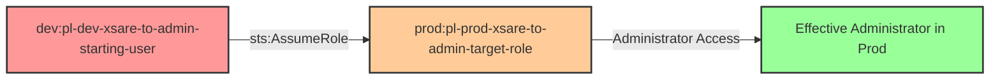

# Cross-Account Privilege Escalation: Dev to Prod Simple Role Assumption

* **Category:** Privilege Escalation
* **Sub-Category:** principal-lateral-movement
* **Path Type:** cross-account
* **Target:** to-admin
* **Environments:** dev, prod
* **Technique:** Direct cross-account role assumption from dev user to prod admin role

## Overview

This scenario demonstrates a cross-account privilege escalation vulnerability where a user in the dev account has permission to assume an administrative role in the production account. This represents a common misconfiguration in multi-account AWS environments where non-production accounts are granted excessive trust relationships with production accounts.

The attack exploits a trust policy in the prod account that explicitly trusts a specific user in the dev account (not just the dev account's :root). When the dev user assumes the prod role, they gain full administrative access to the production environment, effectively crossing the security boundary between lower-trust (dev) and higher-trust (prod) environments.

This is particularly dangerous because it violates the principle that production accounts should have stricter access controls than development accounts. A compromise of the dev account, which typically has looser security controls, directly leads to production account compromise.

## Understanding the attack scenario

### Principals in the attack path

- `arn:aws:iam::{DEV_ACCOUNT}:user/pl-dev-xsare-to-admin-starting-user` (Dev account starting user)
- `arn:aws:iam::{PROD_ACCOUNT}:role/pl-prod-xsare-to-admin-target-role` (Prod account target role with admin permissions)

### Attack Path Diagram



### Attack Steps

1. **Initial Access**: Start as `pl-dev-xsare-to-admin-starting-user` in the dev account (credentials provided via Terraform outputs)
2. **Cross-Account Role Assumption**: Use `sts:AssumeRole` to assume `pl-prod-xsare-to-admin-target-role` in the prod account
3. **Verification**: Verify administrative access in the prod account by listing IAM users or performing other admin-only operations

### Scenario specific resources created

| ARN | Purpose |
| -- | -- |
| `arn:aws:iam::{DEV_ACCOUNT}:user/pl-dev-xsare-to-admin-starting-user` | Dev account starting user with cross-account AssumeRole permission |
| `arn:aws:iam::{PROD_ACCOUNT}:role/pl-prod-xsare-to-admin-target-role` | Prod account role with AdministratorAccess that trusts the dev user |

## Executing the attack

### Using the automated demo_attack.sh

To demonstrate the privilege escalation path, run the provided demo script:

```bash
cd modules/scenarios/cross-account/dev-to-prod/one-hop/simple-role-assumption
./demo_attack.sh
```

The script will:
1. Display a step-by-step walkthrough with color-coded output
2. Show the commands being executed and their results
3. Verify successful cross-account privilege escalation to admin
4. Output standardized test results for automation

### Cleaning up the attack artifacts

This scenario does not create persistent attack artifacts beyond the infrastructure deployed by Terraform. Role assumption is temporary and sessions expire automatically. No cleanup script is needed for this pure role assumption scenario.

## Detection and prevention

### What CSPM Should Detect

A properly configured Cloud Security Posture Management (CSPM) tool should detect:

- **Cross-Account Trust Violations**: Prod roles that trust principals from lower-trust environments (dev, test, sandbox)
- **Overly Permissive Trust Policies**: Trust policies that trust specific users instead of requiring role chaining
- **Direct Admin Access from Non-Prod**: Cross-account paths that grant administrative access from non-production accounts
- **Missing MFA Requirements**: Trust policies for administrative roles that don't require MFA
- **Lack of External ID**: Cross-account trusts without external ID requirements (where applicable)
- **Privilege Escalation Paths**: Automated detection of dev → prod admin paths in IAM Access Analyzer

### MITRE ATT&CK Mapping

- **Tactic**: TA0004 - Privilege Escalation, TA0008 - Lateral Movement
- **Technique**: T1078.004 - Valid Accounts: Cloud Accounts
- **Description**: Adversary uses valid credentials to assume cross-account roles, escalating from a lower-privileged dev account to gain administrative access in a production account

## Prevention recommendations

- **Eliminate Direct Cross-Account Trust**: Never allow production administrative roles to trust users or roles in non-production accounts directly
- **Implement Role Chaining with Break-Glass**: Require multi-hop role assumption with approval workflows for prod access from dev accounts
- **Use Service Control Policies (SCPs)**: Implement SCPs at the AWS Organizations level to restrict cross-account AssumeRole operations:
  ```json
  {
    "Version": "2012-10-17",
    "Statement": [
      {
        "Effect": "Deny",
        "Action": "sts:AssumeRole",
        "Resource": "arn:aws:iam::{PROD_ACCOUNT}:role/admin-*",
        "Condition": {
          "StringNotEquals": {
            "aws:PrincipalAccount": "{PROD_ACCOUNT}"
          }
        }
      }
    ]
  }
  ```
- **Require MFA for Cross-Account Admin Access**: Add MFA conditions to trust policies for administrative roles:
  ```json
  {
    "Condition": {
      "Bool": {
        "aws:MultiFactorAuthPresent": "true"
      }
    }
  }
  ```
- **Use External IDs**: For service-to-service cross-account access, require external IDs to prevent confused deputy attacks
- **Implement Separate AWS Organizations**: Keep production and non-production accounts in separate AWS Organizations with no trust relationships
- **Monitor CloudTrail for Cross-Account AssumeRole**: Alert on `AssumeRole` API calls where the source account differs from the target account, especially for administrative roles
- **Use IAM Access Analyzer**: Enable IAM Access Analyzer to continuously scan for external access to resources and highlight cross-account trust relationships
- **Principle of Least Privilege**: If cross-account access is required, grant only the minimum necessary permissions, not administrative access
- **Time-Based Restrictions**: Add time-of-day restrictions to trust policies to limit when cross-account access is permitted
- **IP Address Restrictions**: Require cross-account assumptions to originate from known IP ranges or VPNs
