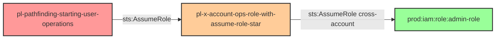

# Cross-Account from Operations to Prod Simple Role Assumption

* **Category:** Privilege Escalation
* **Sub-Category:** cross-account-escalation
* **Path Type:** cross-account
* **Target:** to-admin
* **Environments:** operations, prod
* **Cost Estimate:** $0/mo
* **Technique:** Cross-account role assumption from operations to prod
* **Terraform Variable:** `enable_cross_account_ops_to_prod_one_hop_simple_role_assumption`
* **Schema Version:** 1.0.0
* **Attack Path:** starting_user_ops → (AssumeRole) → ops_role → (sts:AssumeRole cross-account on *) → any_prod_role → privileged access
* **Attack Principals:** `arn:aws:iam::{operations_account_id}:user/pl-pathfinding-starting-user-operations`; `arn:aws:iam::{operations_account_id}:role/pl-x-account-ops-role-with-assume-role-star`; `arn:aws:iam::{prod_account_id}:role/*`
* **Required Permissions:** `sts:AssumeRole` on `*`
* **Helpful Permissions:** `iam:ListRoles` (Discover roles in prod account); `iam:GetRole` (View role trust policies and permissions)
* **MITRE Tactics:** TA0004 - Privilege Escalation, TA0008 - Lateral Movement
* **MITRE Techniques:** T1078.004 - Valid Accounts: Cloud Accounts

## Attack Overview

This module demonstrates cross-account role trust relationships between operations and production accounts, allowing simple role assumption from operations to prod.

This scenario models a common real-world configuration where an operations account is granted the ability to assume roles in a production account for maintenance and monitoring purposes. When the operations role is granted `sts:AssumeRole` on `*`, an attacker who compromises any principal in the operations account can pivot directly into any role in the production account that trusts the operations account — including administrative roles.

The danger is that a blanket `sts:AssumeRole` on `*` means the operations role is not scoped to specific prod roles. Any prod role whose trust policy allows the operations account (or the operations role) can be assumed, turning a limited operations compromise into full production account access.

### MITRE ATT&CK Mapping

- **Tactics**: TA0004 - Privilege Escalation, TA0008 - Lateral Movement
- **Technique**: T1078.004 - Valid Accounts: Cloud Accounts

### Principals in the attack path

- `arn:aws:iam::{operations_account_id}:user/pl-pathfinding-starting-user-operations` (starting user in the operations account)
- `arn:aws:iam::{operations_account_id}:role/pl-x-account-ops-role-with-assume-role-star` (operations role with unrestricted AssumeRole)
- `arn:aws:iam::{prod_account_id}:role/*` (any prod role trusting the operations account)

### Attack Path Diagram



### Attack Steps

1. **Initial Access** — Authenticate as `pl-pathfinding-starting-user-operations` in the operations account using the credentials from Terraform outputs.
2. **Assume operations role** — Call `sts:AssumeRole` to assume `pl-x-account-ops-role-with-assume-role-star`. This role has `sts:AssumeRole` on `*`.
3. **Enumerate prod roles** — Use `iam:ListRoles` (helpful permission) to discover roles in the prod account and identify those whose trust policies allow assumption from the operations account.
4. **Cross-account role assumption** — Call `sts:AssumeRole` on a privileged prod role (e.g., an admin role) using the operations role credentials.
5. **Verification** — Run `sts:GetCallerIdentity` and `iam:ListAttachedRolePolicies` (or similar) to confirm admin-level access in the prod account.

### Scenario specific resources created

| ARN | Purpose |
|-----|---------|
| `arn:aws:iam::{operations_account_id}:user/pl-pathfinding-starting-user-operations` | Starting user in the operations account |
| `arn:aws:iam::{operations_account_id}:role/pl-x-account-ops-role-with-assume-role-star` | Operations role with unrestricted sts:AssumeRole |
| `arn:aws:iam::{prod_account_id}:role/pl-x-account-prod-target-role` | Target prod role that trusts the operations account |

## Attack Lab

### Prerequisites

1. Install the `plabs` CLI:
   ```bash
   brew install pathfinding-labs/tap/plabs
   ```
2. Configure your AWS profiles in `~/.plabs/plabs.yaml` (or run `plabs init` if you haven't already)

### Deploy with plabs non-interactive

```bash
plabs enable enable_cross_account_ops_to_prod_one_hop_simple_role_assumption
plabs apply
```

### Deploy with plabs tui

1. Launch the TUI: `plabs`
2. Navigate to this scenario in the scenarios list
3. Press `space` to enable it
4. Press `d` to deploy

### Executing the automated demo_attack script

The script will:

1. Read starting credentials from Terraform outputs
2. Assume the operations role in the operations account
3. Enumerate roles in the prod account
4. Assume a privileged prod role using the operations role credentials
5. Verify elevated access in the prod account

#### Resources created by attack script

- Temporary STS session credentials for the operations role
- Temporary STS session credentials for the prod target role

#### With plabs non-interactive

```bash
plabs demo --list
plabs demo simple-role-assumption
```

#### With plabs tui

1. Launch the TUI: `plabs`
2. Navigate to this scenario in the scenarios list
3. Press `r` to run the demo script

### Cleanup

#### With plabs non-interactive

```bash
plabs cleanup --list
plabs cleanup simple-role-assumption
```

#### With plabs tui

1. Launch the TUI: `plabs`
2. Navigate to this scenario in the scenarios list
3. Press `c` to run the cleanup script

### Teardown with plabs non-interactive

```bash
plabs disable enable_cross_account_ops_to_prod_one_hop_simple_role_assumption
plabs apply
```

### Teardown with plabs tui

1. Launch the TUI: `plabs`
2. Navigate to this scenario in the scenarios list
3. Press `space` to disable it
4. Press `D` to destroy

## Detecting Misconfiguration (CSPM)

### What CSPM tools should detect

- IAM role in the operations account has `sts:AssumeRole` on `*` — this is an overly permissive cross-account permission that enables lateral movement to any role in any account
- Prod IAM role trust policy allows assumption from the operations account without condition keys (e.g., no `aws:PrincipalArn` condition narrowing which operations principals may assume it)
- No MFA or external ID condition on cross-account role assumption in the trust policy of the prod target role
- The combination of an unconstrained ops-to-prod trust relationship and admin-level permissions on the prod role creates a direct privilege escalation path from the operations account

### Prevention recommendations

- Scope `sts:AssumeRole` in the operations role policy to specific prod role ARNs rather than `*`
- Add `aws:PrincipalArn` or `aws:PrincipalAccount` conditions to prod role trust policies to restrict which principals may assume them
- Require an `sts:ExternalId` condition on all cross-account trust relationships to prevent confused deputy attacks
- Implement an SCP in AWS Organizations that denies `sts:AssumeRole` across account boundaries unless the request comes from an approved operations role ARN
- Enforce MFA conditions (`aws:MultiFactorAuthPresent: true`) on cross-account role trust policies for any role with elevated privileges
- Use AWS IAM Access Analyzer to continuously monitor cross-account trust relationships and alert on overly permissive configurations

## Detection Abuse (CloudSIEM)

### CloudTrail events to monitor

- `STS: AssumeRole` — Cross-account role assumption; alert when a principal in the operations account assumes a role in the prod account, especially admin-level roles
- `IAM: ListRoles` — Enumeration of roles in the prod account; expected from legitimate ops tooling but suspicious if not from a known automation principal

### Detonation logs

_Detonation log integration (Stratus Red Team / Grimoire) is planned for a future release._
