# Privilege Escalation via iam:PassRole + AWS Data Pipeline

* **Category:** Privilege Escalation
* **Sub-Category:** new-passrole
* **Path Type:** one-hop
* **Target:** to-admin
* **Environments:** prod
* **Cost Estimate:** $0/mo
* **Pathfinding.cloud ID:** datapipeline-001
* **Technique:** Creating a Data Pipeline with an admin role to execute commands with elevated privileges
* **Terraform Variable:** `enable_single_account_privesc_one_hop_to_admin_iam_passrole_datapipeline_pipeline`
* **Schema Version:** 1.0.0
* **Attack Path:** starting_user → (datapipeline:CreatePipeline + PutPipelineDefinition + ActivatePipeline) → EC2 with admin role → (aws iam attach-user-policy AdministratorAccess) → admin access
* **Attack Principals:** `arn:aws:iam::{account_id}:user/pl-prod-datapipeline-001-to-admin-starting-user`; `arn:aws:iam::{account_id}:role/pl-prod-datapipeline-001-to-admin-pipeline-role`; `arn:aws:ec2:{region}:{account_id}:instance/i-xxxxxxxxx`
* **Required Permissions:** `iam:PassRole` on `arn:aws:iam::*:role/pl-prod-datapipeline-001-to-admin-pipeline-role`; `datapipeline:CreatePipeline` on `*`; `datapipeline:PutPipelineDefinition` on `*`; `datapipeline:ActivatePipeline` on `*`
* **Helpful Permissions:** `datapipeline:DescribePipelines` (Monitor pipeline status and verify activation); `datapipeline:GetPipelineDefinition` (View pipeline configuration for verification); `iam:ListRoles` (Discover available privileged roles to pass); `iam:GetUser` (Verify policy attachment after escalation)
* **MITRE Tactics:** TA0004 - Privilege Escalation, TA0003 - Persistence
* **MITRE Techniques:** T1098.001 - Account Manipulation: Additional Cloud Credentials, T1578 - Modify Cloud Compute Infrastructure

## Attack Overview

This scenario demonstrates a sophisticated privilege escalation vulnerability where an attacker with `iam:PassRole` and AWS Data Pipeline permissions can gain administrator access. AWS Data Pipeline is a web service designed to reliably process and move data between different AWS compute and storage services. However, when misconfigured, it can be weaponized for privilege escalation.

The attack works by creating a Data Pipeline that launches an EC2 instance with an administrative IAM role. The pipeline definition includes a ShellCommandActivity that executes AWS CLI commands with the elevated permissions of the attached role. In this scenario, the malicious command attaches the AdministratorAccess managed policy to the attacker's starting user, granting full administrative privileges.

This technique is particularly dangerous because Data Pipeline operations are legitimate AWS services that may not trigger immediate security alerts. The privilege escalation occurs through infrastructure-as-code patterns that appear normal in many AWS environments, making it difficult to distinguish from legitimate automation workflows.

### MITRE ATT&CK Mapping

- **Tactic**: TA0004 - Privilege Escalation, TA0003 - Persistence
- **Technique**: T1098.001 - Account Manipulation: Additional Cloud Credentials
- **Technique**: T1578 - Modify Cloud Compute Infrastructure
- **Sub-technique**: Using cloud services to launch compute resources with elevated privileges

### Principals in the attack path

- `arn:aws:iam::PROD_ACCOUNT:user/pl-prod-datapipeline-001-to-admin-starting-user` (Scenario-specific starting user)
- `arn:aws:iam::PROD_ACCOUNT:role/pl-prod-datapipeline-001-to-admin-pipeline-role` (Admin role passed to Data Pipeline EC2 instance)
- `arn:aws:ec2:REGION:PROD_ACCOUNT:instance/i-xxxxxxxxx` (EC2 instance launched by Data Pipeline with admin role)

### Attack Path Diagram

```mermaid
graph LR
    A[pl-prod-datapipeline-001-to-admin-starting-user] -->|datapipeline:CreatePipeline| B[Data Pipeline]
    B -->|datapipeline:PutPipelineDefinition| C[Pipeline Definition]
    C -->|iam:PassRole| D[pl-prod-datapipeline-001-to-admin-pipeline-role]
    D -->|datapipeline:ActivatePipeline| E[EC2 Instance with Admin Role]
    E -->|Execute ShellCommandActivity| F[aws iam attach-user-policy]
    F -->|AdministratorAccess| G[Starting User becomes Admin]

    style A fill:#ff9999,stroke:#333,stroke-width:2px
    style B fill:#ffcc99,stroke:#333,stroke-width:2px
    style C fill:#ffcc99,stroke:#333,stroke-width:2px
    style D fill:#ffcc99,stroke:#333,stroke-width:2px
    style E fill:#ffcc99,stroke:#333,stroke-width:2px
    style F fill:#ffcc99,stroke:#333,stroke-width:2px
    style G fill:#99ff99,stroke:#333,stroke-width:2px
```



### Attack Steps

1. **Initial Access**: Start as `pl-prod-datapipeline-001-to-admin-starting-user` (credentials provided via Terraform outputs)
2. **Create Pipeline**: Use `datapipeline:CreatePipeline` to create a new Data Pipeline
3. **Define Pipeline with Malicious Payload**: Use `datapipeline:PutPipelineDefinition` to configure:
   - EC2Resource that will launch an EC2 instance
   - ShellCommandActivity containing: `aws iam attach-user-policy --user-name pl-prod-datapipeline-001-to-admin-starting-user --policy-arn arn:aws:iam::aws:policy/AdministratorAccess`
   - Pass the admin role `pl-prod-datapipeline-001-to-admin-pipeline-role` to the EC2 resource using `iam:PassRole`
4. **Activate Pipeline**: Use `datapipeline:ActivatePipeline` to start pipeline execution
5. **Wait for Execution**: The pipeline launches an EC2 instance with the admin role attached
6. **Command Execution**: The ShellCommandActivity executes, attaching AdministratorAccess to the starting user
7. **Verification**: Verify administrator access as the starting user (now with AdministratorAccess)

### Scenario specific resources created

| ARN | Purpose |
| -- | -- |
| `arn:aws:iam::PROD_ACCOUNT:user/pl-prod-datapipeline-001-to-admin-starting-user` | Scenario-specific starting user with access keys |
| `arn:aws:iam::PROD_ACCOUNT:role/pl-prod-datapipeline-001-to-admin-pipeline-role` | Administrative role that can be passed to Data Pipeline EC2 instances |
| `arn:aws:iam::PROD_ACCOUNT:policy/pl-prod-datapipeline-001-to-admin-starting-policy` | Policy granting Data Pipeline permissions and iam:PassRole |
| `arn:aws:datapipeline:REGION:PROD_ACCOUNT:pipeline/df-*` | Data Pipeline created during attack (ephemeral) |

## Attack Lab

### Prerequisites

1. Install the `plabs` CLI:
   ```bash
   brew install pathfinding-labs/tap/plabs
   ```
2. Configure your AWS profiles in `~/.plabs/plabs.yaml` (or run `plabs init` if you haven't already)

### Deploy with plabs non-interactive

```bash
plabs enable enable_single_account_privesc_one_hop_to_admin_iam_passrole_datapipeline_pipeline
plabs apply
```

### Deploy with plabs tui

1. Launch the TUI: `plabs`
2. Navigate to this scenario in the scenarios list
3. Press `space` to enable it
4. Press `d` to deploy

### Executing the automated demo_attack script

The script will:
1. Display a step-by-step walkthrough with color-coded output
2. Show the commands being executed and their results
3. Create and activate a Data Pipeline with an admin role
4. Wait for the pipeline to execute the privilege escalation command
5. Verify successful privilege escalation to administrator access
6. Output standardized test results for automation

#### Resources created by attack script

- Data Pipeline (`datapipeline:CreatePipeline`) with a ShellCommandActivity payload
- EC2 instance launched by the pipeline with the admin role attached
- `AdministratorAccess` managed policy attachment on the starting user

#### With plabs non-interactive

```bash
plabs demo --list
plabs demo iam-passrole+datapipeline-pipeline-to-admin
```

#### With plabs tui

1. Launch the TUI: `plabs`
2. Navigate to this scenario in the scenarios list
3. Press `r` to run the demo script

### Cleanup

After demonstrating the attack, clean up the AdministratorAccess policy attachment and Data Pipeline resources. This will:
- Detach the AdministratorAccess managed policy from the starting user
- Delete the Data Pipeline created during the attack
- Terminate any EC2 instances launched by the pipeline

#### With plabs non-interactive

```bash
plabs cleanup --list
plabs cleanup iam-passrole+datapipeline-pipeline-to-admin
```

#### With plabs tui

1. Launch the TUI: `plabs`
2. Navigate to this scenario in the scenarios list
3. Press `c` to run the cleanup script

### Teardown with plabs non-interactive

```bash
plabs disable enable_single_account_privesc_one_hop_to_admin_iam_passrole_datapipeline_pipeline
plabs apply
```

### Teardown with plabs tui

1. Launch the TUI: `plabs`
2. Navigate to this scenario in the scenarios list
3. Press `space` to disable it
4. Press `D` to destroy

## Detecting Misconfiguration (CSPM)

### What CSPM tools should detect

A properly configured Cloud Security Posture Management (CSPM) tool should detect this vulnerability by identifying:

- **IAM Role with PassRole Permissions**: Identify roles/users with `iam:PassRole` permissions on administrative roles
- **Data Pipeline Permissions**: Flag principals with both `iam:PassRole` and Data Pipeline creation permissions (`datapipeline:CreatePipeline`, `datapipeline:PutPipelineDefinition`, `datapipeline:ActivatePipeline`)
- **Administrative Role Usage**: Detect when administrative roles are configured as EC2 instance profiles that can be passed to services
- **Privilege Escalation Path**: Graph-based analysis showing path from low-privilege user to admin access via Data Pipeline

### Prevention recommendations

- **Restrict iam:PassRole**: Implement strict resource-based conditions on `iam:PassRole` permissions to prevent passing administrative roles to services:
  ```json
  {
    "Effect": "Allow",
    "Action": "iam:PassRole",
    "Resource": "arn:aws:iam::*:role/LimitedServiceRole",
    "Condition": {
      "StringEquals": {
        "iam:PassedToService": "datapipeline.amazonaws.com"
      }
    }
  }
  ```

- **Service Control Policies (SCPs)**: Use AWS Organizations SCPs to prevent Data Pipeline creation in accounts where it's not needed:
  ```json
  {
    "Effect": "Deny",
    "Action": [
      "datapipeline:CreatePipeline",
      "datapipeline:PutPipelineDefinition",
      "datapipeline:ActivatePipeline"
    ],
    "Resource": "*",
    "Condition": {
      "StringNotLike": {
        "aws:PrincipalArn": "arn:aws:iam::*:role/ApprovedAutomationRole"
      }
    }
  }
  ```

- **Least Privilege for Roles**: Avoid granting administrative permissions to roles that can be passed to AWS services. Create service-specific roles with minimal permissions required for the task.

- **IAM Access Analyzer**: Enable IAM Access Analyzer to continuously evaluate IAM policies and identify privilege escalation paths through service integrations.

- **Resource Tagging and Monitoring**: Tag all Data Pipeline resources and monitor for untagged or improperly tagged pipelines that may indicate unauthorized creation.

- **VPC and Network Controls**: Configure Data Pipeline EC2 instances to launch in private subnets without internet access when possible, limiting the attack surface for command execution.

## Detection Abuse (CloudSIEM)

### CloudTrail events to monitor

- `DataPipeline: CreatePipeline` — New pipeline created; suspicious when followed immediately by PutPipelineDefinition and ActivatePipeline
- `DataPipeline: PutPipelineDefinition` — Pipeline definition set; high severity when the definition contains a ShellCommandActivity with IAM-related commands
- `DataPipeline: ActivatePipeline` — Pipeline activated; alert when called by non-automation principals
- `IAM: AttachUserPolicy` — Managed policy attached to a user; critical when the source is an EC2 instance launched by Data Pipeline
- `IAM: AttachRolePolicy` — Managed policy attached to a role; critical when originating from Data Pipeline-launched EC2 instances
- `EC2: RunInstances` — EC2 instance launched; monitor for instances launched with administrative instance profiles by Data Pipeline service principals
- `IAM: PassRole` — Role passed to a service; alert when an administrative role is passed to `datapipeline.amazonaws.com`

### Detonation logs

_Detonation log integration (Stratus Red Team / Grimoire) is planned for a future release._

## References

- [AWS Data Pipeline Documentation](https://docs.aws.amazon.com/datapipeline/)
- [Bishop Fox - Privilege Escalation via Data Pipeline](https://bishopfox.com/blog/privilege-escalation-in-aws)
- [Rhino Security Labs - AWS IAM Privilege Escalation Techniques](https://rhinosecuritylabs.com/aws/aws-privilege-escalation-methods-mitigation/)
- [MITRE ATT&CK - T1098.001](https://attack.mitre.org/techniques/T1098/001/)
- [MITRE ATT&CK - T1578](https://attack.mitre.org/techniques/T1578/)
