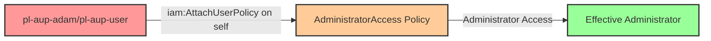

# One-Hop Privilege Escalation: iam:AttachUserPolicy

**Scenario Type:** One-Hop
**Target:** Admin Access
**Technique:** Self-modification via iam:AttachUserPolicy to attach managed admin policy

## Overview

This scenario demonstrates a privilege escalation vulnerability where a principal has permission to attach managed policies to IAM users, including themselves. The attacker can use `iam:AttachUserPolicy` to attach the AWS-managed `AdministratorAccess` policy to their own user, immediately escalating their privileges to administrator level.

Unlike inline policies, this technique leverages existing managed policies, making it simpler to execute and potentially easier to overlook during security reviews. The attack requires only a single API call to gain full administrative access.

## Understanding the attack scenario

### Principals in the attack path

- `arn:aws:iam::PROD_ACCOUNT:user/pl-pathfinder-starting-user-prod` (starting point)
- `arn:aws:iam::PROD_ACCOUNT:role/pl-aup-adam` (role variant)
- `arn:aws:iam::PROD_ACCOUNT:user/pl-aup-user` (user variant)

### Attack Path Diagram



### Attack Steps

1. **Scaffolding aka Initial Access**: Either:
   - `pl-pathfinder-starting-user-prod` assumes the role `pl-aup-adam` to begin the scenario, OR
   - Use the access keys for `pl-aup-user` directly
2. **Attach Managed Policy**: Use `iam:AttachUserPolicy` to attach the `arn:aws:iam::aws:policy/AdministratorAccess` managed policy to the current user
3. **Immediate Escalation**: The managed policy takes effect immediately, granting full administrative access
4. **Verification**: Verify administrator access with the escalated permissions

### Scenario specific resources created

| ARN | Purpose |
| -- | -- |
| `arn:aws:iam::PROD_ACCOUNT:role/pl-aup-adam` | Role with AttachUserPolicy permission |
| `arn:aws:iam::PROD_ACCOUNT:user/pl-aup-user` | User with AttachUserPolicy permission |
| `arn:aws:iam::PROD_ACCOUNT:policy/pl-prod-one-hop-attachuserpolicy-policy` | Policy allowing `iam:AttachUserPolicy` on any resource |

## Executing the attack

### Using the automated demo_attack.sh

To demonstrate the privilege escalation path, run the provided demo script:

```bash
cd modules/scenarios/prod/one-hop/to-admin/iam-attachuserpolicy
./demo_attack.sh
```

The script will:
1. Display a step-by-step walkthrough with color-coded output
2. Show the commands being executed and their results
3. Verify successful privilege escalation
4. Output standardized test results for automation

### Cleaning up the attack artifacts

After demonstrating the attack, clean up the managed policy attachment created during the demo:

```bash
cd modules/scenarios/prod/one-hop/to-admin/iam-attachuserpolicy
./cleanup_attack.sh
```

## Detection and prevention

### MITRE ATT&CK Mapping

- **Tactic**: Privilege Escalation (TA0004), Persistence (TA0003)
- **Technique**: T1098 - Account Manipulation
- **Sub-technique**: T1098.001 - Additional Cloud Credentials
- **Additional**: T1078.004 - Valid Accounts: Cloud Accounts

## Prevention recommendations

- Never grant `iam:AttachUserPolicy` permissions without strict resource constraints
- Use SCPs to prevent managed policy attachments on privileged users
- Implement least privilege - users should not be able to modify their own permissions
- Monitor CloudTrail for `AttachUserPolicy` API calls, especially self-modifications
- Use IAM Access Analyzer to identify privilege escalation paths
- Restrict which managed policies can be attached using `iam:PolicyARN` condition keys
- Enable MFA requirements for sensitive IAM operations
- Set up alerts for attachment of high-privilege managed policies like AdministratorAccess
