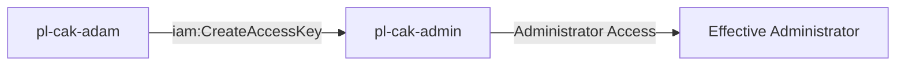

# One-Hop Privilege Escalation: iam:CreateAccessKey

**Scenario Type:** One-Hop  
**Target:** Admin Access  
**Technique:** Access key creation for admin user via iam:CreateAccessKey

## Overview

This scenario demonstrates a privilege escalation vulnerability where a role has permission to create access keys for an administrator user. The attacker can assume a role with `iam:CreateAccessKey` permission on an admin user, create new access keys for that user, and then use those credentials to gain administrator access.

## Understanding the attack scenario

### Principals in the attack path

- `arn:aws:iam::PROD_ACCOUNT:user/pl-pathfinder-starting-user-prod`
- `arn:aws:iam::PROD_ACCOUNT:role/pl-cak-adam`
- `arn:aws:iam::PROD_ACCOUNT:user/pl-cak-admin`

### Attack Path Diagram



### Attack Steps

1. **Scaffolding aka Initial Access**: `pl-pathfinder-starting-user-prod` assumes the role `pl-cak-adam` to begin the scenario
2. **Create Access Keys**: `pl-cak-adam` uses `iam:CreateAccessKey` to create new access keys for the admin user `pl-cak-admin`
3. **Switch Context**: Configure AWS CLI to use the newly created access keys
4. **Verification**: Verify administrator access with the new credentials

### Scenario specific resources created

| ARN | Purpose | 
| -- | -- | 
| `arn:aws:iam::PROD_ACCOUNT:role/pl-cak-adam` | Starting principal |
| `arn:aws:iam::PROD_ACCOUNT:policy/pl-prod-one-hop-createaccesskey-policy` | Allows `iam:createaccesskey` on `pl-cak-admin` only | 
| `arn:aws:iam::PROD_ACCOUNT:user/pl-cak-admin` | Destination principal |

## Executing the attack 

### Using the automated demo_attack.sh 

To demonstrate the privilege escalation path, run the provided demo script:

```bash
cd modules/scenarios/prod/one-hop/to-admin/iam-createaccesskey
./demo_attack.sh
```

The script will:
1. Display a step-by-step walkthrough with color-coded output
2. Show the commands being executed and their results
3. Verify successful privilege escalation
4. Output standardized test results for automation

### Cleaning up the attack artifacts

After demonstrating the attack, clean up the inline policy added during the demo:

```bash
cd modules/scenarios/prod/one-hop/to-admin/iam-createaccesskey
./cleanup_attack.sh
```

## Detection and prevention 


### MITRE ATT&CK Mapping

- **Tactic**: Privilege Escalation, Persistence
- **Technique**: T1098.001 - Account Manipulation: Additional Cloud Credentials
- **Sub-technique**: Creating additional credentials for privileged accounts


## Prevention recommendations  

- Avoid granting `iam:CreateAccessKey` permissions on privileged users
- Use resource-based conditions to restrict which users can have keys created
- Implement SCPs to prevent access key creation on admin users
- Monitor CloudTrail for `CreateAccessKey` API calls on privileged accounts
- Enable MFA requirements for sensitive operations
- Use IAM Access Analyzer to identify privilege escalation paths

