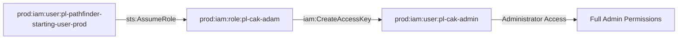

# One-Hop Privilege Escalation: iam:CreateAccessKey

**Scenario Type:** One-Hop (Single Principal Traversal)  
**Target:** Admin Access  
**Technique:** Access key creation for admin user via iam:CreateAccessKey

## Overview

This scenario demonstrates a privilege escalation vulnerability where a role has permission to create access keys for an administrator user. The attacker can assume a role with `iam:CreateAccessKey` permission on an admin user, create new access keys for that user, and then use those credentials to gain administrator access.

## Attack Path

## Attack Steps

1. **Initial Access**: Assume the role `pl-cak-adam` using the pathfinder starting user
2. **Create Access Keys**: Use `iam:CreateAccessKey` to create new access keys for the admin user `pl-cak-admin`
3. **Switch Context**: Configure AWS CLI to use the newly created access keys
4. **Verification**: Verify administrator access with the new credentials

## Resources Created

- **Admin User**: `pl-cak-admin`
  - Permissions: Administrator Access (AWS managed policy)
  
- **Privilege Escalation Role**: `pl-cak-adam`
  - Trusts: `pl-pathfinder-starting-user-prod`
  - Permissions: `iam:CreateAccessKey` on `pl-cak-admin`

- **Policy**: `pl-prod-one-hop-createaccesskey-policy`
  - Allows: `iam:CreateAccessKey` on the admin user's ARN

## CSPM Detection

This scenario should trigger alerts for:
- IAM role with CreateAccessKey permissions on privileged users
- Overly permissive iam:CreateAccessKey permissions
- Privilege escalation path detected
- Role can create credentials for admin users

## MITRE ATT&CK Mapping

- **Tactic**: Privilege Escalation, Persistence
- **Technique**: T1098.001 - Account Manipulation: Additional Cloud Credentials
- **Sub-technique**: Creating additional credentials for privileged accounts

## Usage

See `demo_attack.sh` for a complete demonstration of this attack path.
See `cleanup_attack.sh` to revert any changes made during the demonstration.

## Prevention

- Avoid granting `iam:CreateAccessKey` permissions on privileged users
- Use resource-based conditions to restrict which users can have keys created
- Implement SCPs to prevent access key creation on admin users
- Monitor CloudTrail for `CreateAccessKey` API calls on privileged accounts
- Enable MFA requirements for sensitive operations
- Use IAM Access Analyzer to identify privilege escalation paths

