# One-Hop Privilege Escalation: iam:PassRole + ec2:RunInstances

**Scenario Type:** One-Hop
**Target:** Admin Access
**Technique:** EC2 instance launch with privileged role and user-data backdoor

## Overview

This scenario demonstrates a privilege escalation vulnerability where a role has permission to pass IAM roles to EC2 instances (`iam:PassRole`) and launch EC2 instances (`ec2:RunInstances`). The attacker assumes a vulnerable role, launches an EC2 instance with an administrative instance profile, and uses the instance's user-data script to backdoor the admin role's trust policy. Once the trust policy is modified to allow the starting user to assume the admin role, the attacker gains full administrator access.

This technique is particularly dangerous because it combines IAM permissions with compute service actions, allowing an attacker to leverage temporary compute resources to modify persistent IAM configurations. Even though this involves multiple AWS API calls (PassRole, RunInstances, UpdateAssumeRolePolicy), it's classified as one-hop because there is only one principal traversal: from the vulnerable role to the admin role via the EC2 instance as an intermediary mechanism.

## Understanding the attack scenario

### Principals in the attack path

- `arn:aws:iam::PROD_ACCOUNT:user/pl-prod-one-hop-prec-starting-user` (Scenario-specific starting user)
- `arn:aws:iam::PROD_ACCOUNT:role/pl-prod-one-hop-prec-role` (Vulnerable role with PassRole + RunInstances permissions)
- `arn:aws:iam::PROD_ACCOUNT:role/pl-prod-one-hop-prec-admin-role` (Target admin role that gets backdoored)

### Attack Path Diagram

```mermaid
graph LR
    A[pl-prod-one-hop-prec-starting-user] -->|sts:AssumeRole| B[pl-prod-one-hop-prec-role]
    B -->|iam:PassRole + ec2:RunInstances| C[EC2 Instance]
    C -->|user-data modifies trust| D[pl-prod-one-hop-prec-admin-role]
    D -->|sts:AssumeRole| E[Effective Administrator]

    style A fill:#ff9999,stroke:#333,stroke-width:2px
    style B fill:#ffcc99,stroke:#333,stroke-width:2px
    style C fill:#ffcc99,stroke:#333,stroke-width:2px
    style D fill:#ffcc99,stroke:#333,stroke-width:2px
    style E fill:#99ff99,stroke:#333,stroke-width:2px
```



### Attack Steps

1. **Initial Access**: Start as `pl-prod-one-hop-prec-starting-user` (credentials provided via Terraform outputs)
2. **Assume Vulnerable Role**: Assume the vulnerable role `pl-prod-one-hop-prec-role`
3. **Launch EC2 Instance**: Use `ec2:RunInstances` to launch an EC2 instance, passing the admin instance profile via `iam:PassRole`
4. **Backdoor Execution**: The instance's user-data script executes with the admin role's credentials and modifies the admin role's trust policy to include the starting user
5. **Assume Admin Role**: The starting user can now directly assume the backdoored admin role
6. **Verification**: Verify administrator access by listing IAM users

### Scenario specific resources created

| ARN | Purpose |
| -- | -- |
| `arn:aws:iam::PROD_ACCOUNT:user/pl-prod-one-hop-prec-starting-user` | Scenario-specific starting user with access keys |
| `arn:aws:iam::PROD_ACCOUNT:role/pl-prod-one-hop-prec-role` | Vulnerable role with PassRole and RunInstances permissions |
| `arn:aws:iam::PROD_ACCOUNT:policy/pl-prod-one-hop-passrole-ec2-policy` | Allows `iam:PassRole` and `ec2:RunInstances` |
| `arn:aws:iam::PROD_ACCOUNT:role/pl-prod-one-hop-prec-admin-role` | Target admin role (initially trusts ec2.amazonaws.com) |
| `arn:aws:iam::PROD_ACCOUNT:instance-profile/pl-prod-one-hop-prec-instance-profile` | Instance profile wrapping the admin role |

## Executing the attack

### Using the automated demo_attack.sh

To demonstrate the privilege escalation path, run the provided demo script:

```bash
cd modules/scenarios/prod/one-hop/to-admin/iam-passrole+ec2-runinstances
./demo_attack.sh
```

The script will:
1. Display a step-by-step walkthrough with color-coded output
2. Show the commands being executed and their results
3. Verify successful privilege escalation
4. Output standardized test results for automation

### Cleaning up the attack artifacts

After demonstrating the attack, clean up the EC2 instance and restore the admin role's trust policy:

```bash
cd modules/scenarios/prod/one-hop/to-admin/iam-passrole+ec2-runinstances
./cleanup_attack.sh
```

## Detection and prevention


### MITRE ATT&CK Mapping

- **Tactic**: Privilege Escalation (TA0004), Persistence (TA0003)
- **Technique**: T1098 - Account Manipulation
- **Sub-technique**: T1098.003 - Account Manipulation: Additional Cloud Roles


## Prevention recommendations

- Restrict `iam:PassRole` permissions with resource-based conditions to limit which roles can be passed and to which services
- Implement SCPs preventing EC2 instances from being launched with administrative IAM roles
- Monitor CloudTrail for `PassRole` API calls combined with `RunInstances` events targeting privileged roles
- Alert on `UpdateAssumeRolePolicy` API calls, especially when invoked from EC2 instances
- Regularly audit EC2 instances for excessive IAM permissions using IAM Access Analyzer
- Use resource tagging and condition keys to enforce separation of duties between role creation and role assignment
