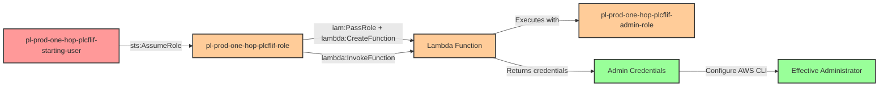

# One-Hop Privilege Escalation: PassRole + Lambda CreateFunction + InvokeFunction

* **Scenario Type:** One-Hop
* **Target:** Admin Access
* **Technique:** Privilege escalation via iam:PassRole, lambda:CreateFunction, and lambda:InvokeFunction

## Overview

This scenario demonstrates a sophisticated privilege escalation vulnerability where a role has the ability to create Lambda functions and pass an administrative role to them. An attacker who compromises credentials with `iam:PassRole`, `lambda:CreateFunction`, and `lambda:InvokeFunction` permissions can escalate to full administrator access by creating a Lambda function that runs with administrative privileges.

The attack works by creating a Lambda function with malicious code that extracts the temporary AWS credentials from the Lambda execution environment (automatically provided via environment variables), passing an admin role to the function during creation, and then invoking it to retrieve those high-privilege credentials. Once obtained, these credentials provide complete administrator access to the AWS environment.

This technique is particularly dangerous because it combines multiple permissions that may individually seem benign but together create a complete privilege escalation path. Organizations often grant developers Lambda creation permissions without realizing the security implications when combined with the ability to pass privileged roles.

## Understanding the attack scenario

### Principals in the attack path

- `arn:aws:iam::PROD_ACCOUNT:user/pl-prod-one-hop-plcflif-starting-user` (Scenario-specific starting user)
- `arn:aws:iam::PROD_ACCOUNT:role/pl-prod-one-hop-plcflif-role` (Vulnerable role with PassRole, CreateFunction, and InvokeFunction permissions)
- `arn:aws:iam::PROD_ACCOUNT:role/pl-prod-one-hop-plcflif-admin-role` (Target admin role passed to Lambda)
- Lambda Function `pl-plcflif-credential-extractor` (Created during attack to extract credentials)

### Attack Path Diagram



### Attack Steps

1. **Initial Access**: Start as `pl-prod-one-hop-plcflif-starting-user` (credentials provided via Terraform outputs)
2. **Assume Role**: Assume the vulnerable role `pl-prod-one-hop-plcflif-role` which has iam:PassRole, lambda:CreateFunction, and lambda:InvokeFunction permissions
3. **Create Malicious Lambda**: Create a Lambda function with Python code that extracts AWS credentials from environment variables (AWS_ACCESS_KEY_ID, AWS_SECRET_ACCESS_KEY, AWS_SESSION_TOKEN)
4. **Pass Admin Role**: During Lambda creation, use iam:PassRole to assign the admin role `pl-prod-one-hop-plcflif-admin-role` as the execution role
5. **Invoke Lambda**: Invoke the Lambda function using lambda:InvokeFunction to execute the credential extraction code
6. **Extract Credentials**: The Lambda function returns the temporary admin credentials from its execution environment
7. **Configure CLI**: Set the extracted credentials as environment variables or AWS CLI profile
8. **Verification**: Verify administrator access with the extracted credentials

### Scenario specific resources created

| ARN | Purpose |
| -- | -- |
| `arn:aws:iam::PROD_ACCOUNT:user/pl-prod-one-hop-plcflif-starting-user` | Scenario-specific starting user with access keys |
| `arn:aws:iam::PROD_ACCOUNT:role/pl-prod-one-hop-plcflif-role` | Vulnerable role with PassRole, CreateFunction, and InvokeFunction permissions |
| `arn:aws:iam::PROD_ACCOUNT:policy/pl-prod-one-hop-passrole-lambda-policy` | Policy granting PassRole on admin role and Lambda creation/invocation |
| `arn:aws:iam::PROD_ACCOUNT:role/pl-prod-one-hop-plcflif-admin-role` | Target admin role with AdministratorAccess policy |

## Executing the attack

### Using the automated demo_attack.sh

To demonstrate the privilege escalation path, run the provided demo script:

```bash
cd modules/scenarios/prod/one-hop/to-admin/iam-passrole+lambda-createfunction+lambda-invokefunction
./demo_attack.sh
```

The script will:
1. Display a step-by-step walkthrough with color-coded output
2. Show the commands being executed and their results
3. Create a Lambda function with credential extraction code
4. Pass the admin role to the Lambda function
5. Invoke the function to retrieve admin credentials
6. Verify successful privilege escalation
7. Output standardized test results for automation

### Cleaning up the attack artifacts

After demonstrating the attack, clean up the Lambda function created during the demo:

```bash
cd modules/scenarios/prod/one-hop/to-admin/iam-passrole+lambda-createfunction+lambda-invokefunction
./cleanup_attack.sh
```

## Detection and prevention

### CSPM Detection Guidance

A properly configured Cloud Security Posture Management (CSPM) tool should detect the following issues:

**High Priority Detections:**
- Role with ability to pass privileged roles to Lambda functions (iam:PassRole on admin roles + lambda:CreateFunction)
- Combined permissions creating privilege escalation path (PassRole + CreateFunction + InvokeFunction on same principal)
- Role with unrestricted Lambda creation and invocation capabilities
- Potential for privilege escalation via Lambda service abuse

**Specific Checks:**
- Check for iam:PassRole permission with wildcards or broad resource specifications
- Identify roles that can both create and invoke Lambda functions
- Detect Lambda functions created with administrative execution roles
- Monitor for privilege escalation paths where Lambda is used as an intermediary
- Flag combinations of iam:PassRole targeting high-privilege roles alongside Lambda permissions

**Runtime Detections:**
- CloudTrail events showing CreateFunction with high-privilege execution roles
- Lambda invocations that appear to be credential extraction attempts
- Short-lived Lambda functions (created and deleted quickly)
- Lambda functions invoked immediately after creation

### MITRE ATT&CK Mapping

- **Tactic**: Privilege Escalation (TA0004), Persistence (TA0003)
- **Technique**: T1078.004 - Valid Accounts: Cloud Accounts
- **Technique**: T1098.003 - Account Manipulation: Additional Cloud Roles
- **Sub-technique**: Using cloud service features (Lambda) to obtain elevated credentials

## Prevention recommendations

- **Restrict PassRole permissions**: Never grant iam:PassRole with wildcards. Use resource-based conditions to limit which roles can be passed and to which services
- **Separate Lambda permissions**: Avoid granting lambda:CreateFunction and lambda:InvokeFunction to the same principals that have iam:PassRole
- **Implement permission boundaries**: Use IAM permission boundaries to prevent roles from being passed to Lambda if they contain sensitive permissions
- **Use SCPs**: Implement Service Control Policies to prevent passing of admin roles to compute services (Lambda, EC2, ECS, etc.)
- **Enable resource-based conditions**: Require specific tags or resource paths for iam:PassRole operations
- **Monitor CloudTrail**: Alert on CreateFunction API calls where the execution role has administrative permissions
- **Implement least privilege**: Lambda functions should run with minimal permissions required for their specific task, never with admin roles
- **Use IAM Access Analyzer**: Leverage IAM Access Analyzer to identify privilege escalation paths involving Lambda
- **Require MFA**: Enforce MFA for sensitive operations like creating Lambda functions or passing roles

## References

- [BishopFox IAM Vulnerable - PassRole + Lambda](https://github.com/BishopFox/iam-vulnerable)
- [Rhino Security Labs - AWS IAM Privilege Escalation Methods](https://rhinosecuritylabs.com/aws/aws-privilege-escalation-methods-mitigation/)
- [AWS Documentation - IAM PassRole](https://docs.aws.amazon.com/IAM/latest/UserGuide/id_roles_use_passrole.html)
- [AWS Lambda Execution Roles](https://docs.aws.amazon.com/lambda/latest/dg/lambda-intro-execution-role.html)
