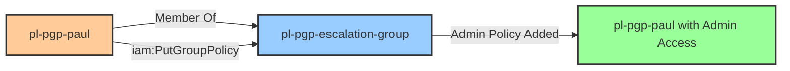

# One-Hop Privilege Escalation: iam:PutGroupPolicy

**Scenario Type:** One-Hop
**Target:** Admin Access
**Technique:** Self-escalation via inline policy addition to own group

## Overview

This scenario demonstrates a self-escalation vulnerability where a user has permission to put inline policies on a group they belong to. The user `pl-pgp-paul` is a member of `pl-pgp-escalation-group` and has `iam:PutGroupPolicy` permission on that same group. By adding an administrator inline policy to their own group, the user can escalate themselves to administrator access.

## Understanding the attack scenario

### Principals in the attack path

- `arn:aws:iam::PROD_ACCOUNT:user/pl-pgp-paul` (vulnerable user who performs self-escalation)
- `arn:aws:iam::PROD_ACCOUNT:group/pl-pgp-escalation-group` (target group that pl-pgp-paul belongs to)

### Attack Path Diagram



### Attack Steps

1. **Starting Point**: Authenticate as `pl-pgp-paul` using their access keys
2. **Verify Membership**: Confirm `pl-pgp-paul` is a member of `pl-pgp-escalation-group`
3. **Self-Escalation**: Use `iam:PutGroupPolicy` to add an admin inline policy to their own group
4. **Admin Access**: `pl-pgp-paul` now has administrator access through their group membership

### Scenario specific resources created

| ARN | Purpose |
| -- | -- |
| `arn:aws:iam::PROD_ACCOUNT:user/pl-pgp-paul` | Vulnerable user with PutGroupPolicy permission on their own group |
| `arn:aws:iam::PROD_ACCOUNT:group/pl-pgp-escalation-group` | Target group that pl-pgp-paul belongs to |

## Executing the attack 

### Using the automated demo_attack.sh 

To demonstrate the privilege escalation path, run the provided demo script:

```bash
cd modules/scenarios/prod/one-hop/to-admin/iam-putgrouppolicy
./demo_attack.sh
```

The script will:
1. Display a step-by-step walkthrough with color-coded output
2. Show the commands being executed and their results
3. Verify successful privilege escalation
4. Output standardized test results for automation

### Cleaning up the attack artifacts

After demonstrating the attack, clean up the inline policy added during the demo:

```bash
cd modules/scenarios/prod/one-hop/to-admin/iam-putgrouppolicy
./cleanup_attack.sh
```

## Detection and prevention 


### MITRE ATT&CK Mapping

- **Tactic**: Privilege Escalation (TA0004)
- **Technique**: T1098.003 - Account Manipulation: Additional Cloud Roles
- **Sub-technique**: Modifying group policies to escalate privileges


## Prevention recommendations  

- Avoid granting `iam:PutGroupPolicy` permissions broadly
- Use resource-based conditions to restrict which groups can have policies added
- Implement SCPs to prevent inline policy additions on sensitive groups
- Monitor CloudTrail for `PutGroupPolicy` API calls
- Use IAM Access Analyzer to identify privilege escalation paths through group memberships
- Prefer managed policies over inline policies for better governance
- Regularly audit group memberships and their effective permissions
