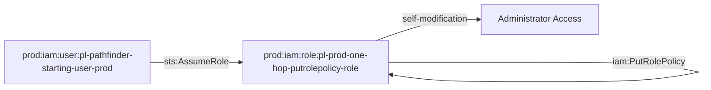

# One-Hop Privilege Escalation: iam:PutRolePolicy

**Scenario Type:** One-Hop (Single Principal Traversal)  
**Target:** Admin Access  
**Technique:** Self-modification via iam:PutRolePolicy

## Overview

This scenario demonstrates a privilege escalation vulnerability where a role can modify its own inline policies using `iam:PutRolePolicy`. The attacker starts with minimal permissions but can grant themselves administrator access by adding an inline policy to their own role.

## Attack Path

## Attack Steps

1. **Initial Access**: Assume the role `pl-prod-one-hop-putrolepolicy-role` using the pathfinder starting user
2. **Privilege Escalation**: Use `iam:PutRolePolicy` to add an inline policy granting admin permissions to the role
3. **Verification**: Verify the escalation by testing administrative actions

## Resources Created

- **Role**: `pl-prod-one-hop-putrolepolicy-role`
  - Trusts: `pl-pathfinder-starting-user-prod`
  - Permissions: `iam:PutRolePolicy` on itself

- **Policy**: `pl-prod-one-hop-putrolepolicy-policy`
  - Allows: `iam:PutRolePolicy` on the role's own ARN

## CSPM Detection

This scenario should trigger alerts for:
- IAM role with self-modification permissions
- Overly permissive iam:PutRolePolicy permissions
- Privilege escalation path detected

## MITRE ATT&CK Mapping

- **Tactic**: Privilege Escalation
- **Technique**: T1078.004 - Valid Accounts: Cloud Accounts
- **Sub-technique**: Abuse of IAM Permissions

## Usage

See `demo_attack.sh` for a complete demonstration of this attack path.
See `cleanup_attack.sh` to revert any changes made during the demonstration.

## Prevention

- Avoid granting `iam:PutRolePolicy` permissions on roles
- If required, use conditions to restrict which roles can be modified
- Implement SCPs to prevent privilege escalation techniques
- Monitor CloudTrail for `PutRolePolicy` API calls

