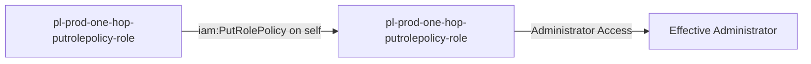

# One-Hop Privilege Escalation: iam:PutRolePolicy

**Scenario Type:** One-Hop
**Target:** Admin Access
**Technique:** Self-modification via iam:PutRolePolicy

## Overview

This scenario demonstrates a privilege escalation vulnerability where a role can modify its own inline policies using `iam:PutRolePolicy`. The attacker starts with minimal permissions but can grant themselves administrator access by adding an inline policy to their own role.

## Understanding the attack scenario

### Principals in the attack path

- `arn:aws:iam::PROD_ACCOUNT:user/pl-pathfinder-starting-user-prod`
- `arn:aws:iam::PROD_ACCOUNT:role/pl-prod-one-hop-putrolepolicy-role`

### Attack Path Diagram



### Attack Steps

1. **Scaffolding aka Initial Access**: `pl-pathfinder-starting-user-prod` assumes the role `pl-prod-one-hop-putrolepolicy-role` to begin the scenario
2. **Self-Modification**: `pl-prod-one-hop-putrolepolicy-role` uses `iam:PutRolePolicy` to add an inline policy granting administrator access to itself
3. **Verification**: Verify administrator access with the modified role

### Scenario specific resources created

| ARN | Purpose |
| -- | -- |
| `arn:aws:iam::PROD_ACCOUNT:role/pl-prod-one-hop-putrolepolicy-role` | Starting principal with self-modification capability |
| `arn:aws:iam::PROD_ACCOUNT:policy/pl-prod-one-hop-putrolepolicy-policy` | Allows `iam:PutRolePolicy` on the role itself |

## Executing the attack

### Using the automated demo_attack.sh

To demonstrate the privilege escalation path, run the provided demo script:

```bash
cd modules/scenarios/prod/one-hop/to-admin/iam-putrolepolicy
./demo_attack.sh
```

The script will:
1. Display a step-by-step walkthrough with color-coded output
2. Show the commands being executed and their results
3. Verify successful privilege escalation
4. Output standardized test results for automation

### Cleaning up the attack artifacts

After demonstrating the attack, clean up the inline policy added during the demo:

```bash
cd modules/scenarios/prod/one-hop/to-admin/iam-putrolepolicy
./cleanup_attack.sh
```

## Detection and prevention


### MITRE ATT&CK Mapping

- **Tactic**: Privilege Escalation
- **Technique**: T1078.004 - Valid Accounts: Cloud Accounts
- **Sub-technique**: Abuse of IAM Permissions


## Prevention recommendations

- Avoid granting `iam:PutRolePolicy` permissions on roles
- If required, use resource-based conditions to restrict which roles can be modified
- Implement SCPs to prevent self-modification of roles
- Monitor CloudTrail for `PutRolePolicy` API calls, especially when the role modifies itself
- Enable MFA requirements for sensitive operations
- Use IAM Access Analyzer to identify privilege escalation paths

