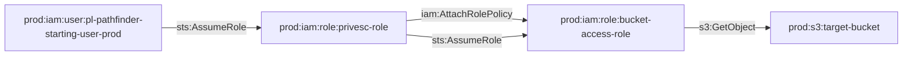

# One-Hop Privilege Escalation: iam:AttachRolePolicy to S3 Bucket

**Scenario Type:** One-Hop (Single Principal Traversal)  
**Target:** S3 Bucket Access  
**Technique:** iam:AttachRolePolicy on another role with S3 access

## Overview

This scenario demonstrates privilege escalation where an attacker can attach managed policies to another role using `iam:AttachRolePolicy`, then assume that role to gain access to a sensitive S3 bucket.

## Attack Path

## Attack Steps

1. Assume the `pl-prod-one-hop-attachrolepolicy-bucket-privesc-role`
2. Use `iam:AttachRolePolicy` to attach a managed policy (like AdministratorAccess or S3FullAccess) to `bucket-access-role`
3. Assume the `bucket-access-role`
4. Access the target S3 bucket

## Resources Created

- **Target Bucket**: `pl-prod-one-hop-attachrolepolicy-bucket-{account_id}-{suffix}`
- **Bucket Access Role**: `pl-prod-one-hop-attachrolepolicy-bucket-access-role`
- **Privesc Role**: `pl-prod-one-hop-attachrolepolicy-bucket-privesc-role`

## CSPM Detection

Should trigger alerts for:
- IAM role with AttachRolePolicy permissions on other roles
- Privilege escalation path to S3 bucket
- Managed policy attachment to roles

## Usage

See `demo_attack.sh` and `cleanup_attack.sh` scripts.

