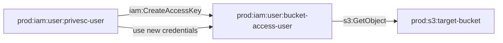

# One-Hop Privilege Escalation: iam:CreateAccessKey to S3 Bucket

**Scenario Type:** One-Hop (Single Principal Traversal) - User-Based  
**Target:** S3 Bucket Access  
**Technique:** iam:CreateAccessKey on a privileged user

## Overview

This scenario demonstrates privilege escalation where an attacker with `iam:CreateAccessKey` permission can create access keys for a privileged user, then use those credentials to access a sensitive S3 bucket.

## Attack Path

## Attack Steps

1. Use privesc-user credentials
2. Create access keys for bucket-access-user via `iam:CreateAccessKey`
3. Configure AWS CLI with the new credentials
4. Access the target S3 bucket

## Resources Created

- **Target Bucket**: `pl-prod-one-hop-createaccesskey-bucket-{account_id}-{suffix}`
- **Bucket Access User**: `pl-prod-one-hop-createaccesskey-bucket-access-user` (has S3 access)
- **Privesc User**: `pl-prod-one-hop-createaccesskey-bucket-privesc-user` (has CreateAccessKey permission)

## CSPM Detection

Should trigger alerts for:
- User with CreateAccessKey permissions on other users
- New access key creation for privileged users
- Privilege escalation path detected

## Usage

See `demo_attack.sh` and `cleanup_attack.sh` scripts.

