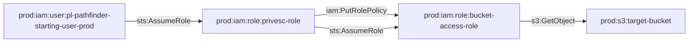

# One-Hop Privilege Escalation: iam:PutRolePolicy to S3 Bucket

**Scenario Type:** One-Hop (Single Principal Traversal)  
**Target:** S3 Bucket Access  
**Technique:** iam:PutRolePolicy on another role with S3 access

## Overview

This scenario demonstrates privilege escalation where an attacker can modify another role's inline policy using `iam:PutRolePolicy`, then assume that role to gain access to a sensitive S3 bucket. This differs from the to-admin variant because the target is S3 bucket access rather than full administrative privileges.

## Attack Path

## Attack Steps

1. **Initial Access**: Assume the `pl-prod-one-hop-putrolepolicy-bucket-privesc-role`
2. **Modify Target Role**: Use `iam:PutRolePolicy` to add an inline policy to `bucket-access-role` that allows the privesc role to assume it
3. **Assume Privileged Role**: Assume the `bucket-access-role` 
4. **Access S3**: Read sensitive data from the target S3 bucket

## Resources Created

- **Target Bucket**: `pl-prod-one-hop-putrolepolicy-bucket-{account_id}-{suffix}`
  - Contains sensitive data file
  
- **Bucket Access Role**: `pl-prod-one-hop-putrolepolicy-bucket-access-role`
  - Has S3 read/write permissions on the target bucket
  
- **Privesc Role**: `pl-prod-one-hop-putrolepolicy-bucket-privesc-role`
  - Trusts: `pl-pathfinder-starting-user-prod`
  - Permissions: `iam:PutRolePolicy` on bucket-access-role, `sts:AssumeRole` on bucket-access-role

## CSPM Detection

This scenario should trigger alerts for:
- IAM role with PutRolePolicy permissions on other roles
- Privilege escalation path to sensitive S3 bucket
- Role trust relationship modification

## MITRE ATT&CK Mapping

- **Tactic**: Privilege Escalation, Collection
- **Technique**: T1078.004 - Valid Accounts: Cloud Accounts
- **Sub-technique**: T1530 - Data from Cloud Storage Object

## Usage

See `demo_attack.sh` for a complete demonstration of this attack path.
See `cleanup_attack.sh` to revert any changes made during the demonstration.

## Prevention

- Restrict `iam:PutRolePolicy` permissions
- Use service control policies (SCPs) to prevent privilege escalation
- Implement S3 bucket policies that restrict access even for privileged roles
- Monitor CloudTrail for `PutRolePolicy` and unusual S3 access patterns

