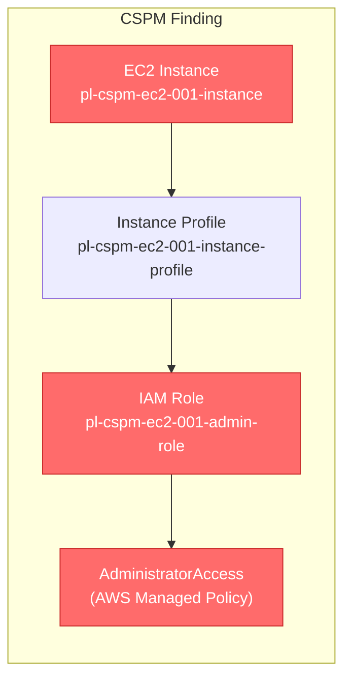
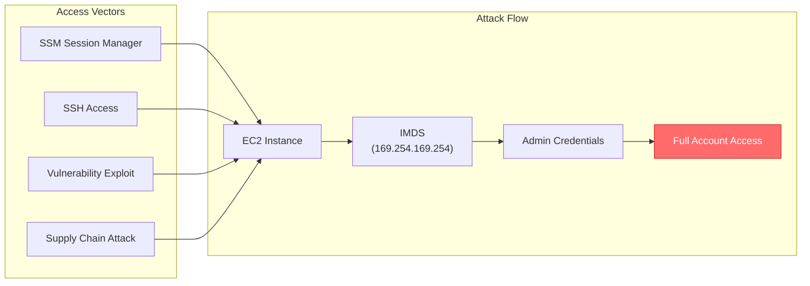

# CSPM Misconfiguration: EC2 Instance with Highly Privileged IAM Role

* **Category:** CSPM: Misconfig
* **Sub-Category:** Compute
* **Path Type:** single-condition
* **Target:** to-admin
* **Environments:** prod
* **Cost Estimate:** $5/mo
* **Technique:** EC2 instance with a highly privileged IAM role attached - validates CSPM detection
* **Terraform Variable:** `enable_single_account_cspm_misconfig_cspm_ec2_001_instance_with_privileged_role`
* **Schema Version:** 1.0.0
* **Pathfinding.cloud ID:** cspm-ec2-001
* **MITRE Tactics:** TA0004 - Privilege Escalation, TA0006 - Credential Access
* **MITRE Techniques:** T1552.005 - Unsecured Credentials: Cloud Instance Metadata API, T1078.004 - Valid Accounts: Cloud Accounts
* **CSPM Rule ID:** aws-ec2-instance-ec2-instance-should-not-have-a-highly-privileged-iam-role-attached-to-it
* **CSPM Severity:** high
* **CSPM Expected Finding:** resource_type=aws_ec2_instance; resource_id=pl-cspm-ec2-001-instance; finding=Instance has role with AdministratorAccess policy attached
* **Risk Summary:** Anyone with access to this EC2 instance can leverage the administrative IAM role
* **Risk Impact:** Instance compromise leads to full AWS account compromise; Credentials can be extracted from IMDS (Instance Metadata Service); Lateral movement to any AWS resource is possible; Data exfiltration across the entire account
* **Remediation:** Remove AdministratorAccess policy from the instance role; Grant only the specific permissions required by applications on the instance; Use separate roles for different workloads; Implement IMDSv2 to require session tokens for metadata access; Monitor for unusual IMDS access patterns; Consider using AWS Secrets Manager instead of instance roles for sensitive operations

## Attack Overview

This scenario creates an EC2 instance with an administrative IAM role attached, validating the CSPM detection rule:

**`aws-ec2-instance-ec2-instance-should-not-have-a-highly-privileged-iam-role-attached-to-it`**

Anyone with access to this EC2 instance can leverage the administrative IAM role. Access vectors include SSM Session Manager, SSH, vulnerability exploits, and supply chain attacks. Once on the instance, credentials are trivially extracted from the Instance Metadata Service (IMDS) at `169.254.169.254`, yielding full AWS account access.

This misconfiguration is common in environments where developers attach `AdministratorAccess` for convenience during initial setup and the permission is never scoped down. Detection difficulty is high because legitimate IMDS access is indistinguishable from malicious credential harvesting without additional controls.

### MITRE ATT&CK Mapping

- **Tactics**: TA0004 - Privilege Escalation, TA0006 - Credential Access
- **Techniques**: T1078.004 - Valid Accounts: Cloud Accounts, T1552.005 - Unsecured Credentials: Cloud Instance Metadata API

### Attack Path Diagram





### Scenario specific resources created

| ARN | Purpose |
|-----|---------|
| `arn:aws:ec2:REGION:PROD_ACCOUNT:instance/pl-cspm-ec2-001-instance` | EC2 instance with privileged role attached |
| `arn:aws:iam::PROD_ACCOUNT:role/pl-cspm-ec2-001-admin-role` | IAM role with AdministratorAccess attached |
| `arn:aws:iam::PROD_ACCOUNT:instance-profile/pl-cspm-ec2-001-instance-profile` | Instance profile linking the role to the EC2 instance |

## Attack Lab

### Prerequisites

1. Install the `plabs` CLI:
   ```bash
   brew install pathfinding-labs/tap/plabs
   ```
2. Configure your AWS profiles in `~/.plabs/plabs.yaml` (or run `plabs init` if you haven't already)

### Deploy with plabs non-interactive

```bash
plabs enable enable_single_account_cspm_misconfig_cspm_ec2_001_instance_with_privileged_role
plabs apply
```

### Deploy with plabs tui

1. Launch the TUI: `plabs`
2. Navigate to this scenario in the scenarios list
3. Press `space` to enable it
4. Press `d` to deploy

### Executing the automated demo_attack script

The script will:
1. Authenticate as a user with only SSM access
2. Start an SSM session to the instance
3. Guide you through extracting admin credentials from IMDS
4. Show the full impact of this misconfiguration

#### Resources created by attack script

- No persistent artifacts are created by the demo script; it demonstrates read-only credential extraction from IMDS

#### With plabs non-interactive

```bash
plabs demo --list
plabs demo cspm-ec2-001-instance-with-privileged-role
```

#### With plabs tui

1. Launch the TUI: `plabs`
2. Navigate to this scenario in the scenarios list
3. Press `r` to run the demo script

### Cleanup

#### With plabs non-interactive

```bash
plabs cleanup --list
plabs cleanup cspm-ec2-001-instance-with-privileged-role
```

#### With plabs tui

1. Launch the TUI: `plabs`
2. Navigate to this scenario in the scenarios list
3. Press `c` to run the cleanup script

### Teardown with plabs non-interactive

```bash
plabs disable enable_single_account_cspm_misconfig_cspm_ec2_001_instance_with_privileged_role
plabs apply
```

### Teardown with plabs tui

1. Launch the TUI: `plabs`
2. Navigate to this scenario in the scenarios list
3. Press `space` to disable it
4. Press `D` to destroy

## Detecting Misconfiguration (CSPM)

### What CSPM tools should detect

- EC2 instance `pl-cspm-ec2-001-instance` has a highly privileged IAM role (`pl-cspm-ec2-001-admin-role`) attached via instance profile
- Role `pl-cspm-ec2-001-admin-role` has the `AdministratorAccess` AWS managed policy attached, granting unrestricted access to all AWS services
- Instance profile grants any process running on the instance the ability to assume administrative credentials via IMDS without authentication
- No IMDSv2 enforcement (`http_tokens = required`) is configured, allowing unauthenticated metadata retrieval

### Prevention recommendations

- Remove `AdministratorAccess` from the instance role and grant only the specific permissions required by applications running on the instance
- Enforce IMDSv2 by setting `http_tokens = required` and `http_put_response_hop_limit = 1` on all EC2 instances to prevent credential theft by containerized workloads
- Use separate IAM roles for different workloads rather than a single broad role
- Implement an SCP that denies attachment of `AdministratorAccess` or any `*:*` policy to EC2 instance profiles
- Use AWS Secrets Manager or IAM Roles Anywhere instead of instance roles for sensitive credentials
- Monitor IMDS access patterns with CloudWatch Logs and GuardDuty to detect unusual credential extraction

## Detection Abuse (CloudSIEM)

### CloudTrail events to monitor

- `STS: AssumeRole` — Role assumed via instance profile; suspicious when called from an EC2 instance with an administrative role and followed by high-privilege API calls
- `EC2: DescribeInstances` — Reconnaissance after gaining admin credentials extracted from IMDS
- `IAM: ListAttachedRolePolicies` — Attacker enumerating the permissions of the instance role
- `SSM: StartSession` — SSM session started to the instance; the initial access vector in the demo

### Detonation logs

_Detonation log integration (Stratus Red Team / Grimoire) is planned for a future release._
