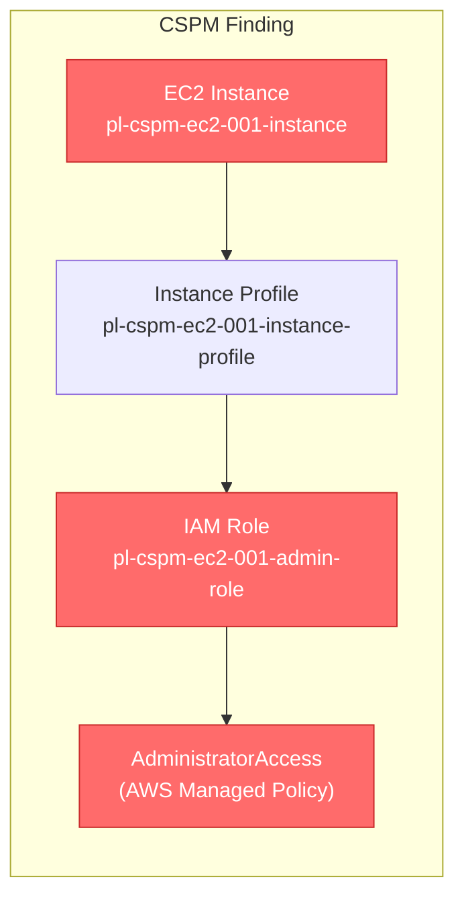
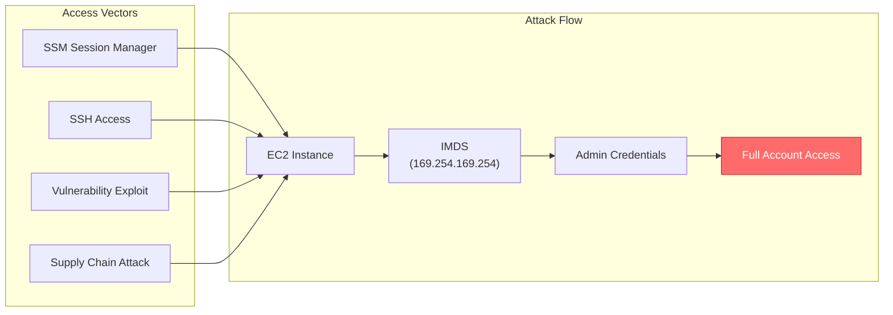

# CSPM Misconfiguration: EC2 Instance with Highly Privileged IAM Role

## Overview

This scenario creates an EC2 instance with an administrative IAM role attached, validating the CSPM detection rule:

**`aws-ec2-instance-ec2-instance-should-not-have-a-highly-privileged-iam-role-attached-to-it`**

## The Misconfiguration



## Risk

Anyone with access to this EC2 instance can leverage the administrative IAM role:



## Why This Matters

| Risk Factor | Description |
|------------|-------------|
| **Blast Radius** | Full AWS account compromise |
| **Attack Surface** | Multiple access vectors (SSM, SSH, exploits) |
| **Credential Exposure** | Credentials available via IMDS to any process on instance |
| **Detection Difficulty** | Legitimate IMDS access is hard to distinguish from malicious |

## CSPM Expected Finding

Your CSPM tool should detect:

- **Resource**: EC2 Instance `pl-cspm-ec2-001-instance`
- **Finding**: Instance has highly privileged role attached
- **Severity**: HIGH
- **Details**: Role `pl-cspm-ec2-001-admin-role` has `AdministratorAccess` policy

## Running the Demo

The demo shows that anyone with SSM access can extract admin credentials:

```bash
# Make the script executable
chmod +x demo_attack.sh

# Run the demonstration
./demo_attack.sh
```

The demo will:
1. Authenticate as a user with only SSM access
2. Start an SSM session to the instance
3. Guide you through extracting admin credentials from IMDS
4. Show the full impact of this misconfiguration

## MITRE ATT&CK Mapping

| Tactic | Technique | Description |
|--------|-----------|-------------|
| Privilege Escalation | T1078.004 | Valid Accounts: Cloud Accounts |
| Credential Access | T1552.005 | Unsecured Credentials: Cloud Instance Metadata API |

## Remediation

### Recommended Actions

1. **Follow Least Privilege**
   ```hcl
   # Instead of AdministratorAccess, use specific permissions
   resource "aws_iam_role_policy" "specific_permissions" {
     role = aws_iam_role.ec2_role.name
     policy = jsonencode({
       Version = "2012-10-17"
       Statement = [
         {
           Effect = "Allow"
           Action = [
             "s3:GetObject",
             "s3:PutObject"
           ]
           Resource = "arn:aws:s3:::my-bucket/*"
         }
       ]
     })
   }
   ```

2. **Enforce IMDSv2**
   ```hcl
   resource "aws_instance" "example" {
     metadata_options {
       http_tokens                 = "required"  # Enforce IMDSv2
       http_put_response_hop_limit = 1
       http_endpoint               = "enabled"
     }
   }
   ```

3. **Use AWS Secrets Manager** for sensitive credentials instead of instance roles

4. **Monitor IMDS Access** using CloudWatch Logs and GuardDuty

## Cost Estimate

~$5/month (t3.nano instance running 24/7)

## Files

| File | Description |
|------|-------------|
| `main.tf` | Terraform resources creating the misconfiguration |
| `variables.tf` | Input variables |
| `outputs.tf` | Output values including CSPM check info |
| `scenario.yaml` | Scenario metadata |
| `demo_attack.sh` | Demonstrates the risk via SSM session |
| `cleanup_attack.sh` | Cleanup script (no artifacts created) |
| `README.md` | This documentation |
