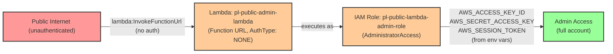

# Public Lambda with Admin Role (Toxic Combination)

* **Category:** CSPM: Toxic Combination
* **Sub-Category:** Publicly-accessible
* **Path Type:** toxic-combination
* **Target:** to-admin
* **Environments:** prod
* **Cost Estimate:** $0/mo
* **Technique:** Publicly accessible Lambda function with administrative IAM role
* **Terraform Variable:** `enable_single_account_cspm_toxic_combo_public_lambda_with_admin`
* **Schema Version:** 1.0.0
* **Attack Path:** public internet → (lambda:InvokeFunctionUrl) → Lambda with admin role → extract credentials → admin access
* **Attack Principals:** `arn:aws:lambda:{region}:{account_id}:function:pl-public-admin-lambda`; `arn:aws:iam::{account_id}:role/pl-public-lambda-admin-role`
* **Required Permissions:** `lambda:InvokeFunctionUrl` on `*`
* **Helpful Permissions:** `lambda:ListFunctions` (Discover publicly accessible Lambda functions); `lambda:GetFunctionUrlConfig` (Identify Lambda functions with public URLs)
* **MITRE Tactics:** TA0001 - Initial Access, TA0004 - Privilege Escalation, TA0006 - Credential Access
* **MITRE Techniques:** T1190 - Exploit Public-Facing Application, T1552.005 - Cloud Instance Metadata API, T1648 - Serverless Execution

## Attack Overview

A Lambda function URL with `AuthorizationType: NONE` is publicly accessible from anywhere on the internet — no AWS credentials or signature required. When that same function's execution role carries `AdministratorAccess`, the combination creates a direct, unauthenticated path to full account compromise. An attacker only needs to discover the function URL and send an HTTP request to gain access to short-lived credentials scoped to the admin role.

The toxic combination here is not any single misconfiguration but the co-existence of two: public exposure and over-privileged permissions. Either finding alone would be serious; together they eliminate any barrier between an unauthenticated external attacker and complete control of the AWS account. Lambda function URLs are easy to overlook because they appear in a separate section of the Lambda console from the function's IAM settings.

In real environments this pattern shows up when developers prototype features using permissive roles and then deploy to production without tightening permissions, or when an existing Lambda function's URL is enabled without reviewing the attached role.

### MITRE ATT&CK Mapping

- **Tactics**: TA0001 - Initial Access, TA0004 - Privilege Escalation, TA0006 - Credential Access
- **Techniques**:
  - T1190 - Exploit Public-Facing Application
  - T1552.005 - Cloud Instance Metadata API
  - T1648 - Serverless Execution

### Principals in the attack path

- `arn:aws:lambda:{region}:{account_id}:function:pl-public-admin-lambda` (publicly accessible Lambda function with admin execution role)
- `arn:aws:iam::{account_id}:role/pl-public-lambda-admin-role` (Lambda execution role with AdministratorAccess)

### Attack Path Diagram



### Attack Steps

1. **Initial Access** — Discover the Lambda function URL (e.g., via `lambda:ListFunctionUrlConfigs`, public source code, or passive recon). No authentication is required to invoke it.
2. **Invoke the function** — Send an HTTP GET or POST request to the function URL. The Lambda runtime injects the execution role's temporary credentials into the function's environment variables (`AWS_ACCESS_KEY_ID`, `AWS_SECRET_ACCESS_KEY`, `AWS_SESSION_TOKEN`).
3. **Extract credentials** — A malicious payload (or the function's existing code if already exfiltrating data) returns the environment variables containing the role's credentials.
4. **Verification** — Use the extracted credentials with `aws sts get-caller-identity` to confirm you are operating as `pl-public-lambda-admin-role` with `AdministratorAccess`.

### Scenario specific resources created

| ARN | Purpose |
|-----|---------|
| `arn:aws:lambda:{region}:{account_id}:function:pl-public-admin-lambda` | Lambda function with a public function URL (AuthType: NONE) |
| `arn:aws:iam::{account_id}:role/pl-public-lambda-admin-role` | Lambda execution role with AdministratorAccess attached |
| `arn:aws:lambda:{region}:{account_id}:function:pl-public-admin-lambda` (URL) | Public HTTPS endpoint — no auth required to invoke |

## Attack Lab

### Prerequisites

1. Install the `plabs` CLI:
   ```bash
   brew install pathfinding-labs/tap/plabs
   ```
2. Configure your AWS profiles in `~/.plabs/plabs.yaml` (or run `plabs init` if you haven't already)

### Deploy with plabs non-interactive

```bash
plabs enable enable_single_account_cspm_toxic_combo_public_lambda_with_admin
plabs apply
```

### Deploy with plabs tui

1. Launch the TUI: `plabs`
2. Navigate to this scenario in the scenarios list
3. Press `space` to enable it
4. Press `d` to deploy

### Executing the automated demo_attack script

The script will:
1. Read the Lambda function URL from Terraform outputs
2. Send an unauthenticated HTTP request to invoke the function
3. Parse the response to extract the temporary IAM credentials
4. Use the extracted credentials to call `aws sts get-caller-identity` and confirm admin role access

#### Resources created by attack script

- No persistent resources are created — the attack uses the existing function URL and reads credentials from the HTTP response

#### With plabs non-interactive

```bash
plabs demo --list
plabs demo public-lambda-with-admin
```

#### With plabs tui

1. Launch the TUI: `plabs`
2. Navigate to this scenario in the scenarios list
3. Press `r` to run the demo script

### Cleanup

#### With plabs non-interactive

```bash
plabs cleanup --list
plabs cleanup public-lambda-with-admin
```

#### With plabs tui

1. Launch the TUI: `plabs`
2. Navigate to this scenario in the scenarios list
3. Press `c` to run the cleanup script

### Teardown with plabs non-interactive

```bash
plabs disable enable_single_account_cspm_toxic_combo_public_lambda_with_admin
plabs apply
```

### Teardown with plabs tui

1. Launch the TUI: `plabs`
2. Navigate to this scenario in the scenarios list
3. Press `space` to disable it
4. Press `D` to destroy

## Detecting Misconfiguration (CSPM)

### What CSPM tools should detect

- Lambda function `pl-public-admin-lambda` has a function URL with `AuthorizationType: NONE` — the function is publicly invocable without any AWS credentials
- Lambda function `pl-public-admin-lambda` executes with the role `pl-public-lambda-admin-role`, which has `AdministratorAccess` (an AWS-managed policy granting `*:*` on `*`)
- Toxic combination: a publicly invocable Lambda function whose execution role provides full administrative access to the account
- The execution role's trust policy allows only `lambda.amazonaws.com` as the principal, but the public URL bypasses the need for any IAM principal to invoke it

### Prevention recommendations

- Remove public Lambda function URLs or change `AuthorizationType` to `AWS_IAM` so only authenticated callers can invoke the function
- Apply least-privilege execution roles to Lambda functions — never attach `AdministratorAccess` or `*:*` policies
- Use SCPs to deny `lambda:CreateFunctionUrlConfig` and `lambda:UpdateFunctionUrlConfig` with `AuthorizationType: NONE` in production accounts
- Enable AWS Config rule `lambda-function-public-access-prohibited` to continuously detect public Lambda configurations
- Enforce IAM permission boundaries on Lambda execution roles to cap the maximum effective permissions regardless of what policies are attached
- Implement CSPM rules that flag the combination of public Lambda exposure and high-privilege execution role as a critical finding, not merely two separate low-severity findings

## Detection Abuse (CloudSIEM)

### CloudTrail events to monitor

- `Lambda: CreateFunctionUrlConfig` — A function URL was created; check the `authorizationType` field for `NONE` which indicates public access
- `Lambda: UpdateFunctionUrlConfig` — A function URL authorization was changed; `NONE` after `AWS_IAM` means the function was made public
- `IAM: AttachRolePolicy` — A managed policy was attached to a role; critical when `policyArn` is `arn:aws:iam::aws:policy/AdministratorAccess` and the role is a Lambda execution role
- `Lambda: CreateFunction20150331` — A new Lambda function was created; correlate the `role` parameter against high-privilege roles
- `Lambda: UpdateFunctionConfiguration20150331v2` — A Lambda function's configuration was updated; watch for changes to the execution role
- `STS: AssumeRole` — Role assumption events for `pl-public-lambda-admin-role` from the Lambda service; unexpected assumption outside normal function invocations warrants investigation

### Detonation logs

_Detonation log integration (Stratus Red Team / Grimoire) is planned for a future release._
