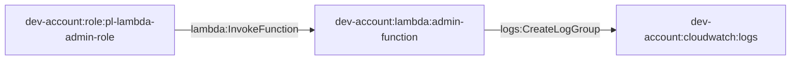

# dev_lambda_admin

* **Category:** Toxic Combination
* **Sub-Category:** Publicly-accessible
* **Path Type:** one-hop
* **Target:** to-admin
* **Environments:** prod
* **Technique:** Publicly accessible Lambda function with administrative IAM role

Lambda admin access patterns in dev environment.

## Overview

This module demonstrates Lambda function administration and access patterns within the development environment. It includes Lambda functions with administrative capabilities and the necessary IAM roles and policies to manage them.

## Access Path Diagram

## Access Path Details

### 1. Admin Role → Lambda Function
- **Permission**: `lambda:InvokeFunction`
- **Implementation**: IAM role policy allowing Lambda function invocation

### 2. Lambda Function → CloudWatch Logs
- **Permission**: `logs:CreateLogGroup`, `logs:CreateLogStream`, `logs:PutLogEvents`
- **Implementation**: Lambda execution role with CloudWatch Logs permissions

## Usage

This module creates Lambda functions with administrative capabilities and the necessary IAM roles and policies for managing Lambda resources in the development environment.

## Requirements

- AWS provider configured for dev account
- Development account ID
