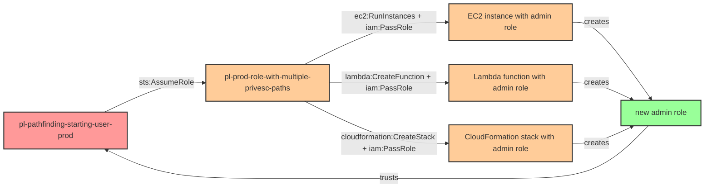

# Prod Role with Multiple Privilege Escalation Paths Module

* **Category:** Privilege Escalation
* **Sub-Category:** privilege-chaining
* **Path Type:** multi-hop
* **Target:** to-admin
* **Environments:** prod
* **Cost Estimate:** $0/mo
* **Technique:** Multiple privilege escalation techniques combined - EC2, Lambda, and CloudFormation paths to admin
* **Terraform Variable:** `enable_single_account_privesc_multi_hop_to_admin_multiple_paths_combined`
* **Schema Version:** 1.0.0
* **Attack Path:** starting_user → (AssumeRole) → starting_role → (PassRole + EC2/Lambda/CloudFormation) → admin role → admin access
* **Attack Principals:** `arn:aws:iam::{account_id}:user/pl-pathfinding-starting-user-prod`; `arn:aws:iam::{account_id}:role/pl-prod-role-with-multiple-privesc-paths`; `arn:aws:iam::{account_id}:role/pl-EC2Admin`
* **Required Permissions:** `iam:PassRole` on `arn:aws:iam::*:role/*`; `ec2:RunInstances` on `*`; `lambda:CreateFunction` on `*`; `cloudformation:CreateStack` on `*`
* **Helpful Permissions:** `iam:ListRoles` (Discover available privileged roles); `ec2:DescribeInstances` (Verify EC2 escalation path); `lambda:ListFunctions` (Verify Lambda escalation path)
* **MITRE Tactics:** TA0004 - Privilege Escalation, TA0002 - Execution
* **MITRE Techniques:** T1098.001 - Account Manipulation: Additional Cloud Credentials, T1578 - Modify Cloud Compute Infrastructure, T1648 - Serverless Execution

This module creates a role with multiple privilege escalation paths and three separate service-trusting admin roles for EC2, Lambda, and CloudFormation.

## Attack Overview

The attack paths are:
1. `pl-pathfinding_starting_user_prod` assumes `pl-prod-role-with-multiple-privesc-paths`
2. The role can then use multiple methods to escalate privileges:
   - **EC2 Path**: Create EC2 instance with admin role → EC2 creates new admin role
   - **Lambda Path**: Create Lambda function with admin role → Lambda creates new admin role
   - **CloudFormation Path**: Create CloudFormation stack with admin role → Stack creates new admin role

This pattern is dangerous because it provides multiple attack vectors for privilege escalation. Service-trusting roles with admin access are extremely powerful, and the attack can be automated and scaled. Each service provides a different persistence mechanism, demonstrating real-world attack patterns used by adversaries.

When this configuration appears in real environments, it is typically the result of overly permissive `iam:PassRole` grants combined with broad service creation permissions. A single role holding `iam:PassRole` plus the ability to launch EC2 instances, Lambda functions, or CloudFormation stacks is effectively equivalent to having administrative access.

### MITRE ATT&CK Mapping

- **Tactics**: TA0004 - Privilege Escalation, TA0002 - Execution
- **Techniques**: T1098.001 - Account Manipulation: Additional Cloud Credentials, T1578 - Modify Cloud Compute Infrastructure, T1648 - Serverless Execution

### Principals in the attack path

- `arn:aws:iam::{PROD_ACCOUNT}:user/pl-pathfinding-starting-user-prod` (starting user; assumes the escalation role)
- `arn:aws:iam::{PROD_ACCOUNT}:role/pl-prod-role-with-multiple-privesc-paths` (escalation role; holds PassRole + service creation permissions)
- `arn:aws:iam::{PROD_ACCOUNT}:role/pl-prod-ec2-admin-role` (EC2 service admin role; trusts ec2.amazonaws.com)
- `arn:aws:iam::{PROD_ACCOUNT}:role/pl-prod-lambda-admin-role` (Lambda service admin role; trusts lambda.amazonaws.com)
- `arn:aws:iam::{PROD_ACCOUNT}:role/pl-prod-cloudformation-admin-role` (CloudFormation service admin role; trusts cloudformation.amazonaws.com)

### Attack Path Diagram



### Attack Steps

1. **Initial Access** — The attacker compromises `pl-pathfinding-starting-user-prod` credentials.
2. **Hop 1 - Role Assumption** — Assume `pl-prod-role-with-multiple-privesc-paths` via `sts:AssumeRole`.
3. **Hop 2 - Privilege Escalation (choose one path)**:
   - **EC2 Path**: Call `ec2:RunInstances` with `iam:PassRole` to launch an EC2 instance attached to `pl-prod-ec2-admin-role`. The instance payload creates a new admin role that trusts the starting user.
   - **Lambda Path**: Call `lambda:CreateFunction` with `iam:PassRole` to create a Lambda function using `pl-prod-lambda-admin-role`. Invoke the function; the payload creates a new admin role that trusts the starting user.
   - **CloudFormation Path**: Call `cloudformation:CreateStack` with `iam:PassRole` to deploy a stack using `pl-prod-cloudformation-admin-role`. The stack template creates a new admin role that trusts the starting user.
4. **Verification** — Assume the newly created admin role and call `sts:GetCallerIdentity` or `iam:ListAttachedRolePolicies` to confirm administrative access.

### Scenario specific resources created

| ARN | Purpose |
|-----|---------|
| `arn:aws:iam::{PROD_ACCOUNT}:role/pl-prod-role-with-multiple-privesc-paths` | Starting escalation role with PassRole + service creation permissions |
| `arn:aws:iam::{PROD_ACCOUNT}:role/pl-prod-ec2-admin-role` | EC2 service admin role (trusts ec2.amazonaws.com, has AdministratorAccess) |
| `arn:aws:iam::{PROD_ACCOUNT}:role/pl-prod-lambda-admin-role` | Lambda service admin role (trusts lambda.amazonaws.com, has AdministratorAccess) |
| `arn:aws:iam::{PROD_ACCOUNT}:role/pl-prod-cloudformation-admin-role` | CloudFormation service admin role (trusts cloudformation.amazonaws.com, has AdministratorAccess) |

## Attack Lab

### Prerequisites

1. Install the `plabs` CLI:
   ```bash
   brew install pathfinding-labs/tap/plabs
   ```
2. Configure your AWS profiles in `~/.plabs/plabs.yaml` (or run `plabs init` if you haven't already)

### Deploy with plabs non-interactive

```bash
plabs enable enable_single_account_privesc_multi_hop_to_admin_multiple_paths_combined
plabs apply
```

### Deploy with plabs tui

1. Launch the TUI: `plabs`
2. Navigate to this scenario in the scenarios list
3. Press `space` to enable it
4. Press `d` to deploy

### Executing the automated demo_attack script

The script will:
1. Assume the privilege escalation role (`pl-prod-role-with-multiple-privesc-paths`)
2. Create an EC2 instance with the admin role and payload
3. Create a Lambda function with the admin role and payload
4. Create a CloudFormation stack with the admin role and payload
5. Verify that new admin roles were created by each service
6. Clean up all created resources

#### Resources created by attack script

- EC2 instance with `pl-prod-ec2-admin-role` attached (terminated after verification)
- Lambda function using `pl-prod-lambda-admin-role` (deleted after verification)
- CloudFormation stack using `pl-prod-cloudformation-admin-role` (deleted after verification)
- New admin IAM roles created by each service payload (deleted during cleanup)

#### With plabs non-interactive

```bash
plabs demo --list
plabs demo multiple-paths-combined
```

#### With plabs tui

1. Launch the TUI: `plabs`
2. Navigate to this scenario in the scenarios list
3. Press `r` to run the demo script

### Executing the attack manually

**Step 1: Assume the escalation role**

```bash
ROLE_CREDS=$(aws sts assume-role \
  --role-arn "arn:aws:iam::{PROD_ACCOUNT}:role/pl-prod-role-with-multiple-privesc-paths" \
  --role-session-name "privesc-demo")

export AWS_ACCESS_KEY_ID=$(echo $ROLE_CREDS | jq -r '.Credentials.AccessKeyId')
export AWS_SECRET_ACCESS_KEY=$(echo $ROLE_CREDS | jq -r '.Credentials.SecretAccessKey')
export AWS_SESSION_TOKEN=$(echo $ROLE_CREDS | jq -r '.Credentials.SessionToken')
```

**Step 2a: EC2 path — launch instance with admin role**

```bash
# Create a user-data script that creates a new admin role trusting the starting user
aws ec2 run-instances \
  --image-id ami-0abcdef1234567890 \
  --instance-type t3.micro \
  --iam-instance-profile Name=pl-prod-ec2-admin-role \
  --user-data file://payload.sh \
  --count 1
```

**Step 2b: Lambda path — create function with admin role**

```bash
aws lambda create-function \
  --function-name privesc-demo-fn \
  --runtime python3.12 \
  --role "arn:aws:iam::{PROD_ACCOUNT}:role/pl-prod-lambda-admin-role" \
  --handler index.handler \
  --zip-file fileb://payload.zip

aws lambda invoke --function-name privesc-demo-fn /tmp/out.json
```

**Step 2c: CloudFormation path — deploy stack with admin role**

```bash
aws cloudformation create-stack \
  --stack-name privesc-demo-stack \
  --template-body file://template.yaml \
  --role-arn "arn:aws:iam::{PROD_ACCOUNT}:role/pl-prod-cloudformation-admin-role" \
  --capabilities CAPABILITY_NAMED_IAM
```

**Step 3: Verify admin access**

```bash
# Assume the newly created admin role
NEW_ROLE_CREDS=$(aws sts assume-role \
  --role-arn "arn:aws:iam::{PROD_ACCOUNT}:role/new-admin-role" \
  --role-session-name "verify-admin")

export AWS_ACCESS_KEY_ID=$(echo $NEW_ROLE_CREDS | jq -r '.Credentials.AccessKeyId')
export AWS_SECRET_ACCESS_KEY=$(echo $NEW_ROLE_CREDS | jq -r '.Credentials.SecretAccessKey')
export AWS_SESSION_TOKEN=$(echo $NEW_ROLE_CREDS | jq -r '.Credentials.SessionToken')

aws sts get-caller-identity
aws iam list-attached-role-policies --role-name new-admin-role
```

### Cleanup

#### With plabs non-interactive

```bash
plabs cleanup --list
plabs cleanup multiple-paths-combined
```

#### With plabs tui

1. Launch the TUI: `plabs`
2. Navigate to this scenario in the scenarios list
3. Press `c` to run the cleanup script

### Teardown with plabs non-interactive

```bash
plabs disable enable_single_account_privesc_multi_hop_to_admin_multiple_paths_combined
plabs apply
```

### Teardown with plabs tui

1. Launch the TUI: `plabs`
2. Navigate to this scenario in the scenarios list
3. Press `space` to disable it
4. Press `D` to destroy

## Detecting Misconfiguration (CSPM)

### What CSPM tools should detect

- `pl-prod-role-with-multiple-privesc-paths` has `iam:PassRole` combined with `ec2:RunInstances`, `lambda:CreateFunction`, and `cloudformation:CreateStack` — each pairing independently constitutes a privilege escalation path
- Three service-linked admin roles (`pl-prod-ec2-admin-role`, `pl-prod-lambda-admin-role`, `pl-prod-cloudformation-admin-role`) each carry `AdministratorAccess`, making them high-value targets if any role with `iam:PassRole` can reference them
- The starting role can be assumed by a non-privileged IAM user, creating a multi-hop path from a low-privilege identity to full administrative control via three different compute services

### Prevention recommendations

- Remove `iam:PassRole` from any role that also holds compute service creation permissions (`ec2:RunInstances`, `lambda:CreateFunction`, `cloudformation:CreateStack`); these combinations are always privilege escalation paths
- Apply permission boundaries to service execution roles so that even if they carry `AdministratorAccess` in their trust/attached policies, a boundary prevents IAM write operations
- Use SCPs to restrict `iam:PassRole` to specific, approved role ARN patterns (e.g., only roles prefixed with `svc-`) rather than allowing `*`
- Enforce least-privilege on CloudFormation stack creation by requiring a `cloudformation:RoleArn` condition that limits which roles can be assumed by CloudFormation
- Audit all roles holding both `iam:PassRole` and any compute creation permission quarterly; alert on any new grant of this combination
- Tag service admin roles with a sensitivity label and enforce that only approved automation can assume or pass them

## Detection Abuse (CloudSIEM)

### CloudTrail events to monitor

- `STS: AssumeRole` — initial role assumption from starting user into the escalation role; alert when a low-privilege user assumes a role with PassRole + compute creation permissions
- `EC2: RunInstances` — EC2 instance launched with an IAM instance profile attached; high severity when the profile role carries AdministratorAccess
- `Lambda: CreateFunction20150331` — Lambda function created with an execution role; alert when the role has AdministratorAccess
- `Lambda: Invoke` — Lambda function invoked shortly after creation; escalation payload likely executing
- `CloudFormation: CreateStack` — stack created with an explicit role ARN; alert when the role has AdministratorAccess and `CAPABILITY_NAMED_IAM` is used
- `IAM: CreateRole` — new IAM role created from within an EC2 instance, Lambda function, or CloudFormation stack execution context; strong indicator of payload success
- `IAM: AttachRolePolicy` — AdministratorAccess or similar managed policy attached to a newly created role
- `STS: AssumeRole` — assumption of the newly created admin role by the original starting user identity; confirms successful escalation

### Detonation logs

_Detonation log integration (Stratus Red Team / Grimoire) is planned for a future release._
