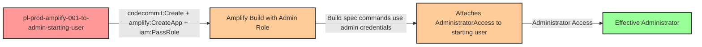

# Privilege Escalation via iam:PassRole + amplify:CreateApp + amplify:CreateBranch + amplify:StartJob

* **Category:** Privilege Escalation
* **Sub-Category:** new-passrole
* **Path Type:** one-hop
* **Target:** to-admin
* **Environments:** prod
* **Pathfinding.cloud ID:** amplify-001
* **Technique:** Creating an Amplify app connected to a CodeCommit repository containing a malicious amplify.yml build spec that executes shell commands with an admin service role

## Overview

This scenario demonstrates a privilege escalation path where a user with `iam:PassRole` and AWS Amplify permissions can gain administrative access by creating an Amplify application with a malicious build specification. The attacker first creates a CodeCommit repository containing an `amplify.yml` file with exploit commands, then creates an Amplify app connected to that repository with an admin service role. When the build job is triggered, the build commands execute in a container with the admin role's credentials, allowing the attacker's code to attach `AdministratorAccess` to the starting user.

AWS Amplify uses `amplify.yml` (or `buildspec.yml`) to define build commands that run during the CI/CD pipeline. These commands execute in a build container that has the Amplify app's service role credentials available as environment variables. The AWS CLI comes pre-installed in the Amplify build environment, making it trivial to call IAM APIs directly from the build spec. When the service role has administrative permissions, the build commands effectively run with full admin access to the AWS account.

This attack leverages the CI/CD pipeline pattern common in many AWS services. The attacker needs to set up a source code repository (CodeCommit in this case) with the malicious build spec before creating the Amplify app. This adds a prerequisite step but is straightforward since the same user typically has CodeCommit permissions. Organizations that grant Amplify permissions without restricting `iam:PassRole` to specific, least-privilege service roles are vulnerable. The cost impact is $0/mo at rest since no builds run until explicitly triggered.

## Understanding the attack scenario

### Principals in the attack path

- `arn:aws:iam::PROD_ACCOUNT:user/pl-prod-amplify-001-to-admin-starting-user` (Scenario-specific starting user with PassRole, Amplify, and CodeCommit permissions)
- `arn:aws:iam::PROD_ACCOUNT:role/pl-prod-amplify-001-to-admin-admin-role` (Admin role that trusts amplify.amazonaws.com, passed as the Amplify app service role)

### Attack Path Diagram



### Attack Steps

1. **Initial Access**: Start as `pl-prod-amplify-001-to-admin-starting-user` (credentials provided via Terraform outputs)
2. **Create CodeCommit Repository**: Create a CodeCommit repository and push a malicious `amplify.yml` build spec containing shell commands that use the AWS CLI to attach `AdministratorAccess` to the starting user.
3. **Create Amplify App**: Use `amplify:CreateApp` with `iam:PassRole` to create an Amplify application connected to the CodeCommit repository, specifying the admin role as the service role.
4. **Create Branch**: Use `amplify:CreateBranch` to create a branch in the Amplify app pointing to the repository branch containing the malicious build spec.
5. **Start Build Job**: Use `amplify:StartJob` to trigger a build. The build container executes the `amplify.yml` commands with the admin role's credentials.
6. **Automatic Escalation**: The build commands execute, using the pre-installed AWS CLI with the admin role credentials to attach `AdministratorAccess` to the starting user.
7. **Verification**: Verify administrator access by listing IAM users or performing other admin-level actions as the starting user.

### Scenario specific resources created

| ARN | Purpose |
| -- | -- |
| `arn:aws:iam::PROD_ACCOUNT:user/pl-prod-amplify-001-to-admin-starting-user` | Scenario-specific starting user with access keys, iam:PassRole, Amplify, and CodeCommit permissions |
| `arn:aws:iam::PROD_ACCOUNT:role/pl-prod-amplify-001-to-admin-admin-role` | Admin role trusting amplify.amazonaws.com, used as the Amplify app service role |
| `arn:aws:codecommit:REGION:PROD_ACCOUNT:pl-prod-amplify-001-to-admin-repo` | CodeCommit repository used to host the malicious amplify.yml build spec |
| Inline policy `pl-prod-amplify-001-to-admin-required-permissions` on `pl-prod-amplify-001-to-admin-starting-user` | Inline user policy granting required iam:PassRole and Amplify permissions |
| Inline policy `pl-prod-amplify-001-to-admin-helpful-permissions` on `pl-prod-amplify-001-to-admin-starting-user` | Inline user policy granting helpful CodeCommit and Amplify cleanup permissions |

## Executing the attack

### Using the automated demo_attack.sh

To demonstrate the privilege escalation path, run the provided demo script:

```bash
cd modules/scenarios/single-account/privesc-one-hop/to-admin/amplify-001-iam-passrole+amplify-createapp+amplify-createbranch+amplify-startjob
./demo_attack.sh
```

The script will:
1. Display a step-by-step walkthrough with color-coded output
2. Show the commands being executed and their results
3. Create a CodeCommit repository with the malicious build spec
4. Wait for the Amplify build to complete
5. Verify successful privilege escalation
6. Output standardized test results for automation

### Cleaning up the attack artifacts

After demonstrating the attack, clean up the Amplify app, CodeCommit repository, and attached admin policy:

```bash
cd modules/scenarios/single-account/privesc-one-hop/to-admin/amplify-001-iam-passrole+amplify-createapp+amplify-createbranch+amplify-startjob
./cleanup_attack.sh
```

The cleanup script will delete the Amplify app and branches, the CodeCommit repository created during the demonstration, detach the `AdministratorAccess` policy from the starting user, and restore the environment to its original state while preserving the deployed infrastructure.

## Detection and prevention


### MITRE ATT&CK Mapping

- **Tactic**: TA0004 - Privilege Escalation, TA0002 - Execution
- **Technique**: T1078.004 - Valid Accounts: Cloud Accounts
- **Technique**: T1578 - Modify Cloud Compute Infrastructure


## Prevention recommendations

- Restrict `iam:PassRole` with resource conditions to limit which roles can be passed: `"Resource": "arn:aws:iam::*:role/specific-amplify-role"` rather than allowing all roles
- Implement Service Control Policies (SCPs) to prevent passing administrative roles to Amplify or any CI/CD service
- Monitor CloudTrail for `amplify:CreateApp` and `amplify:StartJob` API calls, especially when combined with `iam:PassRole` to high-privilege roles
- Use IAM Access Analyzer to identify principals with `iam:PassRole` permissions on administrative roles
- Apply permission boundaries to Amplify service roles to cap the maximum privileges available to build environments
- Require specific IAM conditions on `iam:PassRole` such as `iam:PassedToService` restricted to `amplify.amazonaws.com` combined with role name restrictions to prevent passing admin roles
- Enable GuardDuty and configure alerts for unexpected Amplify application creation, CodeCommit repository creation, and IAM policy attachment events
- Audit all roles with `amplify.amazonaws.com` in their trust policy to ensure they follow least privilege principles and do not have administrative permissions
