# Privilege Escalation via iam:PassRole + apprunner:CreateService

* **Category:** Privilege Escalation
* **Sub-Category:** new-passrole
* **Path Type:** one-hop
* **Target:** to-admin
* **Environments:** prod
* **Cost Estimate:** $0/mo
* **Pathfinding.cloud ID:** apprunner-001
* **Technique:** Pass privileged role to App Runner service with command override
* **Terraform Variable:** `enable_single_account_privesc_one_hop_to_admin_apprunner_001_iam_passrole_apprunner_createservice`
* **Schema Version:** 1.0.0
* **Attack Path:** starting_user → (apprunner:CreateService + iam:PassRole) → App Runner service with target_role → StartCommand override executes with admin role → grants admin to starting_user → admin access
* **Attack Principals:** `arn:aws:iam::{account_id}:user/pl-prod-apprunner-001-to-admin-starting-user`; `arn:aws:iam::{account_id}:role/pl-prod-apprunner-001-to-admin-target-role`
* **Required Permissions:** `apprunner:CreateService` on `*`; `iam:PassRole` on `arn:aws:iam::*:role/pl-prod-apprunner-001-to-admin-target-role`; `iam:CreateServiceLinkedRole` on `arn:aws:iam::*:role/aws-service-role/apprunner.amazonaws.com/AWSServiceRoleForAppRunner`
* **Helpful Permissions:** `apprunner:ListServices` (List App Runner services to verify service creation); `apprunner:DescribeService` (Check service status and configuration); `iam:ListUsers` (Verify admin access after escalation)
* **MITRE Tactics:** TA0004 - Privilege Escalation, TA0002 - Execution
* **MITRE Techniques:** T1078.004 - Valid Accounts: Cloud Accounts, T1651 - Cloud Administration Command

## Attack Overview

This scenario demonstrates a privilege escalation vulnerability where a user with `apprunner:CreateService` and `iam:PassRole` permissions can create an AWS App Runner service that executes arbitrary commands with a privileged role's permissions. The attacker passes an administrative role to the App Runner service and uses the `StartCommand` override feature to execute AWS CLI commands that grant themselves administrator access.

App Runner is AWS's fully managed container application service that automatically builds and deploys web applications from source code or container images. When creating an App Runner service, you can specify an instance role that grants permissions to the running application. The `ImageConfiguration` parameter allows overriding the container's default startup command, providing an execution vector for privilege escalation.

This attack is particularly dangerous because it combines the flexibility of containerized execution with the power of IAM role assumption, all while using a public ECR image that requires no custom code or infrastructure.

**Technical Note**: The public AWS CLI container (`public.ecr.aws/aws-cli/aws-cli:latest`) has its entrypoint set to `/usr/local/bin/aws`, which means any `StartCommand` provided to App Runner is interpreted as arguments to the AWS CLI. This allows us to execute AWS CLI commands directly without needing to specify `/bin/bash` or shell wrappers. The privilege escalation happens immediately when the container starts - the service doesn't need to pass health checks or stay running for the attack to succeed.

### MITRE ATT&CK Mapping

- **Tactic**: TA0004 - Privilege Escalation, TA0002 - Execution
- **Technique**: T1078.004 - Valid Accounts: Cloud Accounts
- **Technique**: T1651 - Cloud Administration Command
- **Sub-technique**: Using cloud service features to execute commands with elevated privileges

### Principals in the attack path

- `arn:aws:iam::PROD_ACCOUNT:user/pl-prod-apprunner-001-to-admin-starting-user` (Scenario-specific starting user)
- `arn:aws:iam::PROD_ACCOUNT:role/pl-prod-apprunner-001-to-admin-target-role` (Privileged role passed to App Runner service)

### Attack Path Diagram

```mermaid
graph LR
    A[pl-prod-apprunner-001-to-admin-starting-user] -->|apprunner:CreateService + iam:PassRole| B[App Runner Service]
    B -->|runs with| C[pl-prod-apprunner-001-to-admin-target-role]
    C -->|StartCommand Override| D[AWS CLI Execution]
    D -->|iam:AttachUserPolicy| E[Starting User + AdministratorAccess]
    E -->|Full Access| F[Effective Administrator]

    style A fill:#ff9999,stroke:#333,stroke-width:2px
    style B fill:#ffcc99,stroke:#333,stroke-width:2px
    style C fill:#ffcc99,stroke:#333,stroke-width:2px
    style D fill:#ffcc99,stroke:#333,stroke-width:2px
    style E fill:#99ff99,stroke:#333,stroke-width:2px
    style F fill:#99ff99,stroke:#333,stroke-width:2px
```



### Attack Steps

1. **Initial Access**: Start as `pl-prod-apprunner-001-to-admin-starting-user` (credentials provided via Terraform outputs)
2. **Create App Runner Service**: Use `apprunner:CreateService` with `iam:PassRole` to create a service using the public AWS CLI container image (`public.ecr.aws/aws-cli/aws-cli:latest`)
3. **Command Override**: Configure the service with a `StartCommand` that executes: `iam attach-user-policy --user-name pl-prod-apprunner-001-to-admin-starting-user --policy-arn arn:aws:iam::aws:policy/AdministratorAccess` (note: the AWS CLI container's entrypoint is `/usr/local/bin/aws`, so we only need to specify the subcommand)
4. **Service Execution**: App Runner starts the service, which executes the override command with the target role's permissions
5. **Policy Attachment**: The command attaches the AWS managed `AdministratorAccess` policy to the starting user
6. **Verification**: Verify administrator access with the starting user's original credentials

### Scenario specific resources created

| ARN | Purpose |
| -- | -- |
| `arn:aws:iam::PROD_ACCOUNT:user/pl-prod-apprunner-001-to-admin-starting-user` | Scenario-specific starting user with access keys |
| `arn:aws:iam::PROD_ACCOUNT:role/pl-prod-apprunner-001-to-admin-target-role` | Privileged role with `iam:AttachUserPolicy` permission, trusted by App Runner service |
| `arn:aws:iam::PROD_ACCOUNT:policy/pl-prod-apprunner-001-to-admin-passrole-policy` | Allows `iam:PassRole` on target role and `apprunner:CreateService` |
| `arn:aws:iam::PROD_ACCOUNT:policy/pl-prod-apprunner-001-to-admin-admin-attach-policy` | Grants target role permission to attach policies to the starting user |

## Attack Lab

### Prerequisites

1. Install the `plabs` CLI:
   ```bash
   brew install pathfinding-labs/tap/plabs
   ```
2. Configure your AWS profiles in `~/.plabs/plabs.yaml` (or run `plabs init` if you haven't already)

### Deploy with plabs non-interactive

```bash
plabs enable enable_single_account_privesc_one_hop_to_admin_apprunner_001_iam_passrole_apprunner_createservice
plabs apply
```

### Deploy with plabs tui

1. Launch the TUI: `plabs`
2. Navigate to this scenario in the scenarios list
3. Press `space` to enable it
4. Press `d` to deploy

### Executing the automated demo_attack script

The script will:
1. Display a step-by-step walkthrough with color-coded output
2. Show the commands being executed and their results
3. Create an App Runner service with the StartCommand override
4. Wait for the service to execute the privilege escalation command
5. Verify successful privilege escalation to administrator
6. Output standardized test results for automation

#### Resources created by attack script

- App Runner service using the public AWS CLI container image (`public.ecr.aws/aws-cli/aws-cli:latest`)
- `AdministratorAccess` policy attached to the starting user

#### With plabs non-interactive

```bash
plabs demo --list
plabs demo apprunner-001-iam-passrole+apprunner-createservice
```

#### With plabs tui

1. Launch the TUI: `plabs`
2. Navigate to this scenario in the scenarios list
3. Press `r` to run the demo script

### Cleanup

#### With plabs non-interactive

```bash
plabs cleanup --list
plabs cleanup apprunner-001-iam-passrole+apprunner-createservice
```

#### With plabs tui

1. Launch the TUI: `plabs`
2. Navigate to this scenario in the scenarios list
3. Press `c` to run the cleanup script

### Teardown with plabs non-interactive

```bash
plabs disable enable_single_account_privesc_one_hop_to_admin_apprunner_001_iam_passrole_apprunner_createservice
plabs apply
```

### Teardown with plabs tui

1. Launch the TUI: `plabs`
2. Navigate to this scenario in the scenarios list
3. Press `space` to disable it
4. Press `D` to destroy

## Detecting Misconfiguration (CSPM)

### What CSPM tools should detect

A properly configured Cloud Security Posture Management (CSPM) tool should identify:
- **High-Risk Permission Combination**: User/role with both `apprunner:CreateService` and `iam:PassRole` permissions
- **Overly Permissive Instance Role**: App Runner service role with IAM modification permissions (`iam:AttachUserPolicy`, `iam:PutUserPolicy`, `iam:AttachRolePolicy`)
- **Service Principal Trust**: IAM roles trusting `tasks.apprunner.amazonaws.com` with sensitive permissions
- **Privilege Escalation Path**: Detection of the one-hop path from starting user through App Runner to admin access
- **Command Override Risk**: App Runner services with `StartCommand` overrides that could execute arbitrary code

### Prevention recommendations

- **Restrict PassRole Permissions**: Limit `iam:PassRole` to specific, well-defined roles with minimal permissions. Use resource-based conditions to prevent passing privileged roles to compute services.
  ```json
  {
    "Effect": "Deny",
    "Action": "iam:PassRole",
    "Resource": "*",
    "Condition": {
      "StringEquals": {
        "iam:PassedToService": "apprunner.amazonaws.com"
      }
    }
  }
  ```

- **Minimize App Runner Service Role Permissions**: Instance roles for App Runner services should follow the principle of least privilege. Avoid granting IAM modification permissions unless absolutely necessary.

- **Implement Service Control Policies (SCPs)**: Use SCPs to prevent App Runner service creation in sensitive accounts or prevent passing privileged roles to App Runner:
  ```json
  {
    "Effect": "Deny",
    "Action": "apprunner:CreateService",
    "Resource": "*",
    "Condition": {
      "StringLike": {
        "apprunner:InstanceRole": "*admin*"
      }
    }
  }
  ```

- **Monitor CloudTrail for App Runner Activity**: Set up alerts for `AppRunner: CreateService`, `AppRunner: UpdateService` API calls, especially those that specify instance roles with sensitive permissions. Pay special attention to services using `StartCommand` overrides.

- **Use IAM Access Analyzer**: Leverage IAM Access Analyzer to identify privilege escalation paths involving `iam:PassRole` and compute service permissions.

- **Implement Resource Tags and Conditions**: Require specific resource tags on roles that can be passed to App Runner services and enforce tag-based conditions in IAM policies.

- **Regular Permission Audits**: Periodically review which principals have `apprunner:CreateService` and `iam:PassRole` permissions, and ensure they are necessary for legitimate business functions.

- **Separate Environments**: Use different AWS accounts for development and production, limiting App Runner deployment capabilities to non-production environments where possible.

## Detection Abuse (CloudSIEM)

### CloudTrail events to monitor

- `IAM: PassRole` — Role passed to App Runner service; high risk when the passed role has IAM modification permissions
- `AppRunner: CreateService` — New App Runner service created; critical when combined with a privileged instance role and a `StartCommand` override
- `IAM: AttachUserPolicy` — Policy attached to a user; critical when the policy is `AdministratorAccess` and follows App Runner service creation

### Detonation logs

_Detonation log integration (Stratus Red Team / Grimoire) is planned for a future release._
