# Privilege Escalation via apprunner:UpdateService

* **Category:** Privilege Escalation
* **Sub-Category:** access-resource
* **Path Type:** one-hop
* **Target:** to-admin
* **Environments:** prod
* **Technique:** Update existing App Runner service to execute privilege escalation commands

## Overview

This scenario demonstrates a privilege escalation vulnerability where a user with `apprunner:UpdateService` permission can exploit an existing AWS App Runner service that has a privileged role attached. Unlike creating a new service from scratch, this attack leverages pre-existing infrastructure by updating the service configuration to execute arbitrary commands with the service's administrative permissions.

The attacker modifies two key aspects of the service configuration: the container image (changing to the AWS CLI container) and the `StartCommand` (setting it to execute IAM commands). When the service updates and restarts, it executes the attacker's commands with the privileged role's permissions, granting the attacker administrator access.

This attack is particularly stealthy because it exploits legitimate infrastructure already present in the environment. Security teams may overlook the risk of `apprunner:UpdateService` permission, focusing instead on service creation capabilities. Additionally, the attack leaves minimal traces beyond normal service update operations, making it harder to distinguish from routine maintenance activities.

**Technical Note**: The public AWS CLI container (`public.ecr.aws/aws-cli/aws-cli:latest`) has its entrypoint set to `/usr/local/bin/aws`, which means any `StartCommand` provided to App Runner is interpreted as arguments to the AWS CLI. This allows us to execute AWS CLI commands directly without needing to specify `/bin/bash` or shell wrappers. The privilege escalation happens immediately when the container starts during the service update - the service doesn't need to pass health checks or stay running for the attack to succeed.

## Understanding the attack scenario

### Principals in the attack path

- `arn:aws:iam::PROD_ACCOUNT:user/pl-prod-aus-to-admin-starting-user` (Scenario-specific starting user)
- `arn:aws:apprunner:REGION:PROD_ACCOUNT:service/pl-prod-aus-to-admin-target-service` (Existing App Runner service)
- `arn:aws:iam::PROD_ACCOUNT:role/pl-prod-aus-to-admin-target-role` (Privileged role attached to the service)

### Attack Path Diagram

```mermaid
graph LR
    A[pl-prod-aus-to-admin-starting-user] -->|apprunner:UpdateService| B[Existing App Runner Service]
    B -->|Update Image & StartCommand| C[AWS CLI Container Execution]
    C -->|runs with| D[pl-prod-aus-to-admin-target-role]
    D -->|iam:AttachUserPolicy| E[Starting User + AdministratorAccess]
    E -->|Full Access| F[Effective Administrator]

    style A fill:#ff9999,stroke:#333,stroke-width:2px
    style B fill:#ffcc99,stroke:#333,stroke-width:2px
    style C fill:#ffcc99,stroke:#333,stroke-width:2px
    style D fill:#ffcc99,stroke:#333,stroke-width:2px
    style E fill:#99ff99,stroke:#333,stroke-width:2px
    style F fill:#99ff99,stroke:#333,stroke-width:2px
```



### Attack Steps

1. **Initial Access**: Start as `pl-prod-aus-to-admin-starting-user` (credentials provided via Terraform outputs)
2. **Discover Target Service**: Identify the existing App Runner service `pl-prod-aus-to-admin-target-service` and verify it has a privileged role attached
3. **Update Service Configuration**: Use `apprunner:UpdateService` to modify the service:
   - Change container image to `public.ecr.aws/aws-cli/aws-cli:latest`
   - Set `StartCommand` to: `iam attach-user-policy --user-name pl-prod-aus-to-admin-starting-user --policy-arn arn:aws:iam::aws:policy/AdministratorAccess`
4. **Service Restart**: App Runner automatically restarts the service with the new configuration
5. **Command Execution**: The AWS CLI container executes the override command with the target role's permissions
6. **Policy Attachment**: The command attaches the AWS managed `AdministratorAccess` policy to the starting user
7. **Verification**: Verify administrator access with the starting user's original credentials

### Scenario specific resources created

| ARN | Purpose |
| -- | -- |
| `arn:aws:iam::PROD_ACCOUNT:user/pl-prod-aus-to-admin-starting-user` | Scenario-specific starting user with access keys and inline policy for App Runner |
| `arn:aws:apprunner:REGION:PROD_ACCOUNT:service/pl-prod-aus-to-admin-target-service` | Existing App Runner service running a benign nginx container |
| `arn:aws:iam::PROD_ACCOUNT:role/pl-prod-aus-to-admin-target-role` | Privileged role attached to the App Runner service with administrator access (`Action: "*"`) |

## Executing the attack

### Using the automated demo_attack.sh

To demonstrate the privilege escalation path, run the provided demo script:

```bash
cd modules/scenarios/single-account/privesc-one-hop/to-admin/apprunner-updateservice
./demo_attack.sh
```

The script will:
1. Display a step-by-step walkthrough with color-coded output
2. Show the commands being executed and their results
3. Backup the original service configuration (image and StartCommand)
4. Update the App Runner service with malicious configuration
5. Wait for the service to execute the privilege escalation command
6. Verify successful privilege escalation to administrator
7. Output standardized test results for automation

### Cleaning up the attack artifacts

After demonstrating the attack, restore the original service configuration and remove administrative access:

```bash
cd modules/scenarios/single-account/privesc-one-hop/to-admin/apprunner-updateservice
./cleanup_attack.sh
```

The cleanup script will:
- Restore the original App Runner service configuration (image and StartCommand)
- Detach the `AdministratorAccess` policy from the starting user
- Verify the service has been restored to its original state
- Confirm the environment is back to baseline

## Detection and prevention

### What CSPM tools should detect

A properly configured Cloud Security Posture Management (CSPM) tool should identify:
- **Overly Permissive Update Permissions**: User/role with `apprunner:UpdateService` permission on services with privileged roles
- **Service with Privileged Role**: App Runner service running with a role that has IAM modification permissions (`iam:AttachUserPolicy`, `iam:PutUserPolicy`, `iam:AttachRolePolicy`)
- **Privilege Escalation Path**: Detection of the one-hop path from starting user through existing App Runner infrastructure to admin access
- **Lack of Resource-Based Restrictions**: `apprunner:UpdateService` permission without conditions limiting which services can be updated
- **Service Role Risk**: IAM roles with both App Runner trust relationships and sensitive permissions like IAM policy manipulation
- **Command Override Capability**: App Runner services that can be updated with `StartCommand` overrides by non-administrative users

### MITRE ATT&CK Mapping

- **Tactic**: TA0004 - Privilege Escalation, TA0002 - Execution
- **Technique**: T1078.004 - Valid Accounts: Cloud Accounts
- **Technique**: T1651 - Cloud Administration Command
- **Sub-technique**: Using cloud service features to execute commands with elevated privileges

## Prevention recommendations

- **Restrict UpdateService Permissions**: Limit `apprunner:UpdateService` to specific services using resource-based conditions. Never grant blanket update permissions across all services:
  ```json
  {
    "Effect": "Allow",
    "Action": "apprunner:UpdateService",
    "Resource": "arn:aws:apprunner:*:*:service/approved-service-name/*",
    "Condition": {
      "StringEquals": {
        "aws:ResourceTag/UpdateAllowed": "true"
      }
    }
  }
  ```

- **Minimize App Runner Service Role Permissions**: Instance roles for App Runner services should follow the principle of least privilege. Avoid granting IAM modification permissions unless absolutely necessary. Use IAM policy conditions to further restrict what a service role can do:
  ```json
  {
    "Effect": "Deny",
    "Action": [
      "iam:AttachUserPolicy",
      "iam:AttachRolePolicy",
      "iam:PutUserPolicy",
      "iam:PutRolePolicy"
    ],
    "Resource": "*"
  }
  ```

- **Implement Service Control Policies (SCPs)**: Use SCPs to prevent updating App Runner services that have privileged roles or to block service updates entirely in sensitive accounts:
  ```json
  {
    "Effect": "Deny",
    "Action": "apprunner:UpdateService",
    "Resource": "*",
    "Condition": {
      "StringLike": {
        "aws:ResourceTag/Sensitivity": "high"
      }
    }
  }
  ```

- **Monitor CloudTrail for Service Updates**: Set up alerts for `UpdateService` API calls, especially those that modify `ImageConfiguration` or `StartCommand`. Pay particular attention to updates on services with privileged instance roles:
  - Alert on: `apprunner:UpdateService` with `ImageConfiguration.StartCommand` changes
  - Alert on: Service updates where the target service has an instance role with IAM permissions
  - Correlate: Service update events followed by unexpected IAM policy attachments

- **Use IAM Access Analyzer**: Leverage IAM Access Analyzer to identify privilege escalation paths involving App Runner service update permissions and roles with IAM modification capabilities.

- **Implement Resource Tags and ABAC**: Tag App Runner services based on their sensitivity level and the permissions of their instance roles. Use Attribute-Based Access Control (ABAC) to restrict who can update high-privilege services:
  ```json
  {
    "Effect": "Deny",
    "Action": "apprunner:UpdateService",
    "Resource": "*",
    "Condition": {
      "StringEquals": {
        "aws:ResourceTag/InstanceRolePrivilege": "admin"
      },
      "StringNotEquals": {
        "aws:PrincipalTag/AppRunnerAdmin": "true"
      }
    }
  }
  ```

- **Regular Permission Audits**: Periodically review which principals have `apprunner:UpdateService` permissions and which services have privileged instance roles. Ensure this combination is necessary for legitimate business functions.

- **Separate Environments and Accounts**: Use different AWS accounts for development and production. Limit App Runner deployment and update capabilities to non-production environments where possible. Use cross-account roles with strict conditions for production service management.

- **Implement Change Control**: Require approval workflows for App Runner service updates in production environments. Use AWS Systems Manager Change Manager or third-party tools to gate service configuration changes.

- **Enable AWS Config Rules**: Configure AWS Config to monitor App Runner service configurations and alert on changes to image sources or command overrides:
  - Rule: Detect when service instance roles have IAM permissions
  - Rule: Alert on image changes from approved registries
  - Rule: Monitor StartCommand modifications
