# Privilege Escalation via iam:PassRole + batch:RegisterJobDefinition + batch:SubmitJob

* **Category:** Privilege Escalation
* **Sub-Category:** new-passrole
* **Path Type:** one-hop
* **Target:** to-admin
* **Environments:** prod
* **Pathfinding.cloud ID:** batch-001
* **Technique:** Registering a Batch job definition with an admin role and submitting a job that grants the starting user administrative access

## Overview

This scenario demonstrates a privilege escalation vulnerability where a user has permissions to pass an IAM role to AWS Batch, register job definitions, and submit jobs. The attacker registers a Batch job definition that specifies a privileged role as the `jobRoleArn`, submits the job to an existing Fargate job queue, and the container executes with administrative credentials via the ECS container credential provider. The container then attaches AdministratorAccess to the starting user, completing the escalation.

AWS Batch orchestrates container workloads on top of Amazon ECS (or ECS on Fargate). When a job definition specifies a `jobRoleArn`, that role is assumed by the ECS task running the container -- meaning the role must trust `ecs-tasks.amazonaws.com`, not `batch.amazonaws.com`. This subtlety is important for both understanding the attack and configuring detection rules correctly. An attacker who can pass a privileged role to Batch and submit jobs effectively gains the full permissions of that role within the container.

This attack is particularly dangerous because AWS Batch is often provisioned with broad compute environments and job queues shared across teams. If an IAM user has `iam:PassRole` on a privileged role combined with Batch job submission permissions, they can launch arbitrary containers that execute with administrative credentials. The attack requires no existing infrastructure beyond a job queue and compute environment, and the container can perform any action the passed role allows.

## Understanding the attack scenario

### Principals in the attack path

- `arn:aws:iam::PROD_ACCOUNT:user/pl-prod-batch-001-to-admin-starting-user` (Scenario-specific starting user with PassRole and Batch permissions)
- `arn:aws:iam::PROD_ACCOUNT:role/pl-prod-batch-001-to-admin-admin-role` (Admin role passed as jobRoleArn to the Batch job definition)

### Attack Path Diagram

```mermaid
graph LR
    A[pl-prod-batch-001-to-admin-starting-user] -->|iam:PassRole + batch:RegisterJobDefinition| B[Batch Job Definition]
    B -->|batch:SubmitJob| C[Batch Job Container]
    C -->|Executes with| D[pl-prod-batch-001-to-admin-admin-role]
    D -->|iam:AttachUserPolicy| E[Starting User = Administrator]

    style A fill:#ff9999,stroke:#333,stroke-width:2px
    style B fill:#ffcc99,stroke:#333,stroke-width:2px
    style C fill:#ffcc99,stroke:#333,stroke-width:2px
    style D fill:#ffcc99,stroke:#333,stroke-width:2px
    style E fill:#99ff99,stroke:#333,stroke-width:2px
```



### Attack Steps

1. **Initial Access**: Start as `pl-prod-batch-001-to-admin-starting-user` (credentials provided via Terraform outputs)
2. **Register Job Definition**: Use `batch:RegisterJobDefinition` with `iam:PassRole` to register a job definition that specifies the admin role as the `jobRoleArn`. The container image runs a command that attaches AdministratorAccess to the starting user.
3. **Submit Job**: Use `batch:SubmitJob` to submit the job to the existing Fargate job queue. The Batch service launches a container that inherits the admin role credentials via the ECS container credential provider.
4. **Wait for Execution**: The Batch job runs the container, which uses the admin role to call `iam:AttachUserPolicy` and attach `AdministratorAccess` to the starting user.
5. **Verification**: Verify administrator access by performing admin-level actions (e.g., `iam:ListUsers`) as the starting user.

### Scenario specific resources created

| ARN | Purpose |
| -- | -- |
| `arn:aws:iam::PROD_ACCOUNT:user/pl-prod-batch-001-to-admin-starting-user` | Scenario-specific starting user with access keys, PassRole, and Batch permissions |
| `arn:aws:iam::PROD_ACCOUNT:role/pl-prod-batch-001-to-admin-admin-role` | Admin role (trusts ecs-tasks.amazonaws.com) passed as jobRoleArn |
| Execution role | ECS task execution role for pulling container images and sending logs |
| Fargate compute environment | AWS Batch compute environment using Fargate for container execution |
| Job queue | AWS Batch job queue associated with the Fargate compute environment |
| Policy attached to starting user | Grants `iam:PassRole` on admin role, `batch:RegisterJobDefinition`, and `batch:SubmitJob` |

## Executing the attack

### Using the automated demo_attack.sh

To demonstrate the privilege escalation path, run the provided demo script:

```bash
cd modules/scenarios/single-account/privesc-one-hop/to-admin/batch-001-iam-passrole+batch-registerjobdefinition+batch-submitjob
./demo_attack.sh
```

The script will:
1. Display a step-by-step walkthrough with color-coded output
2. Show the commands being executed and their results
3. Verify successful privilege escalation
4. Output standardized test results for automation

### Cleaning up the attack artifacts

After demonstrating the attack, clean up the AdministratorAccess policy attached to the starting user and any Batch job definitions created during the demo:

```bash
cd modules/scenarios/single-account/privesc-one-hop/to-admin/batch-001-iam-passrole+batch-registerjobdefinition+batch-submitjob
./cleanup_attack.sh
```

## Detection and prevention


### MITRE ATT&CK Mapping

- **Tactic**: TA0004 - Privilege Escalation, TA0002 - Execution
- **Technique**: T1078.004 - Valid Accounts: Cloud Accounts
- **Technique**: T1610 - Deploy Container


## Prevention recommendations

- Restrict `iam:PassRole` permissions using strict resource conditions to limit which roles can be passed to Batch job definitions
- Implement the `iam:PassedToService` condition key to constrain PassRole usage to specific AWS services
- Use the `batch:Image` condition key to restrict which container images can be used in job definitions, preventing arbitrary command execution
- Monitor CloudTrail for `batch:RegisterJobDefinition` events where the `jobRoleArn` references a privileged role
- Implement Service Control Policies (SCPs) that prevent passing roles with administrative permissions to Batch
- Use IAM Access Analyzer to identify privilege escalation paths involving PassRole to Batch job roles
- Monitor for `batch:SubmitJob` API calls from unusual principals or outside expected automation workflows
- Enable AWS Config rules to detect Batch job definitions configured with overly permissive task roles
