# Privilege Escalation via iam:PassRole + Bedrock AgentCore Code Interpreter

* **Category:** Privilege Escalation
* **Sub-Category:** new-passrole
* **Path Type:** one-hop
* **Target:** to-admin
* **Environments:** prod
* **Cost Estimate:** $0/mo
* **Pathfinding.cloud ID:** bedrock-001
* **Technique:** Pass privileged IAM role to Bedrock code interpreter and extract credentials from MicroVM Metadata Service
* **Terraform Variable:** `enable_single_account_privesc_one_hop_to_admin_bedrock_001_iam_passrole_bedrockagentcore_codeinterpreter`
* **Schema Version:** 1.0.0
* **Attack Path:** starting_user → (PassRole + CreateCodeInterpreter) → code interpreter with admin role → (StartSession + InvokeCodeInterpreter) → extract credentials from MMDS at 169.254.169.254 → admin access
* **Attack Principals:** `arn:aws:iam::{account_id}:user/pl-prod-bedrock-001-to-admin-starting-user`; `arn:aws:iam::{account_id}:role/pl-prod-bedrock-001-to-admin-target-role`
* **Required Permissions:** `iam:PassRole` on `arn:aws:iam::*:role/pl-prod-bedrock-001-to-admin-target-role`; `bedrock-agentcore:CreateCodeInterpreter` on `*`; `bedrock-agentcore:StartCodeInterpreterSession` on `*`; `bedrock-agentcore:InvokeCodeInterpreter` on `*`
* **Helpful Permissions:** `iam:ListRoles` (Discover available privileged roles to pass); `iam:GetRole` (View role trust policies and attached permissions); `bedrock-agentcore:GetCodeInterpreter` (Verify code interpreter creation and configuration)
* **MITRE Tactics:** TA0004 - Privilege Escalation, TA0006 - Credential Access
* **MITRE Techniques:** T1098.001 - Account Manipulation: Additional Cloud Credentials, T1552.005 - Unsecured Credentials: Cloud Instance Metadata API

## Attack Overview

This scenario demonstrates a novel privilege escalation vulnerability discovered by Nigel Sood at Sonrai Security in 2025. An attacker with `iam:PassRole` and Bedrock AgentCore permissions can create a code interpreter with a privileged IAM role. Code interpreters run on Firecracker MicroVMs that expose a MicroVM Metadata Service (MMDS) at 169.254.169.254, similar to EC2's Instance Metadata Service (IMDS). By invoking Python code within the interpreter session, the attacker can access the metadata service to extract temporary credentials for the execution role, gaining its full permissions.

This represents a significant expansion of the traditional PassRole attack surface into AWS's AI/ML tooling ecosystem. Unlike EC2 or Lambda functions which require infrastructure deployment, code interpreters provide immediate interactive access to credentials through their metadata service.

The vulnerability is particularly dangerous because:
- Code interpreters provide immediate, interactive credential access (no waiting for service initialization)
- The attack can be executed entirely through API calls without deploying persistent infrastructure
- Many organizations are adopting Bedrock for AI/ML workloads without awareness of this escalation path
- Traditional CSPM tools may not detect this as a privilege escalation risk

### MITRE ATT&CK Mapping

- **Tactic**: TA0004 - Privilege Escalation, TA0006 - Credential Access
- **Technique**: T1098.001 - Account Manipulation: Additional Cloud Credentials
- **Technique**: T1552.005 - Unsecured Credentials: Cloud Instance Metadata API
- **Sub-technique**: Extracting credentials from AWS service metadata endpoints

### Principals in the attack path

- `arn:aws:iam::PROD_ACCOUNT:user/pl-prod-bedrock-001-to-admin-starting-user` (Scenario-specific starting user)
- `arn:aws:iam::PROD_ACCOUNT:role/pl-prod-bedrock-001-to-admin-target-role` (Target privileged role with admin permissions)

### Attack Path Diagram

```mermaid
graph LR
    A[pl-prod-bedrock-001-to-admin-starting-user] -->|iam:PassRole| B[Create Code Interpreter]
    B -->|bedrock-agentcore:CreateCodeInterpreter| C[Code Interpreter with Admin Role]
    C -->|bedrock-agentcore:StartCodeInterpreterSession| D[Active Session]
    D -->|bedrock-agentcore:InvokeCodeInterpreter| E[Execute Python Code]
    E -->|HTTP GET 169.254.169.254| F[MicroVM Metadata Service]
    F -->|Return Credentials| G[Extract Admin Role Credentials]
    G -->|Use Credentials| H[Administrator Access]

    style A fill:#ff9999,stroke:#333,stroke-width:2px
    style C fill:#ffcc99,stroke:#333,stroke-width:2px
    style F fill:#ffcc99,stroke:#333,stroke-width:2px
    style H fill:#99ff99,stroke:#333,stroke-width:2px
```



### Attack Steps

1. **Initial Access**: Start as `pl-prod-bedrock-001-to-admin-starting-user` (credentials provided via Terraform outputs)
2. **Create Code Interpreter**: Use `bedrock-agentcore:CreateCodeInterpreter` and pass the privileged target role via `iam:PassRole`
3. **Start Session**: Initiate a code interpreter session with `bedrock-agentcore:StartCodeInterpreterSession`
4. **Execute Credential Extraction**: Use `bedrock-agentcore:InvokeCodeInterpreter` to run Python code that accesses the MicroVM Metadata Service at 169.254.169.254
5. **Extract Credentials**: Read temporary credentials from `/latest/meta-data/iam/security-credentials/execution_role`
6. **Verification**: Use the extracted credentials to verify administrator access

### Scenario specific resources created

| ARN | Purpose |
| -- | -- |
| `arn:aws:iam::PROD_ACCOUNT:user/pl-prod-bedrock-001-to-admin-starting-user` | Scenario-specific starting user with access keys |
| `arn:aws:iam::PROD_ACCOUNT:role/pl-prod-bedrock-001-to-admin-target-role` | Target privileged role with AdministratorAccess policy |
| `arn:aws:iam::PROD_ACCOUNT:policy/pl-prod-bedrock-001-to-admin-starting-user-policy` | Policy granting PassRole and Bedrock AgentCore permissions |

## Attack Lab

### Prerequisites

1. Install the `plabs` CLI:
   ```bash
   brew install pathfinding-labs/tap/plabs
   ```
2. Configure your AWS profiles in `~/.plabs/plabs.yaml` (or run `plabs init` if you haven't already)

### Deploy with plabs non-interactive

```bash
plabs enable enable_single_account_privesc_one_hop_to_admin_bedrock_001_iam_passrole_bedrockagentcore_codeinterpreter
plabs apply
```

### Deploy with plabs tui

1. Launch the TUI: `plabs`
2. Navigate to this scenario in the scenarios list
3. Press `space` to enable it
4. Press `d` to deploy

### Executing the automated demo_attack script

The script will:
1. Display a step-by-step walkthrough with color-coded output
2. Show the commands being executed and their results
3. Create a code interpreter with the privileged role
4. Extract credentials from the MicroVM Metadata Service
5. Verify successful privilege escalation with admin operations
6. Output standardized test results for automation

#### Resources created by attack script

- Bedrock AgentCore code interpreter with the privileged target role attached
- Active code interpreter session

#### With plabs non-interactive

```bash
plabs demo --list
plabs demo bedrock-001-iam-passrole+bedrockagentcore-codeinterpreter
```

#### With plabs tui

1. Launch the TUI: `plabs`
2. Navigate to this scenario in the scenarios list
3. Press `r` to run the demo script

### Cleanup

#### With plabs non-interactive

```bash
plabs cleanup --list
plabs cleanup bedrock-001-iam-passrole+bedrockagentcore-codeinterpreter
```

#### With plabs tui

1. Launch the TUI: `plabs`
2. Navigate to this scenario in the scenarios list
3. Press `c` to run the cleanup script

### Teardown with plabs non-interactive

```bash
plabs disable enable_single_account_privesc_one_hop_to_admin_bedrock_001_iam_passrole_bedrockagentcore_codeinterpreter
plabs apply
```

### Teardown with plabs tui

1. Launch the TUI: `plabs`
2. Navigate to this scenario in the scenarios list
3. Press `space` to disable it
4. Press `D` to destroy

## Detecting Misconfiguration (CSPM)

### What CSPM tools should detect

A properly configured Cloud Security Posture Management (CSPM) tool should identify this vulnerability by detecting:

1. **Privilege Escalation Path**: Principal with `iam:PassRole` permission on privileged roles combined with `bedrock-agentcore:CreateCodeInterpreter`
2. **Overly Permissive PassRole**: IAM policy allowing PassRole on roles with administrative or sensitive permissions
3. **Broad Bedrock Permissions**: Principal with unrestricted `bedrock-agentcore:*` permissions
4. **Trust Policy Issues**: Roles that trust bedrock-agentcore.amazonaws.com without restrictive conditions
5. **Toxic Combination**: User/role with both PassRole and Bedrock AgentCore permissions that can access privileged roles

### Prevention recommendations

1. **Restrict PassRole Permissions**: Limit `iam:PassRole` to specific non-privileged roles using resource-based conditions:
   ```json
   {
     "Effect": "Allow",
     "Action": "iam:PassRole",
     "Resource": "arn:aws:iam::*:role/bedrock-limited-*",
     "Condition": {
       "StringEquals": {
         "iam:PassedToService": "bedrock-agentcore.amazonaws.com"
       }
     }
   }
   ```

2. **Implement Service Control Policies (SCPs)**: Use SCPs to prevent PassRole on administrative roles:
   ```json
   {
     "Effect": "Deny",
     "Action": "iam:PassRole",
     "Resource": [
       "arn:aws:iam::*:role/*Admin*",
       "arn:aws:iam::*:role/*admin*"
     ],
     "Condition": {
       "StringEquals": {
         "iam:PassedToService": "bedrock-agentcore.amazonaws.com"
       }
     }
   }
   ```

3. **Restrict Bedrock AgentCore Permissions**: Avoid granting broad `bedrock-agentcore:*` permissions. Separate responsibilities:
   - Grant `CreateCodeInterpreter` only to trusted automation
   - Grant `InvokeCodeInterpreter` only to users who need interactive access
   - Never combine with `iam:PassRole` on privileged roles

4. **Role Trust Policy Restrictions**: Add conditions to roles trusted by bedrock-agentcore.amazonaws.com:
   ```json
   {
     "Effect": "Allow",
     "Principal": {
       "Service": "bedrock-agentcore.amazonaws.com"
     },
     "Action": "sts:AssumeRole",
     "Condition": {
       "StringEquals": {
         "aws:SourceAccount": "123456789012"
       },
       "ArnLike": {
         "aws:SourceArn": "arn:aws:bedrock:us-east-1:123456789012:code-interpreter/*"
       }
     }
   }
   ```

5. **Use IAM Access Analyzer**: Enable IAM Access Analyzer to identify privilege escalation paths involving PassRole and AWS service integrations

6. **Principle of Least Privilege**: Design Bedrock execution roles with minimal permissions required for the specific use case, never administrative access

7. **Network Monitoring**: Monitor for unusual network patterns from Bedrock resources, including requests to metadata service endpoints

## Detection Abuse (CloudSIEM)

### CloudTrail events to monitor

- `IAM: PassRole` — Role passed to Bedrock AgentCore service; critical when the passed role has elevated or administrative permissions
- `Bedrock: CreateAgentActionGroup` — Bedrock AgentCore code interpreter created with an execution role; monitor for privileged role ARNs in the request
- `Bedrock: InvokeAgent` — Code interpreter session invoked; high severity when followed by credential usage from a different IP address
- `STS: AssumeRole` — Temporary credentials assumed by the Bedrock AgentCore service on behalf of a code interpreter session

### Detonation logs

_Detonation log integration (Stratus Red Team / Grimoire) is planned for a future release._

## References

This privilege escalation technique was discovered by **Nigel Sood** at **Sonrai Security** in 2025:

- [AWS AgentCore: The Overlooked Privilege Escalation Path in Bedrock AI Tooling](https://sonraisecurity.com/blog/aws-agentcore-privilege-escalation-bedrock-scp-fix/) - Sonrai Security Blog
- [Sandboxed to Compromised: New Research Exposes Credential Exfiltration Paths in AWS Code Interpreters](https://sonraisecurity.com/blog/sandboxed-to-compromised-new-research-exposes-credential-exfiltration-paths-in-aws-code-interpreters/) - Sonrai Security Blog

**Credit**: Special thanks to Nigel Sood and the Sonrai Security research team for discovering and responsibly disclosing this privilege escalation path.
