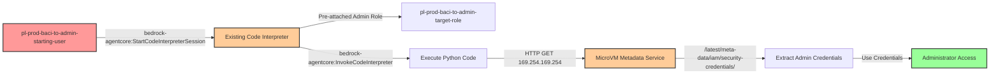

# Privilege Escalation via Bedrock AgentCore: Accessing Existing Code Interpreters

**Category:** Privilege Escalation
**Sub-Category:** access-resource
**Path Type:** one-hop
**Target:** to-admin
**Environments:** prod
**Pathfinding.cloud ID:** bedrock-002
**Technique:** Access existing code interpreter with privileged role to extract credentials from MicroVM Metadata Service (no iam:PassRole required)

## Overview

This scenario demonstrates a critical privilege escalation vulnerability discovered by Nigel Sood at Sonrai Security in 2025. Unlike the bedrock-001 attack which requires creating a NEW code interpreter with `iam:PassRole`, this scenario exploits EXISTING code interpreters that already have privileged IAM roles attached. An attacker with only `bedrock-agentcore:StartCodeInterpreterSession` and `bedrock-agentcore:InvokeCodeInterpreter` permissions can access pre-deployed code interpreters, start a session, and extract credentials from the MicroVM Metadata Service (MMDS) at 169.254.169.254.

This attack is analogous to `lambda:UpdateFunctionCode` versus `lambda:CreateFunction` - it targets existing resources rather than creating new ones, and therefore does NOT require `iam:PassRole` permission since the role is already attached to the interpreter.

The vulnerability is particularly dangerous because:
- **No iam:PassRole Required**: The role is already attached to the existing interpreter, eliminating the most common privilege escalation control
- **Lower Permission Bar**: Organizations may grant "read-only" Bedrock access (Start/Invoke) while carefully restricting Create permissions
- **Existing Infrastructure**: Exploits legitimate code interpreters already deployed for AI/ML workloads
- **Similar to Lambda UpdateFunctionCode**: Follows the same pattern as other "modify existing resource" escalation paths
- **Detection Gap**: CSPM tools may focus on CreateCodeInterpreter while missing Start/Invoke on existing privileged interpreters

## Understanding the attack scenario

### Principals in the attack path

- `arn:aws:iam::PROD_ACCOUNT:user/pl-prod-baci-to-admin-starting-user` (Scenario-specific starting user)
- `arn:aws:bedrock-agentcore:REGION:PROD_ACCOUNT:code-interpreter/pl-prod-baci-to-admin-target-interpreter` (Pre-deployed code interpreter with admin role)
- `arn:aws:iam::PROD_ACCOUNT:role/pl-prod-baci-to-admin-target-role` (Admin execution role already attached to the interpreter)

### Attack Path Diagram



### Attack Steps

1. **Initial Access**: Start as `pl-prod-baci-to-admin-starting-user` (credentials provided via Terraform outputs)
2. **Discover Existing Interpreter**: Identify the pre-deployed code interpreter `pl-prod-baci-to-admin-target-interpreter` (optionally using `bedrock-agentcore:ListCodeInterpreters`)
3. **Start Session**: Initiate a session on the existing interpreter using `bedrock-agentcore:StartCodeInterpreterSession` (NO iam:PassRole required)
4. **Execute Credential Extraction**: Use `bedrock-agentcore:InvokeCodeInterpreter` to run Python code that accesses the MicroVM Metadata Service at 169.254.169.254
5. **Extract Credentials**: Read temporary credentials from `/latest/meta-data/iam/security-credentials/execution_role`
6. **Verification**: Use the extracted credentials to verify administrator access

### Scenario specific resources created

| ARN | Purpose |
| -- | -- |
| `arn:aws:iam::PROD_ACCOUNT:user/pl-prod-baci-to-admin-starting-user` | Scenario-specific starting user with access keys |
| `arn:aws:bedrock-agentcore:REGION:PROD_ACCOUNT:code-interpreter/pl-prod-baci-to-admin-target-interpreter` | Pre-deployed code interpreter with admin execution role |
| `arn:aws:iam::PROD_ACCOUNT:role/pl-prod-baci-to-admin-target-role` | Target privileged role with AdministratorAccess (pre-attached to interpreter) |
| `arn:aws:iam::PROD_ACCOUNT:policy/pl-prod-baci-to-admin-starting-user-policy` | Policy granting Start/Invoke permissions (NO PassRole or CreateCodeInterpreter) |

## Executing the attack

### Using the automated demo_attack.sh

To demonstrate the privilege escalation path, run the provided demo script:

```bash
cd modules/scenarios/single-account/privesc-one-hop/to-admin/bedrockagentcore-startsession+invoke
./demo_attack.sh
```

The script will:
1. Display a step-by-step walkthrough with color-coded output
2. Show the commands being executed and their results
3. Start a session on the existing code interpreter (no creation needed)
4. Extract credentials from the MicroVM Metadata Service
5. Verify successful privilege escalation with admin operations
6. Output standardized test results for automation

### Cleaning up the attack artifacts

After demonstrating the attack, clean up the interpreter session:

```bash
cd modules/scenarios/single-account/privesc-one-hop/to-admin/bedrockagentcore-startsession+invoke
./cleanup_attack.sh
```

## Detection and prevention

### What should CSPM tools detect?

A properly configured Cloud Security Posture Management (CSPM) tool should identify this vulnerability by detecting:

1. **Access to Privileged Interpreters**: Principals with `StartCodeInterpreterSession` and `InvokeCodeInterpreter` permissions on code interpreters that have privileged execution roles
2. **Privilege Escalation Path**: Path from low-privilege principal to high-privilege interpreter without requiring PassRole
3. **Overly Broad Bedrock Permissions**: Principals with `bedrock-agentcore:*` or unrestricted Start/Invoke permissions
4. **Dangerous Resource Combinations**: Code interpreters with administrative roles + broad Start/Invoke access
5. **Similar to Lambda Update Paths**: Code interpreters with privileged roles accessible for session/invocation (analogous to Lambda functions with UpdateFunctionCode risk)

### MITRE ATT&CK Mapping

- **Tactic**: TA0004 - Privilege Escalation, TA0006 - Credential Access
- **Technique**: T1078.004 - Valid Accounts: Cloud Accounts
- **Technique**: T1552.005 - Unsecured Credentials: Cloud Instance Metadata API
- **Sub-technique**: Accessing existing privileged resources to extract credentials from metadata service

## Prevention recommendations

1. **Restrict Session Start Permissions**: Limit `bedrock-agentcore:StartCodeInterpreterSession` to specific non-privileged interpreters using resource-based conditions:
   ```json
   {
     "Effect": "Allow",
     "Action": "bedrock-agentcore:StartCodeInterpreterSession",
     "Resource": "arn:aws:bedrock-agentcore:*:*:code-interpreter/non-privileged-*"
   }
   ```

2. **Restrict Invoke Permissions**: Similarly limit `bedrock-agentcore:InvokeCodeInterpreter` to specific interpreters:
   ```json
   {
     "Effect": "Allow",
     "Action": "bedrock-agentcore:InvokeCodeInterpreter",
     "Resource": "arn:aws:bedrock-agentcore:*:*:code-interpreter/non-privileged-*"
   }
   ```

3. **Implement Service Control Policies (SCPs)**: Use SCPs to prevent access to code interpreters with privileged roles:
   ```json
   {
     "Effect": "Deny",
     "Action": [
       "bedrock-agentcore:StartCodeInterpreterSession",
       "bedrock-agentcore:InvokeCodeInterpreter"
     ],
     "Resource": "arn:aws:bedrock-agentcore:*:*:code-interpreter/*admin*",
     "Condition": {
       "StringNotEquals": {
         "aws:PrincipalArn": "arn:aws:iam::*:role/TrustedAutomationRole"
       }
     }
   }
   ```

4. **Separate Responsibilities**: Never grant both Start and Invoke permissions together unless absolutely necessary:
   - Grant `StartCodeInterpreterSession` only to trusted users/services
   - Grant `InvokeCodeInterpreter` only to authorized operators
   - Require both permissions to be present for exploitation

5. **Monitor CloudTrail Events**: Set up alerts for suspicious Bedrock AgentCore activity:
   - `StartCodeInterpreterSession` on interpreters with privileged execution roles
   - `InvokeCodeInterpreter` API calls with HTTP requests to 169.254.169.254
   - Session starts followed immediately by credential usage from different IP addresses
   - Multiple failed session attempts followed by successful credential extraction

6. **Principle of Least Privilege for Interpreter Roles**: Design code interpreter execution roles with minimal permissions:
   - Never use AdministratorAccess or PowerUserAccess for interpreter execution roles
   - Grant only specific permissions required for AI/ML workload (e.g., S3 read access to training data)
   - Use resource-based conditions to limit scope

7. **Use IAM Access Analyzer**: Enable IAM Access Analyzer to identify privilege escalation paths involving Bedrock AgentCore resources and their execution roles

8. **Implement Resource Tagging and Conditional Access**: Tag code interpreters with sensitivity levels and enforce conditional access:
   ```json
   {
     "Effect": "Deny",
     "Action": [
       "bedrock-agentcore:StartCodeInterpreterSession",
       "bedrock-agentcore:InvokeCodeInterpreter"
     ],
     "Resource": "*",
     "Condition": {
       "StringEquals": {
         "aws:ResourceTag/Sensitivity": "Privileged"
       }
     }
   }
   ```

9. **Audit Existing Code Interpreters**: Regularly review all deployed code interpreters and their execution roles:
   ```bash
   # List all interpreters and check their execution roles
   aws bedrock-agentcore list-code-interpreters
   aws bedrock-agentcore get-code-interpreter --interpreter-id <ID>
   aws iam get-role --role-name <execution-role-name>
   ```

10. **Network Monitoring**: Monitor for unusual network patterns from Bedrock resources, including requests to 169.254.169.254

## Cost Estimate

**Free Tier**: This scenario operates within AWS Free Tier limits for Bedrock AgentCore. The pre-deployed code interpreter incurs minimal costs, and normal testing activities should remain free.

**Note**: Bedrock AgentCore code interpreters are billed based on usage time. Standard testing should remain within free tier limits, but extended sessions or automated testing may incur minimal charges.

## References

This privilege escalation technique (bedrock-002) was discovered by **Nigel Sood** at **Sonrai Security** in 2025:

- [AWS AgentCore: The Overlooked Privilege Escalation Path in Bedrock AI Tooling](https://sonraisecurity.com/blog/aws-agentcore-privilege-escalation-bedrock-scp-fix/) - Sonrai Security Blog
- [Sandboxed to Compromised: New Research Exposes Credential Exfiltration Paths in AWS Code Interpreters](https://sonraisecurity.com/blog/sandboxed-to-compromised-new-research-exposes-credential-exfiltration-paths-in-aws-code-interpreters/) - Sonrai Security Blog

**Credit**: Special thanks to Nigel Sood and the Sonrai Security research team for discovering and responsibly disclosing both bedrock-001 and bedrock-002 privilege escalation paths.

## Technical Background

### Key Differences from bedrock-001

| Aspect | bedrock-001 (CREATE) | bedrock-002 (ACCESS) |
|--------|---------------------|---------------------|
| **Primary Permission** | `bedrock-agentcore:CreateCodeInterpreter` | `bedrock-agentcore:StartCodeInterpreterSession` |
| **Requires iam:PassRole** | ✅ YES | ❌ NO |
| **Target Resource** | Creates new interpreter | Accesses existing interpreter |
| **Analogous To** | `lambda:CreateFunction` + `iam:PassRole` | `lambda:UpdateFunctionCode` or `lambda:InvokeFunction` |
| **Detection Focus** | Monitor Create + PassRole combination | Monitor Start/Invoke on privileged interpreters |
| **Common Scenario** | Developer with Create permissions | Operator with "read-only" access to existing interpreters |

### Why This is Different and Dangerous

The bedrock-002 attack path represents a **fundamentally different escalation vector**:

1. **Bypasses PassRole Controls**: Organizations that carefully restrict `iam:PassRole` are still vulnerable if they grant Start/Invoke permissions on existing privileged interpreters

2. **"Read-Only" Misconception**: Teams may view `StartCodeInterpreterSession` and `InvokeCodeInterpreter` as "safe" operational permissions, similar to viewing Lambda logs or invoking functions

3. **Pre-Deployed Infrastructure**: Exploits legitimate business resources (AI/ML interpreters) rather than requiring attacker-controlled infrastructure

4. **Follows Known Pattern**: Similar to other "modify existing resource" attacks:
   - `lambda:UpdateFunctionCode` on privileged Lambda functions
   - `codebuild:StartBuild` on privileged build projects
   - `apprunner:UpdateService` on privileged App Runner services

5. **Broader Attack Surface**: More principals likely have Start/Invoke than Create+PassRole permissions

### MicroVM Metadata Service (MMDS)

Bedrock code interpreters run on Firecracker MicroVMs, which expose a metadata service similar to EC2's IMDS:

- **Endpoint**: 169.254.169.254 (same as EC2 IMDS)
- **Credential Path**: `/latest/meta-data/iam/security-credentials/execution_role`
- **Format**: JSON response containing AccessKeyId, SecretAccessKey, Token, and Expiration
- **Access**: No IMDSv2 token requirement (unlike EC2)
- **Availability**: Accessible from any Python code executed in the interpreter

### Attack Flow Comparison

**bedrock-001 (CREATE + PassRole)**:
```
Principal → CreateCodeInterpreter (with PassRole) → New Interpreter → StartSession → InvokeCode → MMDS → Credentials
```

**bedrock-002 (ACCESS existing)**:
```
Principal → StartSession (on existing interpreter) → InvokeCode → MMDS → Credentials
```

The second path is shorter, requires fewer permissions, and exploits existing infrastructure.

## Deployment Instructions

This scenario is deployed as part of the Pathfinder Labs framework. To enable it:

1. **Edit terraform.tfvars**:
   ```hcl
   enable_single_account_privesc_one_hop_to_admin_bedrockagentcore_startsession_invoke = true
   ```

2. **Apply Terraform**:
   ```bash
   terraform init
   terraform plan
   terraform apply
   ```

3. **Retrieve Credentials** (automatic in demo_attack.sh):
   ```bash
   terraform output -json | jq -r '.single_account_privesc_one_hop_to_admin_bedrockagentcore_startsession_invoke.value'
   ```

4. **Run the Demo**:
   ```bash
   cd modules/scenarios/single-account/privesc-one-hop/to-admin/bedrockagentcore-startsession+invoke
   ./demo_attack.sh
   ```

## Additional Notes

- **Bedrock Region Availability**: This scenario requires a region where Amazon Bedrock AgentCore is available
- **Pre-Deployed Interpreter**: Unlike bedrock-001, this scenario deploys the code interpreter during Terraform apply (not during the attack)
- **Service Quotas**: Default Bedrock quotas should be sufficient for testing
- **Cleanup**: The cleanup script terminates sessions but preserves the interpreter and IAM infrastructure
- **Real-World Scenario**: This scenario models a common pattern where organizations deploy shared AI/ML infrastructure with privileged roles for legitimate business purposes, then grant operators access to use those resources
- **Research Credit**: This technique (along with bedrock-001) represents cutting-edge cloud security research and demonstrates the evolving nature of AWS privilege escalation paths in the AI/ML era

## Relationship to Other Scenarios

This scenario is part of a family of "access existing privileged resource" escalation paths:

- **bedrock-002** (this scenario): `StartCodeInterpreterSession` + `InvokeCodeInterpreter` on existing interpreter
- **lambda:UpdateFunctionCode**: Modify existing privileged Lambda function code
- **lambda:InvokeFunction**: Invoke existing Lambda with privileged role (for credential extraction via logs)
- **codebuild:StartBuild**: Start existing privileged CodeBuild project
- **apprunner:UpdateService**: Update existing privileged App Runner service

All follow the pattern: **Access + Modify/Execute Existing Privileged Resource → Credential Extraction → Privilege Escalation**
