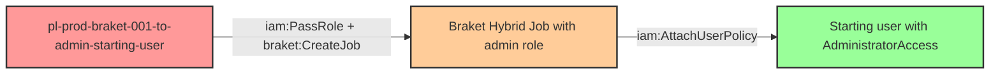

# Privilege Escalation via iam:PassRole + braket:CreateJob

* **Category:** Privilege Escalation
* **Sub-Category:** new-passrole
* **Path Type:** one-hop
* **Target:** to-admin
* **Environments:** prod
* **Pathfinding.cloud ID:** braket-001
* **Technique:** Passing an admin role to an Amazon Braket Hybrid Job that executes a malicious script to grant the starting user administrative access

## Overview

This scenario demonstrates a privilege escalation path where a user with `iam:PassRole` and `braket:CreateJob` permissions can escalate to full administrative access by creating an Amazon Braket Hybrid Job that runs with a privileged IAM role. The attacker crafts a malicious Python script, packages it as a tar.gz archive, uploads it to an S3 bucket with the required `amazon-braket-` prefix, and then creates a Braket Hybrid Job that passes the admin role as the `roleArn`. When the job executes, the script runs with the admin role's credentials and attaches `AdministratorAccess` to the starting user.

Amazon Braket Hybrid Jobs run containerized Python workloads on managed ML instances (EC2-backed) using the SageMaker Training Toolkit under the hood for credential injection. The Braket service automatically injects the passed role's temporary credentials into the container environment, making them available to any code running inside the job -- including attacker-controlled scripts. Because boto3 comes pre-installed in the Braket container image, the malicious script can immediately make IAM API calls without any additional setup.

This attack vector is particularly stealthy because Amazon Braket is a niche quantum computing service that most organizations do not actively monitor. Security teams rarely include `braket:*` API calls in their CloudTrail alerting rules, and CSPM tools may not evaluate privilege escalation paths through Braket. The attack uses the SV1 simulator device (which is free) and does not actually execute any quantum tasks -- the quantum device ARN is simply a required API parameter. Braket is only available in five AWS regions (us-east-1, us-west-1, us-west-2, eu-west-2, eu-north-1), which is worth noting for both attackers and defenders.

## Understanding the attack scenario

### Principals in the attack path

- `arn:aws:iam::PROD_ACCOUNT:user/pl-prod-braket-001-to-admin-starting-user` (Scenario-specific starting user with iam:PassRole, braket:CreateJob, and s3:PutObject permissions)
- `arn:aws:iam::PROD_ACCOUNT:role/pl-prod-braket-001-to-admin-admin-role` (Admin role trusting braket.amazonaws.com, with AdministratorAccess)

### Attack Path Diagram



### Attack Steps

1. **Initial Access**: Start as `pl-prod-braket-001-to-admin-starting-user` (credentials provided via Terraform outputs)
2. **Prepare Malicious Script**: Create a Python script that uses boto3 to attach `AdministratorAccess` to the starting user. Package the script as a tar.gz archive.
3. **Upload to S3**: Upload the tar.gz archive to the Braket S3 bucket (must have the `amazon-braket-` prefix) under an exploit path
4. **Create Braket Hybrid Job**: Call `braket:CreateJob` with the admin role ARN as `roleArn`, pointing to the uploaded script as the algorithm source, and specifying the SV1 simulator as the device
5. **Job Execution**: Braket spins up an ML instance, injects the admin role's credentials into the container, and executes the malicious Python script. The script attaches `AdministratorAccess` to the starting user.
6. **Verification**: Verify administrator access by performing admin-level actions such as listing IAM users

### Scenario specific resources created

| ARN | Purpose |
| -- | -- |
| `arn:aws:iam::PROD_ACCOUNT:user/pl-prod-braket-001-to-admin-starting-user` | Scenario-specific starting user with iam:PassRole, braket:CreateJob, and s3:PutObject permissions |
| `arn:aws:iam::PROD_ACCOUNT:role/pl-prod-braket-001-to-admin-admin-role` | Admin role trusting braket.amazonaws.com with AdministratorAccess policy |
| `arn:aws:s3:::amazon-braket-pl-prod-braket-001-{account_id}-{suffix}` | S3 bucket with required amazon-braket- prefix for job input/output |

## Executing the attack

### Using the automated demo_attack.sh

To demonstrate the privilege escalation path, run the provided demo script:

```bash
cd modules/scenarios/single-account/privesc-one-hop/to-admin/braket-001-iam-passrole+braket-createjob
./demo_attack.sh
```

The script will:
1. Display a step-by-step walkthrough with color-coded output
2. Show the commands being executed and their results
3. Verify successful privilege escalation
4. Output standardized test results for automation

### Cleaning up the attack artifacts

After demonstrating the attack, clean up the AdministratorAccess policy attached to the starting user and any Braket job artifacts:

```bash
cd modules/scenarios/single-account/privesc-one-hop/to-admin/braket-001-iam-passrole+braket-createjob
./cleanup_attack.sh
```

The cleanup script will detach the AdministratorAccess policy from the starting user and remove any temporary S3 objects created during the demonstration, restoring the environment to its original state while preserving the deployed infrastructure.

## Detection and prevention


### MITRE ATT&CK Mapping

- **Tactic**: TA0004 - Privilege Escalation, TA0002 - Execution
- **Technique**: T1078.004 - Valid Accounts: Cloud Accounts, T1578 - Modify Cloud Compute Infrastructure


## Prevention recommendations

- Restrict `iam:PassRole` scope to specific roles and use the `iam:PassedToService` condition key to limit which services can receive roles: `"Condition": {"StringEquals": {"iam:PassedToService": "braket.amazonaws.com"}}` -- or better yet, exclude `braket.amazonaws.com` entirely if Braket is not used
- Implement Service Control Policies (SCPs) to deny `braket:*` actions in accounts and regions where Amazon Braket is not required, reducing the attack surface from unused services
- Audit all IAM roles with trust policies that allow `braket.amazonaws.com` to assume them, and ensure none have overly permissive policies like AdministratorAccess
- Monitor CloudTrail for `braket:CreateJob` API calls, particularly when the `roleArn` parameter references roles with administrative or highly privileged policies
- Monitor for `iam:PassRole` events where the target service is `braket.amazonaws.com`, as this is an uncommon and potentially suspicious combination
- Use IAM Access Analyzer to identify privilege escalation paths through Braket, including users with `iam:PassRole` combined with `braket:CreateJob`
- Apply the principle of least privilege to Braket execution roles -- avoid attaching broad policies and scope permissions to only the quantum devices and S3 paths the job actually needs
- Implement alerting on IAM policy attachment events (AttachUserPolicy, AttachRolePolicy) originating from Braket execution roles or SageMaker-backed compute instances
