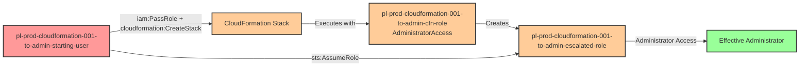

# One-Hop Privilege Escalation: iam:PassRole + cloudformation:CreateStack

* **Category:** Privilege Escalation
* **Sub-Category:** new-passrole
* **Path Type:** one-hop
* **Target:** to-admin
* **Environments:** prod
* **Cost Estimate:** $0/mo
* **Pathfinding.cloud ID:** cloudformation-001
* **Technique:** CloudFormation stack creation with privileged service role to create escalated IAM roles
* **Terraform Variable:** `enable_single_account_privesc_one_hop_to_admin_cloudformation_001_iam_passrole_cloudformation`
* **Schema Version:** 1.0.0
* **Attack Path:** starting_user → (PassRole + cloudformation:CreateStack) → CloudFormation creates role with admin → assume escalated role → admin access
* **Attack Principals:** `arn:aws:iam::{account_id}:user/pl-prod-cloudformation-001-to-admin-starting-user`; `arn:aws:iam::{account_id}:role/pl-prod-cloudformation-001-to-admin-cfn-role`; `arn:aws:iam::{account_id}:role/pl-prod-cloudformation-001-to-admin-escalated-role`
* **Required Permissions:** `iam:PassRole` on `arn:aws:iam::*:role/pl-prod-cloudformation-001-to-admin-cfn-role`; `cloudformation:CreateStack` on `*`
* **Helpful Permissions:** `cloudformation:DescribeStacks` (Monitor stack creation progress); `iam:ListRoles` (Discover available privileged roles to pass); `cloudformation:DeleteStack` (Clean up attack artifacts)
* **MITRE Tactics:** TA0004 - Privilege Escalation, TA0003 - Persistence
* **MITRE Techniques:** T1098.001 - Account Manipulation: Additional Cloud Credentials

## Attack Overview

This scenario demonstrates a privilege escalation vulnerability where a user has permission to pass IAM roles to AWS CloudFormation (`iam:PassRole`) and create CloudFormation stacks (`cloudformation:CreateStack`). The attacker creates a CloudFormation stack with a malicious template that defines a new IAM role with administrative permissions and a trust policy allowing the attacker to assume it. By passing a privileged role to CloudFormation as the service role, the attacker leverages CloudFormation's elevated permissions to create resources they couldn't create directly.

The attack works by exploiting the CloudFormation service's ability to create and manage AWS resources on behalf of users. When CloudFormation executes with an administrative service role, it can create any AWS resource defined in the template, including IAM roles with privileged policies and custom trust relationships. The attacker crafts a template that creates a backdoor admin role, and CloudFormation provisions it using the passed admin role's permissions.

This technique is particularly dangerous because CloudFormation is often granted broad permissions to provision infrastructure, and developers are frequently given CloudFormation access without understanding the privilege escalation implications. The combination of `iam:PassRole` and `cloudformation:CreateStack` creates a complete path to admin access through infrastructure-as-code abuse.

### MITRE ATT&CK Mapping

- **Tactic**: Privilege Escalation (TA0004), Persistence (TA0003)
- **Technique**: T1548 - Abuse Elevation Control Mechanism
- **Sub-technique**: T1548.005 - Temporary Elevated Cloud Access
- **Related Technique**: T1098.003 - Account Manipulation: Additional Cloud Roles

### Principals in the attack path

- `arn:aws:iam::PROD_ACCOUNT:user/pl-prod-cloudformation-001-to-admin-starting-user` (Scenario-specific starting user with CloudFormation permissions)
- `arn:aws:iam::PROD_ACCOUNT:role/pl-prod-cloudformation-001-to-admin-cfn-role` (Privileged role trusted by cloudformation.amazonaws.com, passed to CloudFormation)
- `arn:aws:iam::PROD_ACCOUNT:role/pl-prod-cloudformation-001-to-admin-escalated-role` (New admin role created by CloudFormation during attack)

### Attack Path Diagram



### Attack Steps

1. **Initial Access**: Start as `pl-prod-cloudformation-001-to-admin-starting-user` (credentials provided via Terraform outputs)
2. **Craft Malicious Template**: Create a CloudFormation template that defines a new IAM role with AdministratorAccess and a trust policy allowing the starting user to assume it
3. **Pass Admin Role**: Use `iam:PassRole` to pass the `pl-prod-cloudformation-001-to-admin-cfn-role` as the CloudFormation service role
4. **Create Stack**: Use `cloudformation:CreateStack` to deploy the malicious template with the passed admin role
5. **CloudFormation Execution**: CloudFormation executes with the admin role's permissions and creates the escalated role (`pl-prod-cloudformation-001-to-admin-escalated-role`)
6. **Assume Escalated Role**: Use `sts:AssumeRole` to assume the newly created admin role
7. **Verification**: Verify administrator access by listing IAM users or performing other admin actions

### Scenario specific resources created

| ARN | Purpose |
| -- | -- |
| `arn:aws:iam::PROD_ACCOUNT:user/pl-prod-cloudformation-001-to-admin-starting-user` | Scenario-specific starting user with access keys |
| `arn:aws:iam::PROD_ACCOUNT:role/pl-prod-cloudformation-001-to-admin-cfn-role` | Privileged role with AdministratorAccess, trusted by cloudformation.amazonaws.com |

## Attack Lab

### Prerequisites

1. Install the `plabs` CLI:
   ```bash
   brew install pathfinding-labs/tap/plabs
   ```
2. Configure your AWS profiles in `~/.plabs/plabs.yaml` (or run `plabs init` if you haven't already)

### Deploy with plabs non-interactive

```bash
plabs enable enable_single_account_privesc_one_hop_to_admin_cloudformation_001_iam_passrole_cloudformation
plabs apply
```

### Deploy with plabs tui

1. Launch the TUI: `plabs`
2. Navigate to this scenario in the scenarios list
3. Press `space` to enable it
4. Press `d` to deploy

### Executing the automated demo_attack script

The script will:
1. Display a step-by-step walkthrough with color-coded output
2. Show the commands being executed and their results
3. Create a CloudFormation stack with a malicious template
4. Pass the admin role to CloudFormation as the service role
5. Create a new escalated IAM role via CloudFormation
6. Assume the newly created role
7. Verify successful privilege escalation
8. Output standardized test results for automation

#### Resources created by attack script

- A CloudFormation stack containing a malicious template
- `pl-prod-cloudformation-001-to-admin-escalated-role` — new IAM role with AdministratorAccess created by the stack

#### With plabs non-interactive

```bash
plabs demo --list
plabs demo cloudformation-001-iam-passrole-cloudformation
```

#### With plabs tui

1. Launch the TUI: `plabs`
2. Navigate to this scenario in the scenarios list
3. Press `r` to run the demo script

### Cleanup

#### With plabs non-interactive

```bash
plabs cleanup --list
plabs cleanup cloudformation-001-iam-passrole-cloudformation
```

#### With plabs tui

1. Launch the TUI: `plabs`
2. Navigate to this scenario in the scenarios list
3. Press `c` to run the cleanup script

### Teardown with plabs non-interactive

```bash
plabs disable enable_single_account_privesc_one_hop_to_admin_cloudformation_001_iam_passrole_cloudformation
plabs apply
```

### Teardown with plabs tui

1. Launch the TUI: `plabs`
2. Navigate to this scenario in the scenarios list
3. Press `space` to disable it
4. Press `D` to destroy

## Detecting Misconfiguration (CSPM)

### What CSPM tools should detect

A properly configured Cloud Security Posture Management (CSPM) tool should detect the following issues:

**High Priority Detections:**
- User with ability to pass privileged roles to CloudFormation (iam:PassRole on admin roles + cloudformation:CreateStack)
- Combined permissions creating privilege escalation path (PassRole + CreateStack on same principal)
- User with unrestricted CloudFormation stack creation capabilities
- Potential for privilege escalation via CloudFormation service abuse
- CloudFormation service role with IAM creation permissions

**Specific Checks:**
- Check for iam:PassRole permission with wildcards or broad resource specifications targeting CloudFormation-trusted roles
- Identify users that can both pass roles and create CloudFormation stacks
- Detect CloudFormation stacks created with administrative service roles
- Monitor for privilege escalation paths where CloudFormation is used as an intermediary
- Flag roles trusted by cloudformation.amazonaws.com with iam:CreateRole or iam:AttachRolePolicy permissions

### Prevention recommendations

- **Restrict PassRole permissions**: Never grant iam:PassRole with wildcards. Use resource-based conditions to limit which roles can be passed and to which services (use `iam:PassedToService` condition key to restrict to specific services)
- **Limit CloudFormation service roles**: CloudFormation service roles should follow least privilege. Avoid granting them administrative IAM permissions
- **Separate CloudFormation permissions**: Avoid granting cloudformation:CreateStack and cloudformation:UpdateStack to principals that have iam:PassRole on privileged roles
- **Implement permission boundaries**: Use IAM permission boundaries to prevent roles from being passed to CloudFormation if they contain sensitive IAM creation permissions
- **Use SCPs**: Implement Service Control Policies to prevent passing of admin roles to infrastructure services (CloudFormation, Terraform Cloud, etc.)
- **Require stack policies**: Enforce CloudFormation stack policies that restrict IAM resource creation or require approval workflows
- **Enable resource-based conditions**: Require specific tags or resource paths for iam:PassRole operations targeting CloudFormation-trusted roles
- **Monitor CloudTrail**: Alert on CreateStack and UpdateStack API calls where the service role has IAM creation or modification permissions
- **Template validation**: Implement automated CloudFormation template scanning to detect IAM resources with overly permissive policies
- **Use IAM Access Analyzer**: Leverage IAM Access Analyzer to identify privilege escalation paths involving CloudFormation
- **Require MFA**: Enforce MFA for sensitive operations like creating CloudFormation stacks with privileged service roles
- **Implement approval workflows**: Use AWS Service Catalog or custom approval gates for CloudFormation deployments with elevated permissions

## Detection Abuse (CloudSIEM)

### CloudTrail events to monitor

- `IAM: PassRole` — Role passed to CloudFormation as a service role; critical when the passed role has elevated IAM permissions
- `CloudFormation: CreateStack` — New CloudFormation stack created; high severity when a privileged service role is specified
- `CloudFormation: UpdateStack` — Existing stack updated; monitor for IAM resource additions with privileged policies
- `STS: AssumeRole` — Role assumption following stack creation; suspicious when the assumed role was recently created via CloudFormation

### Detonation logs

_Detonation log integration (Stratus Red Team / Grimoire) is planned for a future release._

## References

- [AWS Documentation - IAM PassRole](https://docs.aws.amazon.com/IAM/latest/UserGuide/id_roles_use_passrole.html)
- [AWS CloudFormation Service Role](https://docs.aws.amazon.com/AWSCloudFormation/latest/UserGuide/using-iam-servicerole.html)
- [Rhino Security Labs - AWS IAM Privilege Escalation Methods](https://rhinosecuritylabs.com/aws/aws-privilege-escalation-methods-mitigation/)
- [AWS Security Best Practices for CloudFormation](https://docs.aws.amazon.com/AWSCloudFormation/latest/UserGuide/security-best-practices.html)
