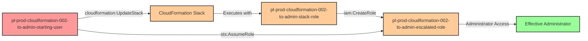

# Privilege Escalation via cloudformation:UpdateStack

* **Category:** Privilege Escalation
* **Sub-Category:** existing-passrole
* **Path Type:** one-hop
* **Target:** to-admin
* **Environments:** prod
* **Technique:** Modifying existing CloudFormation stack to create admin role using stack's elevated service role

## Overview

This scenario demonstrates a sophisticated privilege escalation vulnerability where a user with `cloudformation:UpdateStack` permission can modify an existing CloudFormation stack that has an administrative service role attached. CloudFormation stacks execute with the permissions of their service role, which often requires elevated privileges to manage infrastructure. By updating the stack template to include new IAM resources, an attacker can leverage the stack's elevated permissions to create resources they couldn't create directly.

In production environments, CloudFormation stacks frequently have administrative or near-administrative service roles to allow them to provision and manage diverse AWS resources. DevOps teams may grant developers `cloudformation:UpdateStack` permissions for legitimate infrastructure updates, but this creates an indirect privilege escalation path. The attacker doesn't need direct IAM permissions to create roles or policies - they only need the ability to modify a stack that already has those permissions.

This attack is particularly insidious because it appears as legitimate infrastructure management activity. The CloudFormation stack update follows normal change management processes, making it difficult to distinguish from authorized infrastructure modifications. Organizations often overlook this privilege escalation vector because the UpdateStack permission seems less dangerous than direct IAM permissions, yet it provides equivalent access through the stack's service role.

## Understanding the attack scenario

### Principals in the attack path

- `arn:aws:iam::PROD_ACCOUNT:user/pl-prod-cloudformation-002-to-admin-starting-user` (Scenario-specific starting user with limited permissions)
- `arn:aws:iam::PROD_ACCOUNT:role/pl-prod-cloudformation-002-to-admin-stack-role` (CloudFormation service role with administrative permissions)
- `arn:aws:iam::PROD_ACCOUNT:role/pl-prod-cloudformation-002-to-admin-escalated-role` (Admin role created by stack update)

### Attack Path Diagram



### Attack Steps

1. **Initial Access**: Start as `pl-prod-cloudformation-002-to-admin-starting-user` (credentials provided via Terraform outputs)
2. **Retrieve Existing Template**: Use `cloudformation:GetTemplate` to download the current stack template
3. **Modify Template**: Add a new IAM role resource to the template with AdministratorAccess policy and a trust relationship allowing the starting user to assume it
4. **Update Stack**: Use `cloudformation:UpdateStack` to apply the modified template, leveraging the stack's admin service role to create the new role
5. **Assume Escalated Role**: Use `sts:AssumeRole` to assume the newly created admin role
6. **Verification**: Verify administrator access by listing IAM users or performing other admin-level actions

### Scenario specific resources created

| ARN | Purpose |
| -- | -- |
| `arn:aws:iam::PROD_ACCOUNT:user/pl-prod-cloudformation-002-to-admin-starting-user` | Scenario-specific starting user with access keys and cloudformation:UpdateStack permission |
| `arn:aws:iam::PROD_ACCOUNT:role/pl-prod-cloudformation-002-to-admin-stack-role` | CloudFormation service role with AdministratorAccess used by the stack |
| `arn:aws:cloudformation:*:PROD_ACCOUNT:stack/pl-prod-cloudformation-002-to-admin-stack/*` | CloudFormation stack that can be updated by the starting user |
| `arn:aws:iam::PROD_ACCOUNT:role/pl-prod-cloudformation-002-to-admin-escalated-role` | Admin role created during stack update (created by demo script) |

## Executing the attack

### Using the automated demo_attack.sh

To demonstrate the privilege escalation path, run the provided demo script:

```bash
cd modules/scenarios/single-account/privesc-one-hop/to-admin/cloudformation-002-cloudformation-updatestack
./demo_attack.sh
```

The script will:
1. Display a step-by-step walkthrough with color-coded output
2. Show the commands being executed and their results
3. Verify successful privilege escalation
4. Output standardized test results for automation

### Cleaning up the attack artifacts

After demonstrating the attack, clean up the IAM role and stack modifications created during the demo:

```bash
cd modules/scenarios/single-account/privesc-one-hop/to-admin/cloudformation-002-cloudformation-updatestack
./cleanup_attack.sh
```

The cleanup script will revert the CloudFormation stack to its original state and remove the escalated admin role created during the demonstration, restoring the environment while preserving the deployed infrastructure.

## Detection and prevention


### MITRE ATT&CK Mapping

- **Tactic**: TA0004 - Privilege Escalation, TA0003 - Persistence
- **Technique**: T1098 - Account Manipulation
- **Sub-technique**: T1098.001 - Account Manipulation: Additional Cloud Credentials


## Prevention recommendations

- Implement least privilege principles for CloudFormation service roles - avoid granting AdministratorAccess when more granular permissions suffice
- Restrict `cloudformation:UpdateStack` permissions to specific users/roles who require infrastructure management capabilities
- Use CloudFormation stack policies to prevent modifications to sensitive resources: `"Effect": "Deny", "Principal": "*", "Action": "Update:*", "Resource": "LogicalResourceId/SensitiveRole"`
- Implement Service Control Policies (SCPs) to restrict CloudFormation stack updates that create or modify IAM resources
- Monitor CloudTrail for `UpdateStack` API calls, especially those that modify stacks with elevated service roles
- Use resource-based conditions to limit UpdateStack permissions to specific stacks: `"Condition": {"StringEquals": {"cloudformation:StackId": "arn:aws:cloudformation:*:*:stack/approved-stack/*"}}`
- Enable CloudFormation drift detection and alerts to identify unauthorized stack modifications
- Require MFA for CloudFormation updates using condition keys like `aws:MultiFactorAuthPresent`
- Use IAM Access Analyzer to identify and remediate privilege escalation paths involving CloudFormation permissions
- Implement change approval workflows for CloudFormation stack updates that modify IAM resources
- Regularly audit CloudFormation service roles and reduce permissions to the minimum required for stack operations
